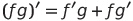
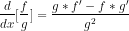

# Differentiability

http://www.math.uri.edu/~mcomerford/math141/Fall11/lesson13.pdf

# Product Rule

If the two functions f(x) and g(x) are differentiable (i.e. the derivative exist) then the product is differentiable and,

&nbsp;&nbsp;&nbsp;&nbsp;&nbsp;&nbsp;&nbsp;&nbsp;&nbsp;&nbsp;&nbsp;&nbsp;&nbsp;&nbsp;&nbsp;&nbsp;&nbsp;&nbsp; 

# Quotient Rule

If the two functions f(x) and g(x) are differentiable (i.e. the derivative exist) then the quotient is differentiable and,

&nbsp;&nbsp;&nbsp;&nbsp;&nbsp;&nbsp;&nbsp;&nbsp;&nbsp;&nbsp;&nbsp;&nbsp;&nbsp;&nbsp;&nbsp;&nbsp;&nbsp;&nbsp; 

# L'Hopital's Rule

https://www.mathsisfun.com/calculus/l-hopitals-rule.html

