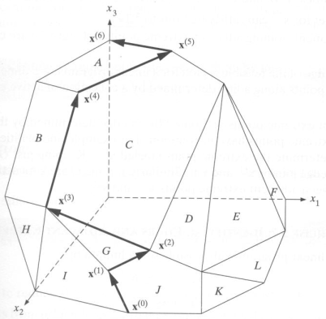
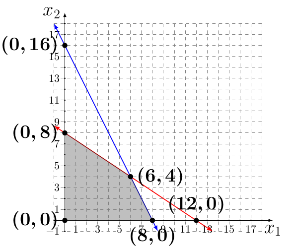

&nbsp;&nbsp;&nbsp;&nbsp;&nbsp;&nbsp;&nbsp;&nbsp;&nbsp;&nbsp;&nbsp;&nbsp;&nbsp;
Pre-Req: Linear Programming, also called as linear optimization, is a method to achieve the best outcome in a mathematical model with constraints represented by linear relationships.

&nbsp;&nbsp;&nbsp;&nbsp;&nbsp;&nbsp;&nbsp;&nbsp;&nbsp;&nbsp;&nbsp;&nbsp;&nbsp;
Simplex algorithm is a method used in mathematical optimization to solve linear programming problems. It can be done by hand or using computers (ex. using solver in Excel).
Furthermore, Simplex method is used to solve maximization problems (every minimization problem can be converted to a maximization problem).
We know that every linear programming (LP) problem has basic solutions. We could check all the solutions for optimality and feasibility
one by one and get our optimal solution. This is simple when our LP problem has a small number of variables. However, most of the real-world
LP problems have many variables and a huge number of constraints. Checking each possible solution would take a great amount of time. 
For example, if a problem has n = 30 decision variables and m = 35 problem constraints, thenumber of possible basic solution becomes 
approximately 3 × 10^18 . It will take about 15 years for an average modern personal computer to check all these solutions for feasibility and optimality. 

&nbsp;&nbsp;&nbsp;&nbsp;&nbsp;&nbsp;&nbsp;&nbsp;&nbsp;&nbsp;&nbsp;&nbsp;&nbsp;
The simplex method describes a ”smart” way to find much smaller subset of
basic solutions which would be sufficient to check in order to identify the optimal
solution. Staring from some basic feasible solution called initial basic feasible
solution, the simplex method moves along the edges of the polyhedron (vertices
of which are basic feasible solutions) in the direction of increase of the
objective function until it reaches the optimal solution. We can see the graphical representation of simplex method in the Figure 1.

&nbsp;&nbsp;&nbsp;&nbsp;&nbsp;&nbsp;&nbsp;&nbsp;&nbsp;&nbsp;&nbsp;&nbsp;&nbsp;&nbsp;&nbsp;&nbsp;&nbsp;&nbsp;&nbsp;&nbsp;&nbsp;&nbsp;&nbsp;&nbsp;&nbsp;&nbsp;&nbsp;&nbsp;  
|  |
|:--:|
| <b> Figure 1</b>|

&nbsp;&nbsp;&nbsp;&nbsp;&nbsp;&nbsp;&nbsp;&nbsp;&nbsp;&nbsp;&nbsp;&nbsp;&nbsp;
In order to tackle the simplex method, we must know the standard form of a standard maximization problem. 
The form is as follows:


#=>Objective function:
P = c1 * x1 + c2 * x2 + . . . + cn * xn
#=> Constraints:
a11 * x1 + a12 * x2 + . . . + a1n * xn ≤ b1
···
am1 * x1 + am2 * x2 + . . . + amn * xn ≤ bm
x1 , x2 , . . . , xn ≥ 0



where x1 , x2 , . . . , xn are decision variables, c1 , . . . , cn ,
a11 , . . . , amn are any real numbers, and b1 , . . . , bm ≥ 0 are
nonnegative real numbers.

We will follow the list of steps to complete LP problem using Simplex method algebraically:

    • Standard form
    • Introducing slack variables
    • Creating the simplex tableau
    • Pivot variables
    • Creating a new simplex tableau
    • Checking for optimality
    • Identify optimal values

# Step 1: Conversion to Standard Form

&nbsp;&nbsp;&nbsp;&nbsp;&nbsp;&nbsp;&nbsp;&nbsp;&nbsp;&nbsp;&nbsp;&nbsp;&nbsp;
First of all, we need to make sure our problem is in the **standard form**. 
Standard form is necessary because it creates an ideal starting point for solving the Simplex method.
Before solving for the optimal solution, we must know that standard form has three requirements:

    (1) must be a maximization problem
    (2) all linear constraints must be in a less-than-or-equal-to inequality
    (3) all variables are non-negative

&nbsp;&nbsp;&nbsp;&nbsp;&nbsp;&nbsp;&nbsp;&nbsp;&nbsp;&nbsp;&nbsp;&nbsp;&nbsp;
To transform a minimization linear program model into a maximization linear program model, all we need to do is to
multiply both sides of objective function by -1. 
 

#=>Objective function:
-P = -5x1 - 4x2

#=>Objective function Conversion:
(-1) * (-P = -5x1 - 4x2) = P = 5x1 + 4x2


The same process is being applied to constraints that are in the form of greater-than-or-equal sign. 
To convert those constraints in the form of less-than-or-equal sign, simply pultiply the equation by -1.


#=>Original Constraints:
-4x1 - 2x2 >= -32
2x1 + 3x2 <= 24
x1, x2 >= 0

#=>Constraint Conversion:
(-1) * (-4x1 - 2x2 >= -32) = 4x1 + 2x2 <= 32

#=>Final set of constraints:
4x1 + 2x2 <= 32
2x1 + 3x2 <= 24
x1, x2 >= 0


Finally, we converted our minimization linear program model into a maximization linear program model in standard form.

# Step 2: Determine Slack Variables

&nbsp;&nbsp;&nbsp;&nbsp;&nbsp;&nbsp;&nbsp;&nbsp;&nbsp;&nbsp;&nbsp;&nbsp;&nbsp;
**Slack variables** are additional variables that are introduced into the linear constraints of a linear program to transform them from inequality constraints to equality constraints. For each problem constraint of the original problem we introduce a single slack variable as follows:


4x1 + 2x2 + s1 = 32
2x1 + 3x2 + s2 = 24
x1, x2, s1, s2 >= 0


&nbsp;&nbsp;&nbsp;&nbsp;&nbsp;&nbsp;&nbsp;&nbsp;&nbsp;&nbsp;&nbsp;&nbsp;&nbsp;
Each solution in the above problem representation correspods to a point in the feasible region of the original problem.

**Note: Slack variables should not be non-negative.**

Next, we add the objective function in the system above, while treating P as another variable.


#=>Original Objective:
P = 5x1 + 4x2

#=> Can be written as:
-5x1 - 4x2 + P = 0

#=>Final system:
4x1 + 2x2 + s1 = 32
2x1 + 3x2 + s2 = 24
-5x1 - 4x2 + P = 0
x1, x2, s1, s2 >= 0


The above system is also called the **initial system**. 
Again, every solution of the initial system (taking into account nonnegative constrains) corresponds to 
some point in the feasible region of the original LP (andvice versa!).
**Therefore, one of the solution of the initial system should be an optimal
solution of the original LP (if any exists)**.

Let's introduce couple of definitions:

**Basic Solution** - This is one of many solutions of the original system. This solution has all variables set to 0. Hence, this solution is the origin of the graph.

**Basic Feasible Solution** - If a basic solution of the initial system corresponds to a certain point in the feasible region of the original LP, then it is called a basic feasible solution.

Here is how feasbile region of our original problem looks like:

&nbsp;&nbsp;&nbsp;&nbsp;&nbsp;&nbsp;&nbsp;&nbsp;&nbsp;&nbsp;&nbsp;&nbsp;&nbsp;&nbsp;&nbsp;&nbsp;&nbsp;&nbsp;&nbsp;&nbsp;&nbsp;&nbsp;&nbsp;&nbsp;&nbsp;&nbsp;&nbsp;&nbsp;  
|  |
|:--:|
| <b> Figure 2</b>|

&nbsp;&nbsp;&nbsp;&nbsp;&nbsp;&nbsp;&nbsp;&nbsp;&nbsp;&nbsp;&nbsp;&nbsp;&nbsp;
In 2-dimensional case (2 decision variables), the set of basic solutions
is the of pairwise intersections of boundary lines of all problem con-
straints. In turn, the set of basic feasible solutions is the set of the
corner points.

**Pivoting** - is a change of basis where a nonbasic variable `enters` and a basic variable `leaves` the set of basic variables, while preserving feasibility. We can see pivoting process in the Figure 1 shown as arrows on the edges that connect vertices X0, X1, X3, X4, X5, and X6. 

# Spep 3: Creating a Simplex Tableau

&nbsp;&nbsp;&nbsp;&nbsp;&nbsp;&nbsp;&nbsp;&nbsp;&nbsp;&nbsp;&nbsp;&nbsp;&nbsp;
The simplex method utilizes matrix representation of the initial system
while performing search for the optimal solution. This matrix repre-
sentation is called **simplex tableau**. 

&nbsp;&nbsp;&nbsp;&nbsp;&nbsp;&nbsp;&nbsp;&nbsp;&nbsp;&nbsp;&nbsp;&nbsp;&nbsp;
The simplex tableau consists of coefficients corresponding to the linear constraint variables and the coefficients of the objective function.  
In the tableau below, the first two rows represent the linear constraint variable coefficients from the linear programming model, and the last row represents the objective function variable coefficients.


x1 x2 s1 s2  P   R
 4  2  1  0  0 | 32  s1
 2  3  0  1  0 | 24  s2
_______________|___
-5 -4  0  0  1 | 0


**From this tableau we know that x1 and x2 are non-basic variables, so x1 = x2 = 0. This represents our starting feasible point on the graph (0,0).**

# Step 4: Check Optimality

The optimal solution of a maximization linear programming model are the values assigned to the variables in the objective function to give the largest P value.
The optimal solution would exist on the corner points of the graph of the entire model.  To check optimality using the tableau, all values in the last row must contain values greater than or equal to zero. If a value is less than zero, it means that variable has not reached its optimal value.  As seen in the previous tableau, two negative values exists in the bottom row indicating so this solution is not optimal.  If a tableau is not optimal, the next step is to identify ** the pivot variable** to base a new tableau on.

# Step 5: Identify Pivot Variable

Definitions:

**Basic variables** - slack variables (s1, s2) are refered to as basic variables.

**Non-basic variables** - the original variables from the objective function are refered to as non-basic variables. If a variable is considered non-basic, the value of that variable is equal to zero.

**Entering variable** - corresponds to the smallest (the most negative) entry in the bottom row of the tableau.

**Departing variable** - corresponds to the smallest nonnegative ratio of Ri / ij , in the column determined by the entering variable.

**Pivot** - entry in the simplex tableau in the entering variable’s column and the departing variable’s row (intersection).

&nbsp;&nbsp;&nbsp;&nbsp;&nbsp;&nbsp;&nbsp;&nbsp;&nbsp;&nbsp;&nbsp;&nbsp;&nbsp;
In order to search for more optimal solution, we need to perform **pivot operations** on this matrix.
To do this, we need to determine what is our **entering variable and departing variable**.

Entering variable: -5

Departing variable: 32/4 or 24/2 => the final departing variable is the smallest positive ratio, which is 32/4. Hence, the departing variable is s1.

Pivot: 4

**Note**: if departing variables happend to have the same ratio, we would need to pick the variable with smaller index.

# Step 6: Creating the New Tableau

&nbsp;&nbsp;&nbsp;&nbsp;&nbsp;&nbsp;&nbsp;&nbsp;&nbsp;&nbsp;&nbsp;&nbsp;&nbsp;
The new tableau will be used to identify a new possible optimal solution.

&nbsp;&nbsp;&nbsp;&nbsp;&nbsp;&nbsp;&nbsp;&nbsp;&nbsp;&nbsp;&nbsp;&nbsp;&nbsp;
1. To optimize the pivot variable, it will need to be transformed into a unit value (value of 1). To transform the value, multiply the row containing the pivot variable by the reciprocal of the pivot value (1/4). Once that is done, we have changed the base, where non-basic variable x1 entered and basic variable s1 left the set of basic variables (they exchanged).


s1  x2   s1   s2  P   R
 1 0.5  0.25  0   0 | 8 x1
____________________|___
                    | 


&nbsp;&nbsp;&nbsp;&nbsp;&nbsp;&nbsp;&nbsp;&nbsp;&nbsp;&nbsp;&nbsp;&nbsp;&nbsp;
2. After the unit value has been determined, the other values in the column containing the unit value will become zero.  This is because the x1 in the first constraint is being optimized, which requires x1 in the other equations to be zero. 


s1  x2   s1   s2  P   R
 1 0.5  0.25  0   0 | 8  x1 <- New pivot row
 0                  |
____________________|___
 0                  | 


&nbsp;&nbsp;&nbsp;&nbsp;&nbsp;&nbsp;&nbsp;&nbsp;&nbsp;&nbsp;&nbsp;&nbsp;&nbsp;
In order to keep the tableau equivalent, the other variables not contained in the pivot column or pivot row must be calculated by using the new pivot values.  For each new value, multiply the negative of the value in the old pivot column by the value in the new pivot row that corresponds to the value being calculated.  Then add this to the old value from the old tableau to produce the new value for the new tableau.  This step can be condensed into the following equation:

New tableau value = (Negative value in old tableau pivot column) x (value in new tableau pivot row) + (Old tableau value) 

**Old Simplex Tableau**

x1 x2 s1 s2  P   R
 4  2  1  0  0 | 32  s1
 2  3  0  1  0 | 24  s2
_______________|___
-5 -4  0  0  1 | 0


[1][1] = (-2) * (0.5) + 3 = 2

[1][2] = (-2) * (0.25) + 0 = -0.5

[1][3] = (-2) * 0 + 1 = 1

[1][4] = (-2) * 0 + 0 = 0

[1][5] = (-2) * 8 + 24 = 8

[2][1] = (5) * (0.5) + (-4) = -1.5

[2][2] = (5) * (0.25) + 0 = 1.25

[2][3] = (5) * (0) + 0 = 0

[2][4] = (5) * (0) + 1 = 1

[2][5] = (5) * (8) + 0 = 40

**New Simplex Tableau**

s1   x2   s1 s2  P   R
 1  0.5 0.25  0  0 | 8  x1
 0    2 -0.5  1  0 | 8  s2
___________________|___
 0 -1.5 1.25  0  1 | 40


**From this tableau we know that x2 is a non-basic variable, so x2 = 0. We also know that x1 = 8. Hence, our next point in the feasible region in the Figure 2 is the point (8,0).**

A solution is considered optimal if all values in the bottom row are greater than or equal to zero. If negative values exist, the solution is still not optimal and a new pivot point will need to be determined.Hence, we need to repeat the process. 

Entering variable: -1.5

Departing variable: 8/0.5 or 8/2 => the final departing variable is the smallest positive ratio, which is 8/2. Hence, the departing variable is s2.

Pivot: 2

Multiply the whole pivot row by 1/0.5 => 2. Once we exchange the basic and non-basic variables, we get the following row:


s1  s2    s1   s2  P    R
 0   1 -0.25  0.5  0 |  4 x2
_____________________|___
                     | 


Make the pivot column all zeros besides the pivot.


s1  s2    s1   s2  P    R
 0   1 -0.25  0.5  0 |  4  x2 <- New tableau pivot row
     0               |
_____________________|___
     0               | 


Update the rest of the tableau:

New tableau value = (Negative value in old tableau pivot column) x (value in new tableau pivot row) + (Old tableau value) 

**Old Simplex Tableau**


s1   x2   s1 s2  P   R
 1  0.5 0.25  0  0 | 8  x1
 0    2 -0.5  1  0 | 8  s2
___________________|___
 0 -1.5 1.25  0  1 | 40


[0][0] = (-0.5) * 0 + 1 = 1

[0][2] = (-0.5) * (-0.25) + (-0.25) = 0.375

[0][2] = (-0.5) * 0.5 + 0 = -0.25

[0][2] = (-0.5) * 0 + 0 = 0

[0][2] = (-0.5) * 4 + 8 = 6

[2][0] = (1.5) * 0 + 0 = 0

[2][0] = (1.5) * (-0.25) + 1.25 = 0.875

[2][0] = (1.5) * 0.5 + 0 = 0.75

[2][0] = (1.5) * 0 + 1 = 1

[2][0] = (1.5) * 4 + 40 = 46

**New Simplex Tableau**


s1  s2     s1    s2  P    R
 1   0  0.375 -0.25  0 |  6 x1
 0   1 -0.25    0.5  0 |  4 x2
_______________________|___
 0   0  0.875  0.75  1 | 46


**We can see that x1 and x2 are both basic variables where x1 = 6 and x2 = 4, which is our next feasible point in the feasible region.**

# Step 7: Check Optimality

We can now see that we do not have any negative values for our bottom row. This means that we reached our optimum.

# Step 8: Identify Optimal Values

To identify the optimal values, we need to identify basic and non-basic variables. 
A basic variable can be classified to have a single 1 value in its column and the rest be all zeros.  
If a variable does not meet this criteria, it is considered non-basic.  
If a variable is non-basic it means the optimal solution of that variable is zero. 
If a variable is basic, the row that contains the 1 value will correspond to the R value.  
The R value will represent the optimal solution for the given variable. 

Basic variables: x1,x2, P

Non-basic variables: s1,s2

For the variable x1, the 1 is found in the first row.  This shows that the optimal x1 value is found in the first row of the R values, which is 6. Hence x1 = 6.

For the variable x2, the 1 is found in the second row.  This shows that the optimal x2 value is found in the second row of the R values, which is 4. Hence x2 = 4.

For the variable P, the 1 is found in the third row.  This shows that the optimal P value is found in the third row of the R values, which is 46.

**Note:** If any s was to be a basic variable, the solution to it would not be included into the final objective function.

The optimal value is found by having:

x1 = 6

x2 = 4

P = 46

s1, s2 = 0

Hence, P = 5x1 + 4x2 => 46 = 5 * 6 + 4 * 4 is the `optimal solution` we were looking for. 

If we take a look at the original feasibility graph, we can see that our optimal solution is in point (6,4).

# Conclusion

The Simplex method is an approach for determining the optimal value of a linear program by hand.  The method produces an optimal solution to satisfy the given constraints and produce a maximum zeta value.  To use the Simplex method, a given linear programming model needs to be in standard form, where slack variables can then be introduced.  Using the tableau and pivot variables, an optimal solution can be reached.

Nikola Andric
