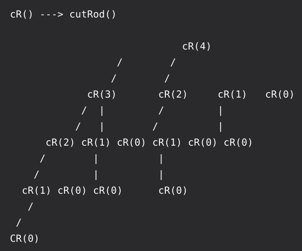

 &nbsp;&nbsp;&nbsp;&nbsp;&nbsp;&nbsp;&nbsp;&nbsp;&nbsp;&nbsp;&nbsp;&nbsp;&nbsp;
 **Rod cutting** problem uses dynamic programming to solve a problem in deciding where to cut steel rods. 

# Problem:

 &nbsp;&nbsp;&nbsp;&nbsp;&nbsp;&nbsp;&nbsp;&nbsp;&nbsp;&nbsp;&nbsp;&nbsp;&nbsp;
 Given a rod of length ***n*** inches and an array of prices ***pi;*** for i = 1,2,...n that includes prices of all pieces of size smaller than n. Determine the maximum revenue value ***rn*** obtainable by cutting up the rod and selling the pieces. Note that if piece ***pn*** for a rod of length n is large enough, an optimal   solution may equire no cutting at all.
 
 How do we meet the necessary properties for dynamic programming:
 
 &nbsp;&nbsp;&nbsp;&nbsp;&nbsp;&nbsp;&nbsp;&nbsp;&nbsp;&nbsp;&nbsp;&nbsp;&nbsp;
 1. Optimal Structure - We can cut the rod in different spots and compare the prices after each cut. Then we can recursively call the same function on a piece obtained after the cut. 
 
 &nbsp;&nbsp;&nbsp;&nbsp;&nbsp;&nbsp;&nbsp;&nbsp;&nbsp;&nbsp;&nbsp;&nbsp;&nbsp;
 2. Overlapping Subproblems - In our recursive implementation, we can see that many subproblems are repeating/overlapping.
 
 &nbsp;&nbsp;&nbsp;&nbsp;&nbsp;&nbsp;&nbsp;&nbsp;&nbsp;&nbsp;&nbsp;&nbsp;&nbsp;
 Let cutRod(n) be the function that gives us the optimal price for the rod of the length n. The definition of the cutRod would be 
 **cutRod(n) = max(price[i] + cutRod(n - i - 1)) for all *i* in {0,1,2,...n-1}**
 
 &nbsp;&nbsp;&nbsp;&nbsp;&nbsp;&nbsp;&nbsp;&nbsp;&nbsp;&nbsp;&nbsp;&nbsp;&nbsp;
 Let us have an example of a table that gives lengths *i* inches of a rod and prices *p* related to each letgth of the rod.
 
 
length   | 1   2   3   4   5   6   7   8
-----------------------------------------
price    | 3   5   8   9   10  17  17  20



&nbsp;&nbsp;&nbsp;&nbsp;&nbsp;&nbsp;&nbsp;&nbsp;&nbsp;&nbsp;&nbsp;&nbsp;&nbsp;
If our optimal solution cuts the rod into *k* pieces, for some 0 < k < n+1, with distance from the left side end to the cut = *i*, then an optimal decomposition

n = i1 + i2 + ... + ik

of the rod into pieces of lengths i1, i2, ..., ik provides maximum corresponding revenue

rn = pi1 + pi2 + ... + pik 

&nbsp;&nbsp;&nbsp;&nbsp;&nbsp;&nbsp;&nbsp;&nbsp;&nbsp;&nbsp;&nbsp;&nbsp;&nbsp;
Now, we can take a look how this problem would evolve using cutRod(4):

&nbsp;&nbsp;&nbsp;&nbsp;&nbsp;&nbsp;&nbsp;&nbsp;&nbsp;&nbsp;&nbsp;&nbsp;&nbsp;&nbsp;&nbsp;&nbsp;&nbsp;&nbsp; 

&nbsp;&nbsp;&nbsp;&nbsp;&nbsp;&nbsp;&nbsp;&nbsp;&nbsp;&nbsp;&nbsp;&nbsp;&nbsp;&nbsp;&nbsp;&nbsp;&nbsp;&nbsp;&nbsp;&nbsp;&nbsp;&nbsp;&nbsp;&nbsp;&nbsp;&nbsp;&nbsp;&nbsp;&nbsp;&nbsp;&nbsp;&nbsp;&nbsp;&nbsp;&nbsp;&nbsp;&nbsp;&nbsp;&nbsp;&nbsp;&nbsp;&nbsp;&nbsp;&nbsp;&nbsp;&nbsp;&nbsp;&nbsp;&nbsp;&nbsp;&nbsp;&nbsp;&nbsp;&nbsp;&nbsp;&nbsp;&nbsp;&nbsp;&nbsp;*Figure 1 - Recursion Tree*

<!-- https://sites.psu.edu/symbolcodes/codehtml/#math LINK FOR SYMBOLS IN EQUATIONS -->
<!-- h&theta;(x) = &theta;o x + &theta;1x -->
 
 &nbsp;&nbsp;&nbsp;&nbsp;&nbsp;&nbsp;&nbsp;&nbsp;&nbsp;&nbsp;&nbsp;&nbsp;&nbsp;
 Nikola Andric

 
