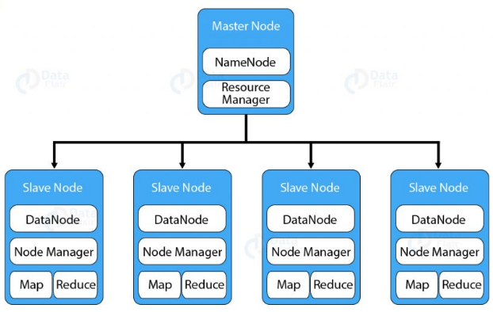
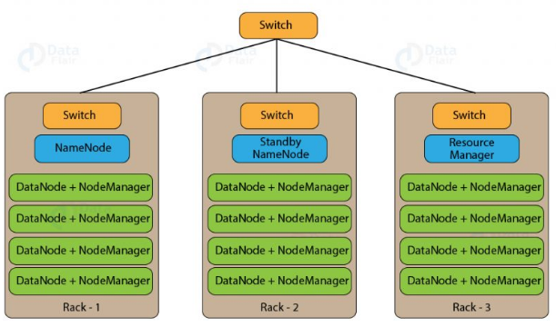
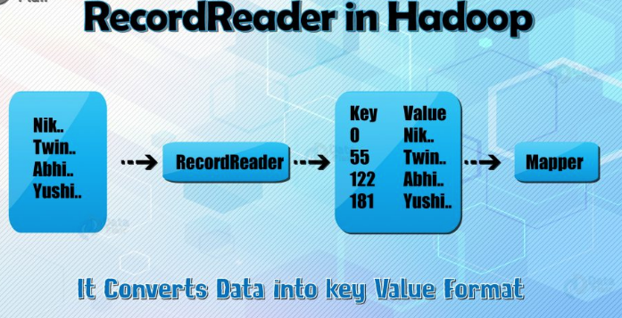
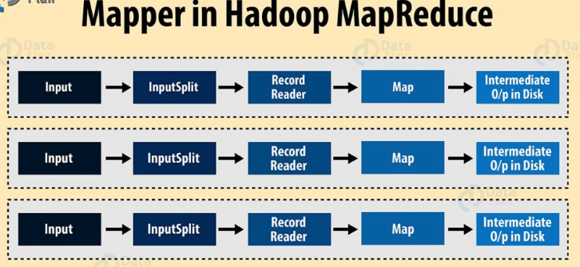
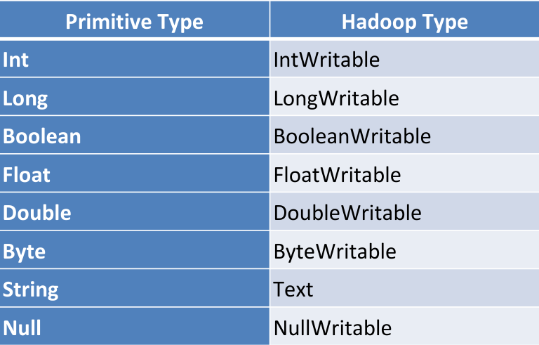

During the 1990's data was usually collected in files that were in format of rows and columns. The amount of data was growing slowly, so a single storage unit and a processor would do the job of storing and processing the data.

However, today data is being shared over the internet in countless formats and in huge amounts. Handling this much data in so many different formats became difficult. This type of data is called **BIG DATA.**. At that point in time, **Hadoop** was invented to deal with this problem!

There are 3 components of Hadoop:

1. Storage Unit --> Hadoop Distributed File System (HDFS)
2. Processing --> MapReduce
3. Resource Negotiator --> YARN

# HDFS

When storing the data, instead of storing the data on one computer (data node), Hadoop uses HDFS to split the data in **BLOCKS** and store them on different data nodes in the network.

In case one data node crashes, the data will not be lost becasue HDFS makes copies of the each block and saves them on different data nodes accross the network. This is called **Replication Method.**

 The daemon called NameNode runs on the master server. It is responsible for **Namespace management and regulates file access by the client**. DataNode daemon runs on slave nodes. It is responsible for s**toring actual business data.** Internally, a file gets split into a number of **data blocks and stored on a group of slave machines.** Namenode manages modifications to file system namespace. These are actions like the **opening, closing and renaming files or directories.** NameNode also keeps track of **mapping of blocks to DataNodes**. This DataNodes serves read/write request from the file system’s client. **DataNode also creates, deletes and replicates blocks on demand from NameNode.**
 
 &nbsp;&nbsp;&nbsp;&nbsp;&nbsp;&nbsp;&nbsp;&nbsp;&nbsp;&nbsp;&nbsp;&nbsp;&nbsp;&nbsp;&nbsp;&nbsp;&nbsp;&nbsp; 
&nbsp;&nbsp;&nbsp;&nbsp;&nbsp;&nbsp;&nbsp;&nbsp;&nbsp;&nbsp;&nbsp;&nbsp;&nbsp;&nbsp;&nbsp;&nbsp;&nbsp;&nbsp; 

**Java** is the native language of HDFS. Hence one can deploy DataNode and NameNode on machines having Java installed. In a typical deployment, there is one dedicated machine running NameNode. And all the other nodes in the cluster run DataNode. The NameNode contains metadata like the location of blocks on the DataNodes. And arbitrates resources among various competing DataNodes.

### Blocks in HDFS

Block is nothing but the smallest unit of storage on a computer system. It is the smallest contiguous storage allocated to a file. In Hadoop, we have a default block size of 128MB or 256 MB.

 &nbsp;&nbsp;&nbsp;&nbsp;&nbsp;&nbsp;&nbsp;&nbsp;&nbsp;&nbsp;&nbsp;&nbsp;&nbsp;&nbsp;&nbsp;&nbsp;&nbsp;&nbsp; 
&nbsp;&nbsp;&nbsp;&nbsp;&nbsp;&nbsp;&nbsp;&nbsp;&nbsp;&nbsp;&nbsp;&nbsp;&nbsp;&nbsp;&nbsp;&nbsp;&nbsp;&nbsp; 

One should select the block size very carefully. To explain why so let us take an example of a file which is 700MB in size. If our block size is 128MB then HDFS divides the file into 6 blocks. Five blocks of 128MB and one block of 60MB. What will happen if the block is of size 4KB? But in HDFS we would be having files of size in the order terabytes to petabytes. With 4KB of the block size, we would be having numerous blocks. This, in turn, will create huge metadata which will overload the NameNode. Hence we have to choose our HDFS block size judiciously.

### Replication Method

To provide fault tolerance HDFS uses a replication technique. In that, it makes copies of the blocks and stores in on different DataNodes. Replication factor decides how many copies of the blocks get stored. It is 3 by default but we can configure to any value.

To maintain the replication factor NameNode collects block report from every DataNode. Whenever a block is under-replicated or over-replicated the NameNode adds or deletes the replicas accordingly.

### Rack Awareness

 &nbsp;&nbsp;&nbsp;&nbsp;&nbsp;&nbsp;&nbsp;&nbsp;&nbsp;&nbsp;&nbsp;&nbsp;&nbsp;&nbsp;&nbsp;&nbsp;&nbsp;&nbsp; 
&nbsp;&nbsp;&nbsp;&nbsp;&nbsp;&nbsp;&nbsp;&nbsp;&nbsp;&nbsp;&nbsp;&nbsp;&nbsp;&nbsp;&nbsp;&nbsp;&nbsp;&nbsp; 

A rack contains many DataNode machines and there are several such racks in the production. HDFS follows a rack awareness algorithm to place the replicas of the blocks in a distributed fashion. This rack awareness algorithm provides for low latency and fault tolerance. Suppose the replication factor configured is 3. Now rack awareness algorithm will place the first block on a local rack. It will keep the other two blocks on a different rack. It does not store more than two blocks in the same rack if possible.

# MapReduce

In traditional processing of data, the data would be proccessed on a single machine with one processor or a few processors, which would not be efficient when it comes to big data. It would be costly (time).

To overcome this, **MapReduce** splits the data into parts and processes those parts on different data ndoes. The individual results are agregated to give the final output.

MapReduce is the data processing layer of Hadoop. It is a software framework that allows you to write applications for processing a large amount of data. MapReduce runs these applications in parallel on a cluster of low-end machines. It does so in a reliable and fault-tolerant manner.

MapReduce job comprises a number of map tasks and reduces tasks. Each task works on a part of data. This distributes the load across the cluster. The function of **Map tasks** is to load, parse, transform and filter data. Each **reduce task** works on the sub-set of output from the map tasks. **Reduce task** applies grouping and aggregation to this intermediate data from the map tasks.

## Map Task

The map task run in hte following phases:

A) **RecordReader**

The recordreader transforms the input split into records. It parses the data into records but does not parse records itself. It provides the data to the mapper function in key-value pairs. Usually, the key is the positional information and value is the data that comprises the record.

MapReduce has a simple model of data processing. Inputs and Outputs for the map and reduce functions are key-value pairs. The map and reduce functions in Hadoop MapReduce have the following general form:

 &nbsp;&nbsp;&nbsp;&nbsp;&nbsp;&nbsp;&nbsp;&nbsp;&nbsp;&nbsp;&nbsp;&nbsp;&nbsp;&nbsp;&nbsp;&nbsp;&nbsp;&nbsp; 
&nbsp;&nbsp;&nbsp;&nbsp;&nbsp;&nbsp;&nbsp;&nbsp;&nbsp;&nbsp;&nbsp;&nbsp;&nbsp;&nbsp;&nbsp;&nbsp;&nbsp;&nbsp; 

map: (K1, V1) → list(K2, V2)
reduce: (K2, list(V2)) → list(K3, V3)

Now before processing, it needs to know on which data to process, this is achieved with the InputFormat class. InputFormat is the class which selects the file from HDFS that should be input to the map function. An InputFormat is also responsible for creating the InputSplits and dividing them into records. The data is divided into the number of splits(typically 64/128mb) in HDFS. This is called as inputsplit which is the input that is processed by a single map.

InputFormat class calls the getSplits() function and computes splits for each file and then sends them to the JobTracker, which uses their storage locations to schedule map tasks to process them on the TaskTrackers. Map task then passes the split to the createRecordReader() method on InputFormat in task tracker to obtain a RecordReader for that split. The RecordReader load’s data from its source and converts into key-value pairs suitable for reading by the mapper.

Hadoop RecordReader uses the data within the boundaries that are being created by the inputsplit and creates Key-value pairs for the mapper. The “start” is the byte position in the file where the RecordReader should start generating key/value pairs and the “end” is where it should stop reading records. In Hadoop RecordReader, the data is loaded from its source and then the data is converted into key-value pairs suitable for reading by the Mapper. It communicates with the inputsplit until the file reading is not completed.

B) **Map**

In this phase, the mapper which is the user-defined function processes the key-value pair from the recordreader. It produces zero or multiple intermediate key-value pairs.

The decision of what will be the key-value pair lies on the mapper function. The key is usually the data on which the reducer function does the grouping operation. And value is the data which gets aggregated to get the final result in the reducer function.

 &nbsp;&nbsp;&nbsp;&nbsp;&nbsp;&nbsp;&nbsp;&nbsp;&nbsp;&nbsp;&nbsp;&nbsp;&nbsp;&nbsp;&nbsp;&nbsp;&nbsp;&nbsp; 
&nbsp;&nbsp;&nbsp;&nbsp;&nbsp;&nbsp;&nbsp;&nbsp;&nbsp;&nbsp;&nbsp;&nbsp;&nbsp;&nbsp;&nbsp;&nbsp;&nbsp;&nbsp; 

Hadoop Mapper task processes each input record and it generates a new <key, value> pairs. The <key, value> pairs can be completely different from the input pair. In mapper task, the output is the full collection of all these <key, value> pairs. Before writing the output for each mapper task, partitioning of output take place on the basis of the key and then sorting is done. This partitioning specifies that all the values for each key are grouped together.
MapReduce frame generates one map task for each InputSplit generated by the InputFormat for the job.

Mapper only understands <key, value> pairs of data, so before passing data to the mapper, data should be first converted into <key, value> pairs.

Let us now see the mapper process in Hadoop.
InputSplits converts the physical representation of the block into logical for the Hadoop mapper. To read the 100MB file, two InputSlits are required. One InputSplit is created for each block and one RecordReader and one mapper are created for each InputSplit.

InputSpits do not always depend on the number of blocks, we can customize the number of splits for a particular file by setting mapred.max.split.size property during job execution.

RecordReader’s responsibility is to keep reading/converting data into key-value pairs until the end of the file. Byte offset (unique number) is assigned to each line present in the file by RecordReader. Further, this key-value pair is sent to the mapper. The output of the mapper program is called as intermediate data (key-value pairs which are understandable to reduce).

To sum up, Mapper takes the set of key-value pair generates by InputSplit and RecordReader and generate intermediate key-value pairs. Hence, in this phase, we specify all the complex logic/business rules/costly code. 

C) **Combiner**

The combiner is actually a localized reducer which groups the data in the map phase. It is optional. Combiner takes the intermediate data from the mapper and aggregates them. It does so within the small scope of one mapper. In many situations, this decreases the amount of data needed to move over the network. For example, moving (Hello World, 1) three times consumes more network bandwidth than moving (Hello World, 3). Combiner provides extreme performance gain with no drawbacks. The combiner is not guaranteed to execute. Hence it is not of overall algorithm.

D) **Partitioner**

Partitioner pulls the intermediate key-value pairs from the mapper. It splits them into shards, one shard per reducer. By default, partitioner fetches the hashcode of the key. The partitioner performs modulus operation by a number of reducers: key.hashcode()%(number of reducers). This distributes the keyspace evenly over the reducers. It also ensures that key with the same value but from different mappers end up into the same reducer. The partitioned data gets written on the local file system from each map task. It waits there so that reducer can pull it.

## Reduce Task

# YARN (Yet Another Resource Negotiator)

YARN is managing resources that are necessary to execute tasks from MapReduce. YARN consists of:

1. Resource manager
2. Node manager
3. Application Manager
4. Containers

When we want to execute the job we create in the MapReduce, the application master requests the container from the node manager. Once the node manager gets the resources, he/she sends those resources to the resource manager and the request is executed.

# Other Big Data Tools and Frameworks on Hadoop

1. Apache Hive
2. Apache Pig
3. Apache Spark
4. Apache Flume
5. Apache Scoop
6. Apache HBase (NoSQL database)

# Hadoop Data Types

&nbsp;&nbsp;&nbsp;&nbsp;&nbsp;&nbsp;&nbsp;&nbsp;&nbsp;&nbsp;&nbsp;&nbsp;&nbsp;&nbsp;&nbsp;&nbsp;&nbsp;&nbsp; 
&nbsp;&nbsp;&nbsp;&nbsp;&nbsp;&nbsp;&nbsp;&nbsp;&nbsp;&nbsp;&nbsp;&nbsp;&nbsp;&nbsp;&nbsp;&nbsp;&nbsp;&nbsp; 

