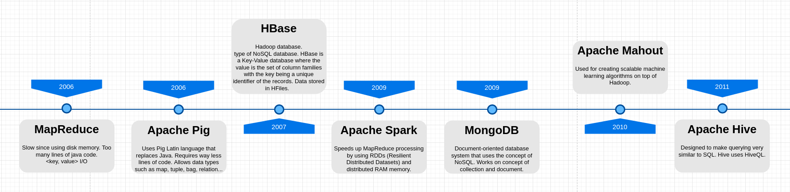
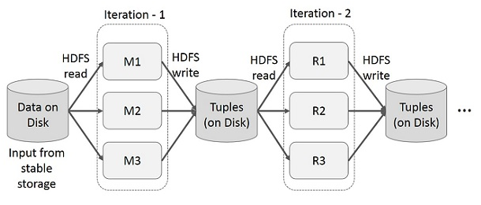
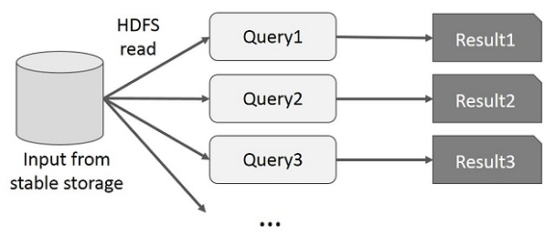
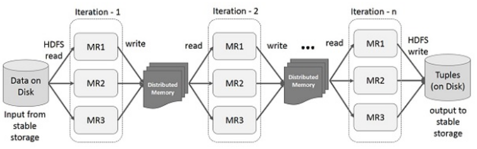
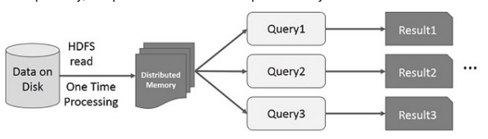

[Good tutorial](https://data-flair.training/blogs/spark-tutorials-home/#tutorials)

&nbsp;&nbsp;&nbsp;&nbsp;&nbsp;&nbsp;&nbsp;&nbsp;&nbsp;&nbsp;&nbsp;&nbsp;&nbsp;&nbsp;&nbsp;&nbsp;&nbsp;&nbsp; 

Industries are using Hadoop extensively to analyze their data sets. The reason is that Hadoop framework is based on a simple programming model (MapReduce) and it enables a computing solution that is scalable, flexible, fault-tolerant and cost effective. Here, **the main concern is to maintain speed in processing large datasets** in terms of **waiting time between queries and waiting time to run the program.**

Spark was introduced by Apache Software Foundation for speeding up the Hadoop computational computing software process.

As against a common belief, **Spark is not a modified version of Hadoop and is not, really, dependent on Hadoop** because it has its own cluster management. Hadoop is just one of the ways to implement Spark.

**Spark uses Hadoop in two ways** – one is **storage** and second is **processing**. Since Spark has its own cluster management computation, it uses Hadoop for storage purpose only.

Apache Spark is a lightning-fast cluster computing technology, designed for fast computation. It is based on Hadoop MapReduce and it extends the MapReduce model to efficiently use it for more types of computations, which includes interactive queries and stream processing. The main feature of Spark is its in-memory cluster computing that increases the processing speed of an application.

Spark is designed to cover a wide range of workloads such as batch applications, iterative algorithms, interactive queries and streaming. Apart from supporting all these workload in a respective system, it reduces the management burden of maintaining separate tools.

Spark is a data processing framework that was developed due to the need for solution that overcomes the limitations of the MapReduce.  Those limitations are:

1. Unsuitable in real-time processing --> MapReduce is based on batch processing
2. Unsuitable for trivial operations such as Filter and Joins due to the key-value patern
3. Unfit for large data on network --> takes a lot of time to copy the data which may cause network bandwidth issues, but it works well locally on the node where the data resides.
4. Unsuitable with Online Transaction Processing (OLTP) because it is batch based and hence has latency.
5. Unfit for processing graphs
6. Unfit for iterative executions --> e.g. K-means needs to rerun itself on the data in order to get better resullts, whereas MapReduce runs from the start every time (stateless executor). 

There was no powerful engine in the industry, that can process the data both in real-time and batch mode. Also, there was a requirement that one engine can respond in sub-second and perform in-memory processing.
Therefore, Apache Spark programming enters, it is a powerful open source engine. Since, it offers **real-time stream processing, interactive processing, graph processing, in-memory processing as well as batch processing**. 
Even with very fast speed, ease of use and standard interface. Basically, these features create the difference between Hadoop and Spark. 

Spark gives the following additional features:

1. Suitable for real-time processing
2. Suitable for trivial operations
3. Can fir large data on network
4. Suitable for OLTP
5. Suitable for graphs
6. Suitable for iterative executions

Spark is about 100 times faster than MapReduce.

Spark Components:

1. Spark Core and Resilient Distributed Databases (RDDs)
2. Spark SQL
3. Spark Streaming 
4. Machine Learning Library (MLlib)
5. GraphX

**Apache Spark Core**

Spark Core is the underlying general execution engine for spark platform that all other functionality is built upon. It provides In-Memory computing and referencing datasets in external storage systems.

**Spark SQL**

Spark SQL is a component on top of Spark Core that introduces a new data abstraction called SchemaRDD, which provides support for structured and semi-structured data.

**Spark Streaming**

Spark Streaming leverages Spark Core's fast scheduling capability to perform streaming analytics. It ingests data in mini-batches and performs RDD (Resilient Distributed Datasets) transformations on those mini-batches of data.

**MLlib (Machine Learning Library)**

MLlib is a distributed machine learning framework above Spark because of the distributed memory-based Spark architecture. It is, according to benchmarks, done by the MLlib developers against the Alternating Least Squares (ALS) implementations. Spark MLlib is nine times as fast as the Hadoop disk-based version of Apache Mahout (before Mahout gained a Spark interface).

**GraphX**

GraphX is a distributed graph-processing framework on top of Spark. It provides an API for expressing graph computation that can model the user-defined graphs by using Pregel abstraction API. It also provides an optimized runtime for this abstraction.

# Resilient Distributed Datasets

Resilient Distributed Datasets (RDD) is a fundamental data structure of Spark. It is an immutable distributed collection of objects. Each dataset in RDD is divided into logical partitions, which may be computed on different nodes of the cluster. RDDs can contain any type of Python, Java, or Scala objects, including user-defined classes.

There are two ways to create RDDs − **parallelizing** an existing collection in your driver program, or **referencing a dataset** in an external storage system, such as a shared file system, HDFS, HBase, or any data source offering a **Hadoop Input Format**.

Spark makes use of the concept of RDD to achieve faster and efficient MapReduce operations!

**Data Sharing is Slow in MapReduce**

MapReduce is widely adopted for processing and generating large datasets with a parallel, distributed algorithm on a cluster. It allows users to write parallel computations, using a set of high-level operators, without having to worry about work distribution and fault tolerance.

Unfortunately, in most current frameworks, the only way to reuse data between computations (Ex − between two MapReduce jobs) is to write it to an external stable storage system (Ex − HDFS). Although this framework provides numerous abstractions for accessing a cluster’s computational resources, users still want more.

Both Iterative and Interactive applications require faster data sharing across parallel jobs. Data sharing is slow in MapReduce due to replication, serialization, and disk IO. Regarding storage system, most of the Hadoop applications, they spend more than 90% of the time doing HDFS read-write operations.

Now, let's see the difference between Itertive and interactive operations on MapReduce vs. Spark.

Iterative Operations on MapReduce
Reuse intermediate results across multiple computations in multi-stage applications. The following illustration explains how the current framework works, while doing the iterative operations on MapReduce. This incurs substantial overheads due to data replication, disk I/O, and serialization, which makes the system slow.

&nbsp;&nbsp;&nbsp;&nbsp;&nbsp;&nbsp;&nbsp;&nbsp;&nbsp;&nbsp;&nbsp;&nbsp;&nbsp;&nbsp;&nbsp;&nbsp;&nbsp;&nbsp; 
&nbsp;&nbsp;&nbsp;&nbsp;&nbsp;&nbsp;&nbsp;&nbsp;&nbsp;&nbsp;&nbsp;&nbsp;&nbsp;&nbsp;&nbsp;&nbsp;&nbsp;&nbsp; 
&nbsp;&nbsp;&nbsp;&nbsp;&nbsp;&nbsp;&nbsp;&nbsp;&nbsp;&nbsp;&nbsp;&nbsp;&nbsp;&nbsp;&nbsp;&nbsp;&nbsp;&nbsp; 

Interactive Operations on MapReduce
User runs ad-hoc queries on the same subset of data. Each query will do the disk I/O on the stable storage, which can dominate application execution time.

The following illustration explains how the current framework works while doing the interactive queries on MapReduce.

&nbsp;&nbsp;&nbsp;&nbsp;&nbsp;&nbsp;&nbsp;&nbsp;&nbsp;&nbsp;&nbsp;&nbsp;&nbsp;&nbsp;&nbsp;&nbsp;&nbsp;&nbsp; 
&nbsp;&nbsp;&nbsp;&nbsp;&nbsp;&nbsp;&nbsp;&nbsp;&nbsp;&nbsp;&nbsp;&nbsp;&nbsp;&nbsp;&nbsp;&nbsp;&nbsp;&nbsp; 
&nbsp;&nbsp;&nbsp;&nbsp;&nbsp;&nbsp;&nbsp;&nbsp;&nbsp;&nbsp;&nbsp;&nbsp;&nbsp;&nbsp;&nbsp;&nbsp;&nbsp;&nbsp; 

**Data Sharing using Spark RDD**

Data sharing is slow in MapReduce due to replication, serialization, and disk IO. Most of the Hadoop applications, they spend more than 90% of the time doing HDFS read-write operations.

Recognizing this problem, researchers developed a specialized framework called Apache Spark. The key idea of spark is Resilient Distributed Datasets (RDD); it supports in-memory processing computation. This means, it stores the state of memory as an object across the jobs and the object is sharable between those jobs. Data sharing in memory is 10 to 100 times faster than network and Disk.

Let us now try to find out how iterative and interactive operations take place in Spark RDD.

**Iterative Operations on Spark RDD**

The illustration given below shows the iterative operations on Spark RDD. It will store intermediate results in a distributed memory instead of Stable storage (Disk) and make the system faster.

Note − If the Distributed memory (RAM) is not sufficient to store intermediate results (State of the JOB), then it will store those results on the disk.

&nbsp;&nbsp;&nbsp;&nbsp;&nbsp;&nbsp;&nbsp;&nbsp;&nbsp;&nbsp;&nbsp;&nbsp;&nbsp;&nbsp;&nbsp;&nbsp;&nbsp;&nbsp; 
&nbsp;&nbsp;&nbsp;&nbsp;&nbsp;&nbsp;&nbsp;&nbsp;&nbsp;&nbsp;&nbsp;&nbsp;&nbsp;&nbsp;&nbsp;&nbsp;&nbsp;&nbsp; 
&nbsp;&nbsp;&nbsp;&nbsp;&nbsp;&nbsp;&nbsp;&nbsp;&nbsp;&nbsp;&nbsp;&nbsp;&nbsp;&nbsp;&nbsp;&nbsp;&nbsp;&nbsp; 

**Interactive Operations on Spark RDD**

This illustration shows interactive operations on Spark RDD. If different queries are run on the same set of data repeatedly, this particular data can be kept in memory for better execution times.

&nbsp;&nbsp;&nbsp;&nbsp;&nbsp;&nbsp;&nbsp;&nbsp;&nbsp;&nbsp;&nbsp;&nbsp;&nbsp;&nbsp;&nbsp;&nbsp;&nbsp;&nbsp; 
&nbsp;&nbsp;&nbsp;&nbsp;&nbsp;&nbsp;&nbsp;&nbsp;&nbsp;&nbsp;&nbsp;&nbsp;&nbsp;&nbsp;&nbsp;&nbsp;&nbsp;&nbsp; 
&nbsp;&nbsp;&nbsp;&nbsp;&nbsp;&nbsp;&nbsp;&nbsp;&nbsp;&nbsp;&nbsp;&nbsp;&nbsp;&nbsp;&nbsp;&nbsp;&nbsp;&nbsp; 

By default, each transformed RDD may be recomputed each time you run an action on it. However, you may also persist an RDD in memory, in which case Spark will keep the elements around on the cluster for much faster access, the next time you query it. There is also support for persisting RDDs on disk, or replicated across multiple nodes.
