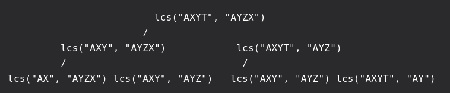
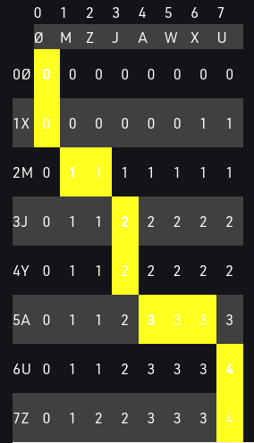

# Problem:

 &nbsp;&nbsp;&nbsp;&nbsp;&nbsp;&nbsp;&nbsp;&nbsp;&nbsp;&nbsp;&nbsp;&nbsp;&nbsp;
 Given two sequences, find the *length* of longest subsequence present in both of them. A subsequence is a sequence that appears in the same relative order, but not necessarily contiguous. For example, “abc”, “abg”, “bdf”, “aeg”, ‘”acefg”, .. etc are subsequences of “abcdefg”. 
 
 This problem can easily solved recursively. However, that is not good enough. There is a lot overlapping when it comes to long sequences and the runtime is O(n2) in the worst case when the sequences have no common characters.
 

def lcs(X, Y, m, n):
 
    if m == 0 or n == 0:
        return 0;
    # case when characters from x and y are equal
    elif X[m-1] == Y[n-1]:
        return 1 + lcs(X, Y, m-1, n-1);
    # case when characters from x and y are not equal
    # we have to compare x with y-1 and opposite
    else:
        return max(lcs(X, Y, m, n-1), lcs(X, Y, m-1, n));
 
 
# Driver program to test the above function
X = "GCGCAATG"
Y = "GCCCTAGCG"
print ("Length of LCS is ", lcs(X , Y, len(X), len(Y)))



 In the following image of a partial tree, we can see taht there are places where coputation was repeated. 
 
  &nbsp;&nbsp;&nbsp;&nbsp;&nbsp;&nbsp;&nbsp;&nbsp;&nbsp;&nbsp;&nbsp;&nbsp;&nbsp;&nbsp;&nbsp;&nbsp;&nbsp;&nbsp; 

 We can solve this using a bottom-up dynamic programming approach, which avoids redundant computation, as follows:


import numpy as np

def lcs(X , Y):
    # find the length of the strings
    m = len(X)
    n = len(Y)
 
    # declaring the array for storing the dp values
    L = [[None]*(n+1) for i in range(m+1)]
 
    """Following steps build L[m+1][n+1] in bottom up fashion
    Note: L[i][j] contains length of LCS of X[0..i-1]
    and Y[0..j-1]"""
    for i in range(m+1):
        for j in range(n+1):
            if i == 0 or j == 0 :
                L[i][j] = 0
            elif X[i-1] == Y[j-1]:
                L[i][j] = L[i-1][j-1]+1
            else:
                L[i][j] = max(L[i-1][j] , L[i][j-1])
                
    print(np.matrix(L))
    
    # L[m][n] contains the length of LCS of X[0..n-1] & Y[0..m-1]
    
    # Following code is used to print LCS
    index = L[m][n]
  
    # Create a character array to store the lcs string
    lcs = [""] * (index+1)
    lcs[index] = ""
  
    # Start from the right-most-bottom-most corner and
    # one by one store characters in lcs[]
    i = m
    j = n
    while i > 0 and j > 0:
  
        # If current character in X[] and Y are same, then
        # current character is part of LCS
        if X[i-1] == Y[j-1]:
            lcs[index-1] = X[i-1]
            i-=1
            j-=1
            index-=1
  
        # If not same, then find the larger of two and
        # go in the direction of larger value
        elif L[i-1][j] > L[i][j-1]:
            i-=1
        else:
            j-=1
        print("current position is: ", i,",",j)
    print ("LCS of " + X + " and " + Y + " is " + "".join(lcs) )
  
    return L[m][n]

X = "GCGCAATG"
Y = "GCCCTAGCG"
print("The final length of LCS is:", lcs(X,Y))



&nbsp;&nbsp;&nbsp;&nbsp;&nbsp;&nbsp;&nbsp;&nbsp;&nbsp;&nbsp;&nbsp;&nbsp;&nbsp;
 Once this code has been executed, you will be able to see the table created and follow the printing part pf the function and recognize the pattern used to print the LCS.
 
 The following image was taken from `Wiki` and represents an example how printing path would look like:
 
 &nbsp;&nbsp;&nbsp;&nbsp;&nbsp;&nbsp;&nbsp;&nbsp;&nbsp;&nbsp;&nbsp;&nbsp;&nbsp;&nbsp;&nbsp;&nbsp;&nbsp;&nbsp; 

 &nbsp;&nbsp;&nbsp;&nbsp;&nbsp;&nbsp;&nbsp;&nbsp;&nbsp;&nbsp;&nbsp;&nbsp;&nbsp;
 The Squid

 
