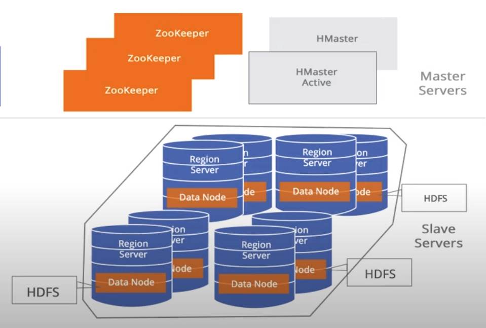
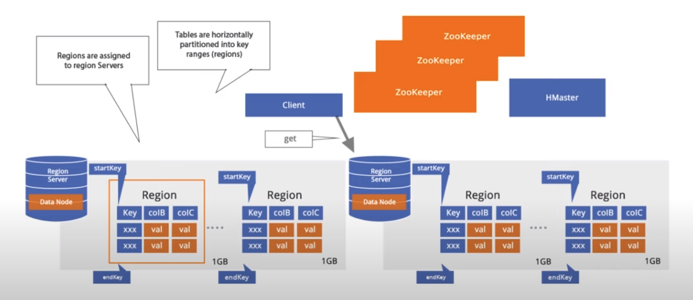
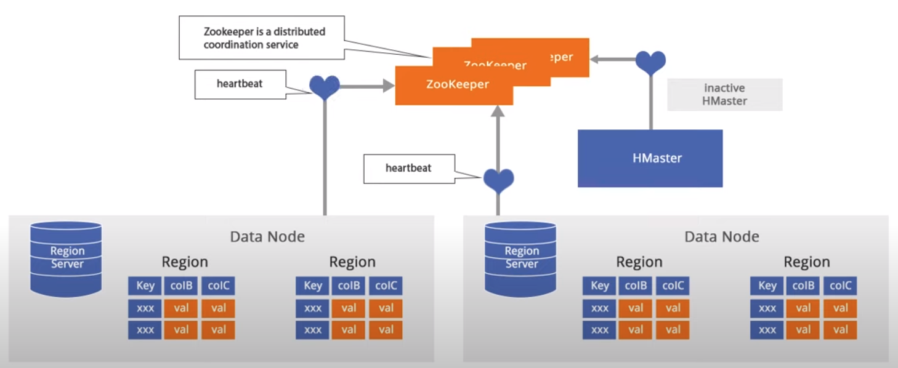

 
 **HBase** is a database management system that rests on top of the HDFS (Hadoop) and enables real time analysis of data. In other words, this is a Hadoop database. It is modeled based after Google's Bogtable and it is used when random, real-time read/write access is needed for Big Data. 
 
 It can store a huge amount of data in a tabular format for extremly fast reads and writes. 
 
 HBase is a type of NoSQL database and it is classified as a key-value store. Some characteristics are:
        
 - Value is identified with a key
 - Key and Value are ByteArray type
 - Values are stored in key-orders 
 
 Hbse is a database in which tables have no schema. At the time of table creation, column families are defined, not columns.
 
# NoSQL Database

 NoSQL is a form of unstructured data and it contains a wide variety of different types of data. On the other hand, RDBMS contains structured data that is heavily dependent on rows, columns, and tables. 
 
 
 Types of NoSQL:
 
      - Key Value database (containts a big hash table of keys and values - Oracle NoSQL,Scalaris)
      - Document-based database (stores documents made up of tagged elements - MongoDB, CouchDB, OrientDB, RavenDB)
      - Column-based database (each storage block contains data from only one column - BigTable, Cassandra, HBase, Hypertable)
      - Graph-based database (network database that uses nodes to represent and store data - Neo4j, Infinite Graph, FlockDB)
      
&nbsp;&nbsp;&nbsp;&nbsp;&nbsp;&nbsp;&nbsp;&nbsp;&nbsp;&nbsp;&nbsp;&nbsp;&nbsp;&nbsp;&nbsp;&nbsp;&nbsp;&nbsp; 

&nbsp;&nbsp;&nbsp;&nbsp;&nbsp;&nbsp;&nbsp;&nbsp;&nbsp;&nbsp;&nbsp;&nbsp;&nbsp;&nbsp;&nbsp;&nbsp;&nbsp;&nbsp;&nbsp;&nbsp;&nbsp;&nbsp;&nbsp;&nbsp;&nbsp;&nbsp;&nbsp;&nbsp;&nbsp;&nbsp;&nbsp;&nbsp;&nbsp;&nbsp;&nbsp;&nbsp;&nbsp;&nbsp;&nbsp;&nbsp;&nbsp;&nbsp;&nbsp;&nbsp;&nbsp;&nbsp;&nbsp;&nbsp;&nbsp;&nbsp;&nbsp;&nbsp;&nbsp;&nbsp;&nbsp;&nbsp;&nbsp;&nbsp;&nbsp;*Figure 1 - Types of NoSQL*

# HBase Architecture

 HBase contains 2 types of nodes - **Master node and RegionServer nodes.** There is only one master node running at the time, whereas there can be one or more region servers. The high availability is maintained by a **service for distributed systems called Zookeeper**. 
 
 The master node manages cluster operations such as *creation and deletion of tables, assignment, load balancing, and splitting.* 
 
 On the other side, there can be one or more RegionServers running at a time, while hosting tables, performing *read and writes* of data. Every RegionServer acts as a slave, and every RegionServer Node communicates with the master node. 
 
 The actual data is stored in RegionServers in a form of files known as HFiles, which are optimized files for the storage of data.
 
 **Zookeeper** performs the distribution coordination. 
 
 &nbsp;&nbsp;&nbsp;&nbsp;&nbsp;&nbsp;&nbsp;&nbsp;&nbsp;&nbsp;&nbsp;&nbsp;&nbsp;&nbsp;&nbsp;&nbsp;&nbsp;&nbsp; 

&nbsp;&nbsp;&nbsp;&nbsp;&nbsp;&nbsp;&nbsp;&nbsp;&nbsp;&nbsp;&nbsp;&nbsp;&nbsp;&nbsp;&nbsp;&nbsp;&nbsp;&nbsp;&nbsp;&nbsp;&nbsp;&nbsp;&nbsp;&nbsp;&nbsp;&nbsp;&nbsp;&nbsp;&nbsp;&nbsp;&nbsp;&nbsp;&nbsp;&nbsp;&nbsp;&nbsp;&nbsp;&nbsp;&nbsp;&nbsp;&nbsp;&nbsp;&nbsp;&nbsp;&nbsp;&nbsp;&nbsp;&nbsp;&nbsp;&nbsp;&nbsp;&nbsp;&nbsp;&nbsp;&nbsp;&nbsp;&nbsp;&nbsp;&nbsp;*Figure 2 - HBase Architecture*

 The data in HBase table is divided *horizontally* accross different regions. In other words, a **Region** in HBase is *a subset of a table's rows. These regions are sorted accross different RegionServeers, where 1 RegionServer can serve thousands of regions. Let's see how that looks like:
 
  &nbsp;&nbsp;&nbsp;&nbsp;&nbsp;&nbsp;&nbsp;&nbsp;&nbsp;&nbsp;&nbsp;&nbsp;&nbsp;&nbsp;&nbsp;&nbsp;&nbsp;&nbsp; 

&nbsp;&nbsp;&nbsp;&nbsp;&nbsp;&nbsp;&nbsp;&nbsp;&nbsp;&nbsp;&nbsp;&nbsp;&nbsp;&nbsp;&nbsp;&nbsp;&nbsp;&nbsp;&nbsp;&nbsp;&nbsp;&nbsp;&nbsp;&nbsp;&nbsp;&nbsp;&nbsp;&nbsp;&nbsp;&nbsp;&nbsp;&nbsp;&nbsp;&nbsp;&nbsp;&nbsp;&nbsp;&nbsp;&nbsp;&nbsp;&nbsp;&nbsp;&nbsp;&nbsp;&nbsp;&nbsp;&nbsp;&nbsp;&nbsp;&nbsp;&nbsp;&nbsp;&nbsp;&nbsp;&nbsp;&nbsp;&nbsp;&nbsp;&nbsp;*Figure 2 - Region Servers & Regions*

 - Every region is sorted according to the **key**, and the content of the region is specified by the **start key & end key**.
 
HBase is a Key-Value database where the value is the set of column families with the key being a unique identifier of the records. 

Every RegionServer sends its **heartbeats** to the ZooKeeper as well as HMaster so ZooKeeper can maintain which among them are active or inactive.

 *Note: there may be more HMaster nodes for the case if one fails, it does not affect the rest of the nodes.*
 
 &nbsp;&nbsp;&nbsp;&nbsp;&nbsp;&nbsp;&nbsp;&nbsp;&nbsp;&nbsp;&nbsp;&nbsp;&nbsp;&nbsp;&nbsp;&nbsp;&nbsp;&nbsp; 

&nbsp;&nbsp;&nbsp;&nbsp;&nbsp;&nbsp;&nbsp;&nbsp;&nbsp;&nbsp;&nbsp;&nbsp;&nbsp;&nbsp;&nbsp;&nbsp;&nbsp;&nbsp;&nbsp;&nbsp;&nbsp;&nbsp;&nbsp;&nbsp;&nbsp;&nbsp;&nbsp;&nbsp;&nbsp;&nbsp;&nbsp;&nbsp;&nbsp;&nbsp;&nbsp;&nbsp;&nbsp;&nbsp;&nbsp;&nbsp;&nbsp;&nbsp;&nbsp;&nbsp;&nbsp;&nbsp;&nbsp;&nbsp;&nbsp;&nbsp;&nbsp;&nbsp;&nbsp;&nbsp;&nbsp;&nbsp;&nbsp;&nbsp;&nbsp;*Figure 3 - Communication Inside HBase*
 
 Another very important concept is a **Meta Table** that contains the information about in which RegionServer, the  *StartKey* and *EndKey* can be found. This is important becausae if you did not have the meta table, you would have to scan every region of particular table to get the desired data. On the other side, if you wanted to get some data for a particular key and if you had meta table, you could directly go to the specified region server. 
 
 **Get** - operation performed by client to read a specific entry from the HBase table.  
 
 **Put** - operation performed by a client to write some data to HBase table. 
 
 When these operations are requested client:
 
  - connects to the ZooKeeper to get the address of the meta table, then 
  - it stores the details of the data present in the meta table
  - looks up to that particular data to connect to a specific RegionServer

 Now, let's see what's going on in the RegionServer.
 
 
# Storage Model of HBase

 The two major components of the storage model are:
 
 1. **Partitioning**
 
 - A table is horizontally partitioned into regions.
 - Each region is managed by RegionServer.
 - A RegionServer may hold multiple regions.

 2. **Persistance and data availability**

 - HBase stores its data in HDFS (Hadoop Distributed File System), does not replicate RegionServers and relies on HDFS replication for data availability.
 - Updates and reads are served from the in-memory cache called **MemStore**.

# Data Storage in HBase

 Data is stored in files called **HFiles or StoreFiles** that are usually saved in HDFS. Hfile is a key-value map generated due to MapReduce operations performed by Hadoop. When the data is added, it is writted to a log ccalled *Write Ahead Log* and stored in the memory, MemStore. HFiles are immutable (cannot be changed) since HDFS does not support updates on existing files. 
 
# Data Model

     
 &nbsp;&nbsp;&nbsp;&nbsp;&nbsp;&nbsp;&nbsp;&nbsp;&nbsp;&nbsp;&nbsp;&nbsp;&nbsp;
 Nikola Andrić
 
 

 
