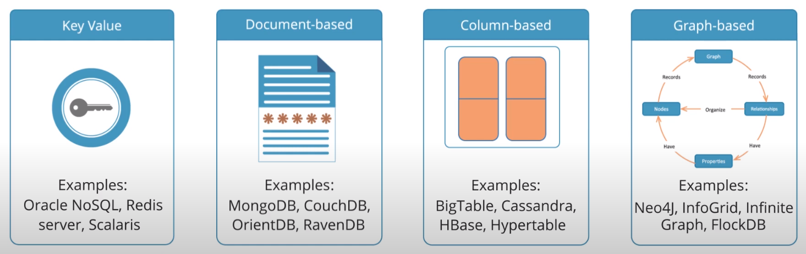

 
 HBase is a database management system that rests on top of the HDFS (Hadoop) and enables real time analysis of data. In other words, this is a Hadoop database. 
 
 It can store a huge amount of data in a tabular format for extremly fast reads and writes. 
 
 HBase is a type of NoSQL database and it is classified as a key-value store. Some characteristics are:
        
    - Value is identified with a key
    - Key and Value are ByteArray type
    - Values are stored in key-orders 
 
 Hbse is a database in which tables have no schema. At the time of table creation, column families are defined, not columns.
 
# NoSQL Database

 NoSQL is a form of unstructured data and it contains a wide variety of different types of data. On the other hand, RDBMS contains structured data that is heavily dependent on rows, columns, and tables. 
 
 
 Types of NoSQL:
 
      - Key Value database (containts a big hash table of keys and values - Oracle NoSQL,Scalaris)
      - Document-based database (stores documents made up of tagged elements - MongoDB, CouchDB, OrientDB, RavenDB)
      - Column-based database (each storage block contains data from only one column - BigTable, Cassandra, HBase, Hypertable)
      - Graph-based database (network database that uses nodes to represent and store data - Neo4j, Infinite Graph, FlockDB)
      
&nbsp;&nbsp;&nbsp;&nbsp;&nbsp;&nbsp;&nbsp;&nbsp;&nbsp;&nbsp;&nbsp;&nbsp;&nbsp;&nbsp;&nbsp;&nbsp;&nbsp;&nbsp; 

&nbsp;&nbsp;&nbsp;&nbsp;&nbsp;&nbsp;&nbsp;&nbsp;&nbsp;&nbsp;&nbsp;&nbsp;&nbsp;&nbsp;&nbsp;&nbsp;&nbsp;&nbsp;&nbsp;&nbsp;&nbsp;&nbsp;&nbsp;&nbsp;&nbsp;&nbsp;&nbsp;&nbsp;&nbsp;&nbsp;&nbsp;&nbsp;&nbsp;&nbsp;&nbsp;&nbsp;&nbsp;&nbsp;&nbsp;&nbsp;&nbsp;&nbsp;&nbsp;&nbsp;&nbsp;&nbsp;&nbsp;&nbsp;&nbsp;&nbsp;&nbsp;&nbsp;&nbsp;&nbsp;&nbsp;&nbsp;&nbsp;&nbsp;&nbsp;*Figure 1 - Types of NoSQL*

 
 

 
