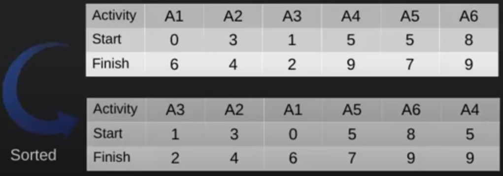
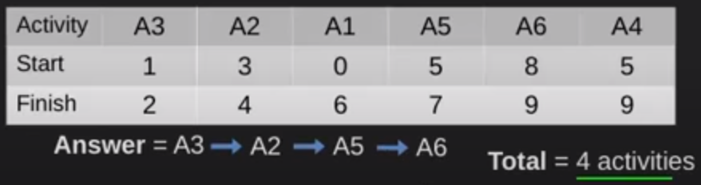

 
# Problem Statement
 
 &nbsp;&nbsp;&nbsp;&nbsp;&nbsp;&nbsp;&nbsp;&nbsp;&nbsp;&nbsp;&nbsp;&nbsp;&nbsp;
 You are given n activities with their start and finish times. Select the maximum number of activities that can be performed by a single person, assuming that a person can only work on a single activity at a time. 
 
 For instance, we are given the following table.
 
 

| Activity  |  A1  |  A2  |  A3  |   
| :---------|  :-  |  :-  |  :-  |
| `Start`   | `12` | `10` | `20` |
| `Finish`  | `25` | `20` | `30` |

 
 &nbsp;&nbsp;&nbsp;&nbsp;&nbsp;&nbsp;&nbsp;&nbsp;&nbsp;&nbsp;&nbsp;&nbsp;&nbsp;
 If we choose activity A1, we will not be able to pick activity A2 or A3 becuase their starting tiems 10 and 20 respectively are in the past once we reach the end of the activity A1, which for ending time has 25. But, if we picked activity A2 first, the ending time is 20 and we see that A3 starting time is 20, which means that we can start this activiry as well. 
 
 How do we go about this problem when solving it?
 
 1. Sort all the activities based on their finish times
 2. Select the first activity from the sorted list of activities
 3. If the start time of the next activity is greater or equal to the finishing time of the previously selected activity, then select this activity 

We are given the list of the following activities in the Figure 1. We go ahead and sort them according to their finishing times.

&nbsp;&nbsp;&nbsp;&nbsp;&nbsp;&nbsp;&nbsp;&nbsp;&nbsp;&nbsp;&nbsp;&nbsp;&nbsp;&nbsp;&nbsp;&nbsp;&nbsp;&nbsp; 

&nbsp;&nbsp;&nbsp;&nbsp;&nbsp;&nbsp;&nbsp;&nbsp;&nbsp;&nbsp;&nbsp;&nbsp;&nbsp;&nbsp;&nbsp;&nbsp;&nbsp;&nbsp;&nbsp;&nbsp;&nbsp;&nbsp;&nbsp;&nbsp;&nbsp;&nbsp;&nbsp;&nbsp;&nbsp;&nbsp;&nbsp;&nbsp;&nbsp;&nbsp;&nbsp;&nbsp;&nbsp;&nbsp;&nbsp;&nbsp;&nbsp;&nbsp;&nbsp;&nbsp;&nbsp;&nbsp;&nbsp;&nbsp;&nbsp;&nbsp;&nbsp;&nbsp;&nbsp;&nbsp;&nbsp;&nbsp;&nbsp;&nbsp;&nbsp;*Figure 1 - Sorted Table*

&nbsp;&nbsp;&nbsp;&nbsp;&nbsp;&nbsp;&nbsp;&nbsp;&nbsp;&nbsp;&nbsp;&nbsp;&nbsp;
We now select the first activity from the sorted table A3, print it, and take a look at the next activity. The next activity starts at time 3, which is after the finishing time of the previously selected activity 2. Hence, we select/print the activity A2. The next activity is A1, whose starting time is 0 and the finishing time of the previous activity was 4, so the time 0 is in the past and we cannot select this activity. We move onto the next one.
 
 &nbsp;&nbsp;&nbsp;&nbsp;&nbsp;&nbsp;&nbsp;&nbsp;&nbsp;&nbsp;&nbsp;&nbsp;&nbsp;&nbsp;&nbsp;&nbsp;&nbsp;&nbsp; 

&nbsp;&nbsp;&nbsp;&nbsp;&nbsp;&nbsp;&nbsp;&nbsp;&nbsp;&nbsp;&nbsp;&nbsp;&nbsp;&nbsp;&nbsp;&nbsp;&nbsp;&nbsp;&nbsp;&nbsp;&nbsp;&nbsp;&nbsp;&nbsp;&nbsp;&nbsp;&nbsp;&nbsp;&nbsp;&nbsp;&nbsp;&nbsp;&nbsp;&nbsp;&nbsp;&nbsp;&nbsp;&nbsp;&nbsp;&nbsp;&nbsp;&nbsp;&nbsp;&nbsp;&nbsp;&nbsp;&nbsp;&nbsp;&nbsp;&nbsp;&nbsp;&nbsp;&nbsp;&nbsp;&nbsp;&nbsp;&nbsp;&nbsp;&nbsp;*Figure 2 - Final List of Activities*

# Coding Solution


def maximize_activities(activities):
    # sort the activities based on the finishing time
    activities = sorted(activities, key=lambda x:x[1])

    selected = []
    # append the first element in the list
    selected.append(activities[0])
    
    # keep track of the curenly executing activity
    selected_obj_index = 0
    
    # compare the start time of the next activity with the finishing 
    # time of the finish time of the current activity
    for i in range(1,len(activities)):
        if activities[selected_obj_index][1] <= activities[i][0]:
            selected.append(activities[i])
            selected_obj_index = i
            
    return selected
    

Activity = [[0,6], [1, 2], [3, 4], [5,9],[5, 7], [8, 9]]

selected = maximize_activities(Activity)

print("Following activities are selected :", end=" ")

print(selected)



 &nbsp;&nbsp;&nbsp;&nbsp;&nbsp;&nbsp;&nbsp;&nbsp;&nbsp;&nbsp;&nbsp;&nbsp;&nbsp;
 Nikola Andrić

 
