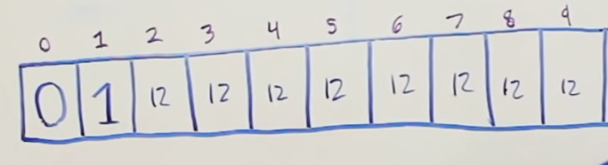
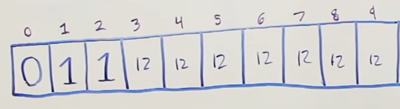

 
 # Problem:

 &nbsp;&nbsp;&nbsp;&nbsp;&nbsp;&nbsp;&nbsp;&nbsp;&nbsp;&nbsp;&nbsp;&nbsp;&nbsp;
 Given a certain amount of coins that associated values to them (ex. coins=[1,2,5]), determine the **minimum amount of coins** that we need to reach the fiven **amount** (ex. amount = 11).

 *NOTE: same coins can be chosen multiple times.*
  

 &nbsp;&nbsp;&nbsp;&nbsp;&nbsp;&nbsp;&nbsp;&nbsp;&nbsp;&nbsp;&nbsp;&nbsp;&nbsp;
 This problem can be solved using recursion, top-down DP, or bottom-up DP. We will go over top-down and bottom-up DP approaches.
 
### Top-Down DP Approach
 
 
 
 coins = [1,2,5]
 amount = 11
 
 
 
 &nbsp;&nbsp;&nbsp;&nbsp;&nbsp;&nbsp;&nbsp;&nbsp;&nbsp;&nbsp;&nbsp;&nbsp;&nbsp;
 In the top-down DP approach, our root node would have the value 11. From there, we would make 1 decision with each possible coin and see what the result is. At that point we know that we made 1 decision and we chose 1 coin. Hence, we need to add 1 to our final amount of coins. We would repeate the same process until we reach value of 0 at some node. If a value in a node is to be negative, that node should not be created, since we do not have a way to reach teh given amoun using that combination of coins. We can see in the following image how that would look like. Here, the tree is not fully developed, but it is enough to get the point accross.
 
&nbsp;&nbsp;&nbsp;&nbsp;&nbsp;&nbsp;&nbsp;&nbsp;&nbsp;&nbsp;&nbsp;&nbsp;&nbsp;&nbsp;&nbsp;&nbsp;&nbsp;&nbsp; 

&nbsp;&nbsp;&nbsp;&nbsp;&nbsp;&nbsp;&nbsp;&nbsp;&nbsp;&nbsp;&nbsp;&nbsp;&nbsp;&nbsp;&nbsp;&nbsp;&nbsp;&nbsp;&nbsp;&nbsp;&nbsp;&nbsp;&nbsp;&nbsp;&nbsp;&nbsp;&nbsp;&nbsp;&nbsp;&nbsp;&nbsp;&nbsp;&nbsp;&nbsp;&nbsp;&nbsp;&nbsp;&nbsp;&nbsp;&nbsp;&nbsp;&nbsp;&nbsp;&nbsp;&nbsp;&nbsp;&nbsp;&nbsp;&nbsp;&nbsp;&nbsp;&nbsp;&nbsp;&nbsp;&nbsp;&nbsp;&nbsp;&nbsp;&nbsp;*Figure 1 - top-down approach*
 
 &nbsp;&nbsp;&nbsp;&nbsp;&nbsp;&nbsp;&nbsp;&nbsp;&nbsp;&nbsp;&nbsp;&nbsp;&nbsp;
 In the red circles we can see the nodes that require the same computation. We solve this, of cource, using *memoization*. 
 
 ### Bottom-Up DP Approach
 
 &nbsp;&nbsp;&nbsp;&nbsp;&nbsp;&nbsp;&nbsp;&nbsp;&nbsp;&nbsp;&nbsp;&nbsp;&nbsp;
 In the bottom-up DP approach, we compute answers to the smaller subproblems and build the higher level problems using the solutions to the smaller subproblems. In this particular problem, if we know the minimum amount of coins to reach the amount of 2, then we will need to make just one more decision to reach the amount of 4. Let's see how it works.
 
 &nbsp;&nbsp;&nbsp;&nbsp;&nbsp;&nbsp;&nbsp;&nbsp;&nbsp;&nbsp;&nbsp;&nbsp;&nbsp;
 1. We will initialize our array L of size 11 and assign arbitrarily high values as place-holders. In this case that can be value 12.
 2. For amount 0, we do no need any coins, hence we can initialize L[0] = 0.
 3. In order to solve the problem of choosing the minimum amount of coins for the amount 11, we need to solve the same problem for the smaller amounts than 11 (subproblems), which will lead towards to solution for value of 11.
 
 
 &nbsp;&nbsp;&nbsp;&nbsp;&nbsp;&nbsp;&nbsp;&nbsp;&nbsp;&nbsp;&nbsp;&nbsp;&nbsp;&nbsp;&nbsp;&nbsp;&nbsp;&nbsp; 

&nbsp;&nbsp;&nbsp;&nbsp;&nbsp;&nbsp;&nbsp;&nbsp;&nbsp;&nbsp;&nbsp;&nbsp;&nbsp;&nbsp;&nbsp;&nbsp;&nbsp;&nbsp;&nbsp;&nbsp;&nbsp;&nbsp;&nbsp;&nbsp;&nbsp;&nbsp;&nbsp;&nbsp;&nbsp;&nbsp;&nbsp;&nbsp;&nbsp;&nbsp;&nbsp;&nbsp;&nbsp;&nbsp;&nbsp;&nbsp;&nbsp;&nbsp;&nbsp;&nbsp;&nbsp;&nbsp;&nbsp;&nbsp;&nbsp;&nbsp;&nbsp;&nbsp;&nbsp;&nbsp;&nbsp;&nbsp;&nbsp;&nbsp;&nbsp;*Figure 2 - bottom-up approach*
 
 &nbsp;&nbsp;&nbsp;&nbsp;&nbsp;&nbsp;&nbsp;&nbsp;&nbsp;&nbsp;&nbsp;&nbsp;&nbsp;
 The process of thinking is as follows: For index 1 -->  we will try each coin from our list of possible coins, which will lead us to a new amount, *old_amount - coni_value = new_amount*. Try coin 1 => 1 - 1 = 0. Our subproblem turned to be the amount of 0, for which we know the answer = 0. Now, we know that we picked coin 1, which means that we made a decision to add that coin to the final amount of coins to reach amount 1. For amount of 0, we need 0 coins, we add the 1 coin of value 1 we chose, and our final amount of coins  we need to reach the amount would be the *minimum between previous value at index1 and our new solution => min(0+1, 12) = 1*. Hence, our best solution for value 1 so far is to pick only 1 coin. Try coin 2 => 1 - 2 = -1 => we do not take this in consideration since we get negative amount for our subproblem. Try coin 5 => 1 - 5 = -4 => we do not take this one in consideration eaither. 
 
  &nbsp;&nbsp;&nbsp;&nbsp;&nbsp;&nbsp;&nbsp;&nbsp;&nbsp;&nbsp;&nbsp;&nbsp;&nbsp;&nbsp;&nbsp;&nbsp;&nbsp;&nbsp; 

&nbsp;&nbsp;&nbsp;&nbsp;&nbsp;&nbsp;&nbsp;&nbsp;&nbsp;&nbsp;&nbsp;&nbsp;&nbsp;&nbsp;&nbsp;&nbsp;&nbsp;&nbsp;&nbsp;&nbsp;&nbsp;&nbsp;&nbsp;&nbsp;&nbsp;&nbsp;&nbsp;&nbsp;&nbsp;&nbsp;&nbsp;&nbsp;&nbsp;&nbsp;&nbsp;&nbsp;&nbsp;&nbsp;&nbsp;&nbsp;&nbsp;&nbsp;&nbsp;&nbsp;&nbsp;&nbsp;&nbsp;&nbsp;&nbsp;&nbsp;&nbsp;&nbsp;&nbsp;&nbsp;&nbsp;&nbsp;&nbsp;&nbsp;&nbsp;*Figure 3 - subproblem 1*

&nbsp;&nbsp;&nbsp;&nbsp;&nbsp;&nbsp;&nbsp;&nbsp;&nbsp;&nbsp;&nbsp;&nbsp;&nbsp;
We move on onto the index 2, meaning the subproblem of amount 2.  Repeat the process. Pick coint 1 => 2 - 1 = 1. Our new amount is 1. We have already computed the best amount of coins to reach the value of 1, which is 1. Since this value is 1 and we picked the coin 1 again, that is 1 + 1 = 2 coins picked to make the value of 2. The final test in the array = 8min(1+1, 12) = 2. Now, we pick coin with value 2 => 2 - 2 = 0. We, know that for the amount of 0, we need no coins, so we only picked one coin this time 0 + 1 = 1. Check with the previous best amount of coins for the value of 2 and choose the smaller one => min(0+1, 2) = 1. Hence, our new minimum amount of coins to reach teh value of w is 1 (we just picked the coin with value 2).  Now we try coin 5 => 2 - 5 = -3. Not considering this one. 

  &nbsp;&nbsp;&nbsp;&nbsp;&nbsp;&nbsp;&nbsp;&nbsp;&nbsp;&nbsp;&nbsp;&nbsp;&nbsp;&nbsp;&nbsp;&nbsp;&nbsp;&nbsp; 

&nbsp;&nbsp;&nbsp;&nbsp;&nbsp;&nbsp;&nbsp;&nbsp;&nbsp;&nbsp;&nbsp;&nbsp;&nbsp;&nbsp;&nbsp;&nbsp;&nbsp;&nbsp;&nbsp;&nbsp;&nbsp;&nbsp;&nbsp;&nbsp;&nbsp;&nbsp;&nbsp;&nbsp;&nbsp;&nbsp;&nbsp;&nbsp;&nbsp;&nbsp;&nbsp;&nbsp;&nbsp;&nbsp;&nbsp;&nbsp;&nbsp;&nbsp;&nbsp;&nbsp;&nbsp;&nbsp;&nbsp;&nbsp;&nbsp;&nbsp;&nbsp;&nbsp;&nbsp;&nbsp;&nbsp;&nbsp;&nbsp;&nbsp;&nbsp;*Figure 4 - subproblem 2*

 &nbsp;&nbsp;&nbsp;&nbsp;&nbsp;&nbsp;&nbsp;&nbsp;&nbsp;&nbsp;&nbsp;&nbsp;&nbsp;
 Nikola Andrić
 
 

 
