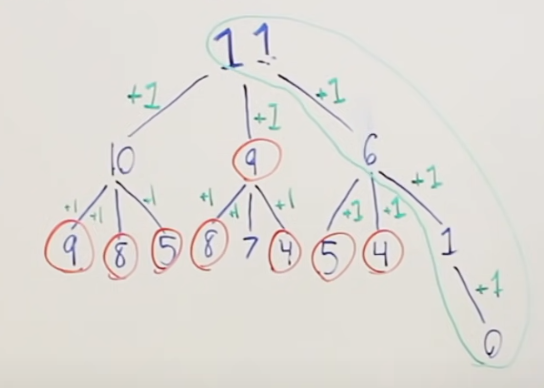
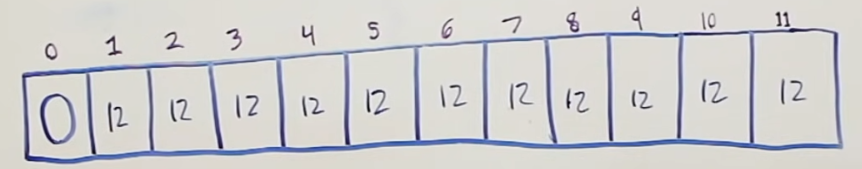

 
# Problem:

 &nbsp;&nbsp;&nbsp;&nbsp;&nbsp;&nbsp;&nbsp;&nbsp;&nbsp;&nbsp;&nbsp;&nbsp;&nbsp;
 Given a certain amount of coins that associated values to them (ex. coins=[[1,2,5]), determine the **minimum amount of coins** that we need to reach the fiven **amount** (ex. amount = 11).

 *NOTE: same coins can be chosen multiple times.*
  

 &nbsp;&nbsp;&nbsp;&nbsp;&nbsp;&nbsp;&nbsp;&nbsp;&nbsp;&nbsp;&nbsp;&nbsp;&nbsp;
 This problem can be solved using recursion, top-down DP, or bottom-up DP. We will go over top-down and bottom-up DP approaches.
 
 ### Top-Down DP Approach
 
 %highlight ruby%
 
 coins = [1,2,5]
 amount = 11
 
 %end highliight%
 
 In the top-down DP approach, our root node would have the value 11. From there, we would make 1 decision with each possible coin and see what the result is. At that point we know that we made 1 decision and we chose 1 coin. Hence, we need to add 1 to our final amount of coins. We would repeate the same process until we reach value of 0 at some node. If a value in a node is to be negative, that node should not be created, since we do not have a way to reach teh given amoun using that combination of coins. We can see in the following image how that would look like. Here, the tree is not fully developed, but it is enough to get the point accross.
 
&nbsp;&nbsp;&nbsp;&nbsp;&nbsp;&nbsp;&nbsp;&nbsp;&nbsp;&nbsp;&nbsp;&nbsp;&nbsp;&nbsp;&nbsp;&nbsp;&nbsp;&nbsp; 

&nbsp;&nbsp;&nbsp;&nbsp;&nbsp;&nbsp;&nbsp;&nbsp;&nbsp;&nbsp;&nbsp;&nbsp;&nbsp;&nbsp;&nbsp;&nbsp;&nbsp;&nbsp;&nbsp;&nbsp;&nbsp;&nbsp;&nbsp;&nbsp;&nbsp;&nbsp;&nbsp;&nbsp;&nbsp;&nbsp;&nbsp;&nbsp;&nbsp;&nbsp;&nbsp;&nbsp;&nbsp;&nbsp;&nbsp;&nbsp;&nbsp;&nbsp;&nbsp;&nbsp;&nbsp;&nbsp;&nbsp;&nbsp;&nbsp;&nbsp;&nbsp;&nbsp;&nbsp;&nbsp;&nbsp;&nbsp;&nbsp;&nbsp;&nbsp;*Figure 1 - top-down approach*
 
 &nbsp;&nbsp;&nbsp;&nbsp;&nbsp;&nbsp;&nbsp;&nbsp;&nbsp;&nbsp;&nbsp;&nbsp;&nbsp;
 In the red circles we can see the nodes that require the same computation. We solve this, of cource, using *memoization*. 
 
 ### Bottom-Up DP Approach
 
 &nbsp;&nbsp;&nbsp;&nbsp;&nbsp;&nbsp;&nbsp;&nbsp;&nbsp;&nbsp;&nbsp;&nbsp;&nbsp;
 In the bottom-up DP approach, we compute answers to the smaller subproblems and build the higher level problems using the solutions to the smaller subproblems. In this particular problem, if we know the minimum amount of coins to reach the amount of 2, then we will need to make just one more decision to reach the amount of 4. Let's see how it works.
 
 &nbsp;&nbsp;&nbsp;&nbsp;&nbsp;&nbsp;&nbsp;&nbsp;&nbsp;&nbsp;&nbsp;&nbsp;&nbsp;
 1. We will initialize our array L of size 11 and assign arbitrarily high values as place-holders. In this case that can be value 12.
 2. For amount 0, we do no need any coins, hence we can initialize L[0] = 0.
 3. In order to solve the problem of choosing the minimum amount of coins for the amount 11, we need to solve the same problem for the smaller amounts than 11 (subproblems), which will lead towards to solution for value of 11.
 
 
 &nbsp;&nbsp;&nbsp;&nbsp;&nbsp;&nbsp;&nbsp;&nbsp;&nbsp;&nbsp;&nbsp;&nbsp;&nbsp;&nbsp;&nbsp;&nbsp;&nbsp;&nbsp; 

&nbsp;&nbsp;&nbsp;&nbsp;&nbsp;&nbsp;&nbsp;&nbsp;&nbsp;&nbsp;&nbsp;&nbsp;&nbsp;&nbsp;&nbsp;&nbsp;&nbsp;&nbsp;&nbsp;&nbsp;&nbsp;&nbsp;&nbsp;&nbsp;&nbsp;&nbsp;&nbsp;&nbsp;&nbsp;&nbsp;&nbsp;&nbsp;&nbsp;&nbsp;&nbsp;&nbsp;&nbsp;&nbsp;&nbsp;&nbsp;&nbsp;&nbsp;&nbsp;&nbsp;&nbsp;&nbsp;&nbsp;&nbsp;&nbsp;&nbsp;&nbsp;&nbsp;&nbsp;&nbsp;&nbsp;&nbsp;&nbsp;&nbsp;&nbsp;*Figure 2 - bottom-up approach*
 
 &nbsp;&nbsp;&nbsp;&nbsp;&nbsp;&nbsp;&nbsp;&nbsp;&nbsp;&nbsp;&nbsp;&nbsp;&nbsp;
 Nikola Andrić
 
 

 
