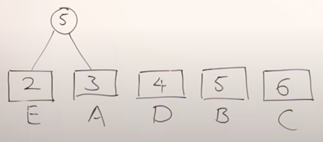
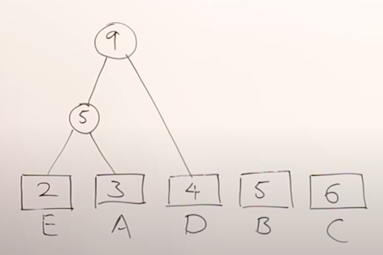
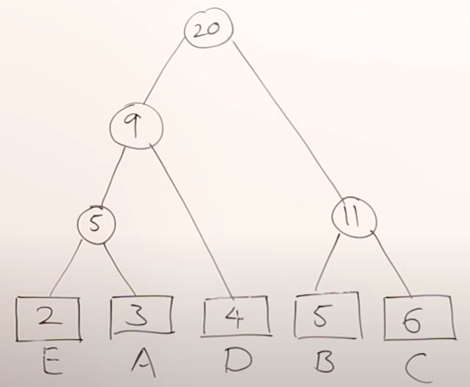

 Invented by a matematician David Huffman.
 
 &nbsp;&nbsp;&nbsp;&nbsp;&nbsp;&nbsp;&nbsp;&nbsp;&nbsp;&nbsp;&nbsp;&nbsp;&nbsp;
 Huffman Coding is a compression technique that is used to compress text files. We know that all what computer sees is a long stream of 1's and 0s. Hence, when we type text we get bunch of 0's and 1's. All these letters according to ASCII table have some value and each value is represented as 8 bits. That requires quiet a bit of memory. Hence, Huffman invented the first method for compressing this information. Today there are many compression techniques, but Huffman's was the first one. Today, we compress huge files to send them over email, etc.
 
 &nbsp;&nbsp;&nbsp;&nbsp;&nbsp;&nbsp;&nbsp;&nbsp;&nbsp;&nbsp;&nbsp;&nbsp;&nbsp;
 If we have a string `BCCABBDDAECCBBAEDDCC`, we can see that it contains 20 characters. Each character consists of 8 bits => 20 x 8 = 160 bits total for this message.

# Fixed sized codes

 &nbsp;&nbsp;&nbsp;&nbsp;&nbsp;&nbsp;&nbsp;&nbsp;&nbsp;&nbsp;&nbsp;&nbsp;&nbsp;
 We can see that we have 5 different values. We do not need all 8 bits to represent these 5 values. We can represent them with 3 bits.
 
  

| Character  |  count  | frequency  |  code  |   
| :----------|  :----  |  :-------  |  :---  | 
|     `A`    |   `3`   |   `3/20`   |  `000` |
|     `B`    |   `5`   |   `5/20`   |  `001` |
|     `C`    |   `6`   |   `6/20`   |  `010` |
|     `D`    |   `4`   |   `4/20`   |  `011` |
|     `E`    |   `2`   |   `2/20`   |  `100` |

 &nbsp;&nbsp;&nbsp;&nbsp;&nbsp;&nbsp;&nbsp;&nbsp;&nbsp;&nbsp;&nbsp;&nbsp;&nbsp;
 Each character from the string is represented with 3 bits. That means that total memory of the string is 20 x 3 = 60 bits, which is much better. Our string starts with BCC, so according to our table, it will be encoded as 001-010-010... 
 
 
 &nbsp;&nbsp;&nbsp;&nbsp;&nbsp;&nbsp;&nbsp;&nbsp;&nbsp;&nbsp;&nbsp;&nbsp;&nbsp;
 When we recieve this message, how is our computer going to know how to read this string now? Well, when we compress this text file, we compress the table together with it. That way, the reader will be able to decode the string. This table also requires some memory. The table contains 5 alphabets => 5 x 8bits = 40 bits. For each new code for letter we have 3 bits => 5 x 3 bits = 15bits. So, the size of our table is 40 + 15 = 55 bits.
 
 message + table = 60 + 55 = 115 bits
 
  &nbsp;&nbsp;&nbsp;&nbsp;&nbsp;&nbsp;&nbsp;&nbsp;&nbsp;&nbsp;&nbsp;&nbsp;&nbsp;
 This is much less than our original message. This was done using *fixed-size codes*, but we can do even better with *variable-sized codes*.
 
# Variable Sized codes (Huffman Coding)

 There are two major parts in Huffman Coding:
 
 1. Build a Huffman Tree from input characters.
 2. Traverse the Huffman Tree and assign codes to characters.

**Steps to build Huffman Tree**

 Input is an array of unique characters along with their frequency of occurrences and output is Huffman Tree. 

 1. Create a leaf node for each unique character and build a min heap of all leaf nodes (Min Heap is used as a priority queue. The value of frequency field is used to compare two nodes in min heap. Initially, the least frequent character is at root)
 
 2. Extract two nodes with the minimum frequency from the min heap.
 
 3. Create a new internal node with a frequency equal to the sum of the two nodes frequencies. Make the first extracted node as its left child and the other extracted node as its right child. Add this node to the min heap.
 
 4. Repeat steps#2 and #3 until the heap contains only one node. The remaining node is the root node and the tree is complete.

 Let us understand the algorithm with an example:

 **Step 1:** Build a min heap that contains 6 nodes where each node represents root of a tree with single node.
 
 **Step 2:** Extract two minimum frequency nodes from min heap. Add a new internal node with frequency 2 + 3 = 5.
 
 &nbsp;&nbsp;&nbsp;&nbsp;&nbsp;&nbsp;&nbsp;&nbsp;&nbsp;&nbsp;&nbsp;&nbsp;&nbsp;&nbsp;&nbsp;&nbsp;&nbsp;&nbsp; 

&nbsp;&nbsp;&nbsp;&nbsp;&nbsp;&nbsp;&nbsp;&nbsp;&nbsp;&nbsp;&nbsp;&nbsp;&nbsp;&nbsp;&nbsp;&nbsp;&nbsp;&nbsp;&nbsp;&nbsp;&nbsp;&nbsp;&nbsp;&nbsp;&nbsp;&nbsp;&nbsp;&nbsp;&nbsp;&nbsp;&nbsp;&nbsp;&nbsp;&nbsp;&nbsp;&nbsp;&nbsp;&nbsp;&nbsp;&nbsp;&nbsp;&nbsp;&nbsp;&nbsp;&nbsp;&nbsp;&nbsp;&nbsp;&nbsp;&nbsp;&nbsp;&nbsp;&nbsp;&nbsp;&nbsp;&nbsp;&nbsp;&nbsp;&nbsp;*Figure 1 - Building min-heap*

 **Step 3:** Extract two minimum frequency nodes from heap. Add a new internal node with frequency 5 + 4 = 9.

&nbsp;&nbsp;&nbsp;&nbsp;&nbsp;&nbsp;&nbsp;&nbsp;&nbsp;&nbsp;&nbsp;&nbsp;&nbsp;&nbsp;&nbsp;&nbsp;&nbsp;&nbsp; 

&nbsp;&nbsp;&nbsp;&nbsp;&nbsp;&nbsp;&nbsp;&nbsp;&nbsp;&nbsp;&nbsp;&nbsp;&nbsp;&nbsp;&nbsp;&nbsp;&nbsp;&nbsp;&nbsp;&nbsp;&nbsp;&nbsp;&nbsp;&nbsp;&nbsp;&nbsp;&nbsp;&nbsp;&nbsp;&nbsp;&nbsp;&nbsp;&nbsp;&nbsp;&nbsp;&nbsp;&nbsp;&nbsp;&nbsp;&nbsp;&nbsp;&nbsp;&nbsp;&nbsp;&nbsp;&nbsp;&nbsp;&nbsp;&nbsp;&nbsp;&nbsp;&nbsp;&nbsp;&nbsp;&nbsp;&nbsp;&nbsp;&nbsp;&nbsp;*Figure 2 - Building min-heap*

 **Step 4:** Repeat the same process until we finish the tree.
 
 &nbsp;&nbsp;&nbsp;&nbsp;&nbsp;&nbsp;&nbsp;&nbsp;&nbsp;&nbsp;&nbsp;&nbsp;&nbsp;&nbsp;&nbsp;&nbsp;&nbsp;&nbsp; 

&nbsp;&nbsp;&nbsp;&nbsp;&nbsp;&nbsp;&nbsp;&nbsp;&nbsp;&nbsp;&nbsp;&nbsp;&nbsp;&nbsp;&nbsp;&nbsp;&nbsp;&nbsp;&nbsp;&nbsp;&nbsp;&nbsp;&nbsp;&nbsp;&nbsp;&nbsp;&nbsp;&nbsp;&nbsp;&nbsp;&nbsp;&nbsp;&nbsp;&nbsp;&nbsp;&nbsp;&nbsp;&nbsp;&nbsp;&nbsp;&nbsp;&nbsp;&nbsp;&nbsp;&nbsp;&nbsp;&nbsp;&nbsp;&nbsp;&nbsp;&nbsp;&nbsp;&nbsp;&nbsp;&nbsp;&nbsp;&nbsp;&nbsp;&nbsp;*Figure  - Finished min-heap*

 &nbsp;&nbsp;&nbsp;&nbsp;&nbsp;&nbsp;&nbsp;&nbsp;&nbsp;&nbsp;&nbsp;&nbsp;&nbsp;
 Nikola Andrić

 
