# History
 
 &nbsp;&nbsp;&nbsp;&nbsp;&nbsp;&nbsp;&nbsp;&nbsp;&nbsp;&nbsp;&nbsp;&nbsp;&nbsp;
 The idea of the **artificial neural networks** was born in 1940's, but began to be efficient around 2011 when it outperformed support vector machines (SVMs).
 
 
# Basic Idea

 &nbsp;&nbsp;&nbsp;&nbsp;&nbsp;&nbsp;&nbsp;&nbsp;&nbsp;&nbsp;&nbsp;&nbsp;&nbsp;
 The main idea behind the artificial neural networks is to ***mimic a neuron in the brain***. Basic components are ***dendrites, a nucleus, an axon, and axon terminals***. Neurons transmit/transport information using ***synapse (a bridge between axon terminals of one neuron and dentrites on another neuron.)***
 
  &nbsp;&nbsp;&nbsp;&nbsp;&nbsp;&nbsp;&nbsp;&nbsp;&nbsp;&nbsp;&nbsp;&nbsp;&nbsp;&nbsp;&nbsp;&nbsp;&nbsp;&nbsp; 
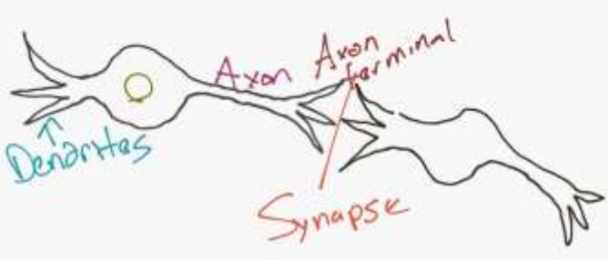

&nbsp;&nbsp;&nbsp;&nbsp;&nbsp;&nbsp;&nbsp;&nbsp;&nbsp;&nbsp;&nbsp;&nbsp;&nbsp;&nbsp;&nbsp;&nbsp;&nbsp;&nbsp;&nbsp;&nbsp;&nbsp;&nbsp;&nbsp;&nbsp;&nbsp;&nbsp;&nbsp;&nbsp;&nbsp;&nbsp;&nbsp;&nbsp;&nbsp;&nbsp;&nbsp;&nbsp;&nbsp;&nbsp;&nbsp;&nbsp;&nbsp;&nbsp;&nbsp;&nbsp;&nbsp;&nbsp;&nbsp;&nbsp;&nbsp;&nbsp;&nbsp;&nbsp;&nbsp;&nbsp;&nbsp;&nbsp;&nbsp;&nbsp;&nbsp;*Figure 1 - Neurons*

 &nbsp;&nbsp;&nbsp;&nbsp;&nbsp;&nbsp;&nbsp;&nbsp;&nbsp;&nbsp;&nbsp;&nbsp;&nbsp;
 In the Figure 2, we can see how computer scientists mimic this:
 
 &nbsp;&nbsp;&nbsp;&nbsp;&nbsp;&nbsp;&nbsp;&nbsp;&nbsp;&nbsp;&nbsp;&nbsp;&nbsp;&nbsp;&nbsp;&nbsp;&nbsp;&nbsp; 
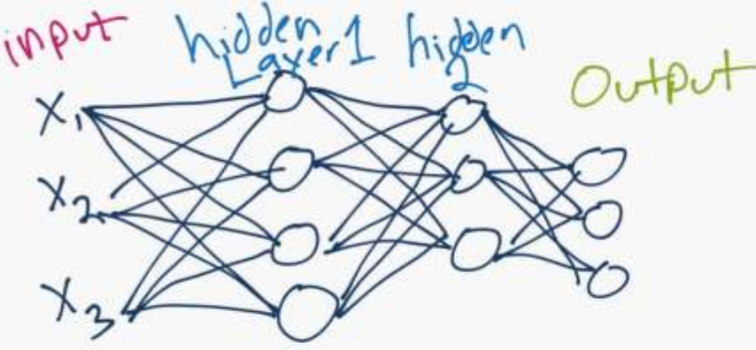

&nbsp;&nbsp;&nbsp;&nbsp;&nbsp;&nbsp;&nbsp;&nbsp;&nbsp;&nbsp;&nbsp;&nbsp;&nbsp;&nbsp;&nbsp;&nbsp;&nbsp;&nbsp;&nbsp;&nbsp;&nbsp;&nbsp;&nbsp;&nbsp;&nbsp;&nbsp;&nbsp;&nbsp;&nbsp;&nbsp;&nbsp;&nbsp;&nbsp;&nbsp;&nbsp;&nbsp;&nbsp;&nbsp;&nbsp;&nbsp;&nbsp;&nbsp;&nbsp;&nbsp;&nbsp;&nbsp;&nbsp;&nbsp;&nbsp;&nbsp;&nbsp;&nbsp;&nbsp;&nbsp;&nbsp;&nbsp;&nbsp;&nbsp;&nbsp;*Figure 2 - Artifician Neural Network Structure*
 
# Perceptrons

What is a neural network? To get started, I'll explain a type of artificial neuron called a perceptron. Perceptrons were developed in the 1950s and 1960s by the scientist Frank Rosenblatt, inspired by earlier work by Warren McCulloch and Walter Pitts. Today, it's more common to use other models of artificial neurons - in this book, and in much modern work on neural networks, the main neuron model used is one called the sigmoid neuron. We'll get to sigmoid neurons shortly. But to understand why sigmoid neurons are defined the way they are, it's worth taking the time to first understand perceptrons.

So how do perceptrons work? A perceptron takes several binary inputs, x1,x2,…, and produces a single binary output:

 &nbsp;&nbsp;&nbsp;&nbsp;&nbsp;&nbsp;&nbsp;&nbsp;&nbsp;&nbsp;&nbsp;&nbsp;&nbsp;&nbsp;&nbsp;&nbsp;&nbsp;&nbsp; 
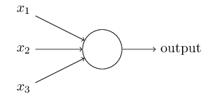

In the example shown the perceptron has three inputs, x1,x2,x3. In general it could have more or fewer inputs. Rosenblatt proposed a simple rule to compute the output. He introduced weights, w1,w2,…, real numbers expressing the importance of the respective inputs to the output. The neuron's output, 0 or 1, is determined by whether the weighted sum ∑jwjxj is less than or greater than some threshold value. Just like the weights, the threshold is a real number which is a parameter of the neuron.

 &nbsp;&nbsp;&nbsp;&nbsp;&nbsp;&nbsp;&nbsp;&nbsp;&nbsp;&nbsp;&nbsp;&nbsp;&nbsp;&nbsp;&nbsp;&nbsp;&nbsp;&nbsp; 
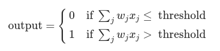

Incidentally, when I defined perceptrons I said that a perceptron has just a single output. In the network above the perceptrons look like they have multiple outputs. In fact, they're still single output. The multiple output arrows are merely a useful way of indicating that the output from a perceptron is being used as the input to several other perceptrons. It's less unwieldy than drawing a single output line which then splits.

Let's simplify the way we describe perceptrons. The condition ∑jwjxj>threshold is cumbersome, and we can make two notational changes to simplify it. The first change is to write ∑jwjxj as a dot product, w⋅x≡∑jwjxj, where w and x are vectors whose components are the weights and inputs, respectively. **The second change is to move the threshold to the other side of the inequality, and to replace it by what's known as the perceptron's bias, b≡−threshold.** Using the bias instead of the threshold, the perceptron rule can be rewritten:

 &nbsp;&nbsp;&nbsp;&nbsp;&nbsp;&nbsp;&nbsp;&nbsp;&nbsp;&nbsp;&nbsp;&nbsp;&nbsp;&nbsp;&nbsp;&nbsp;&nbsp;&nbsp; 
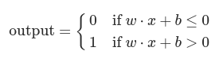

You can think of the bias as a measure of how easy it is to get the perceptron to output a 1. Or to put it in more biological terms, the bias is a measure of how easy it is to get the perceptron to fire. For a perceptron with a really big bias, it's extremely easy for the perceptron to output a 1. But if the bias is very negative, then it's difficult for the perceptron to output a 1.

# Sigmoid Neurons

Learning algorithms sound terrific. But how can we devise such algorithms for a neural network? Suppose we have a network of perceptrons that we'd like to use to learn to solve some problem. For example, the inputs to the network might be the raw pixel data from a scanned, handwritten image of a digit. And we'd like the network to learn weights and biases so that the output from the network correctly classifies the digit. To see how learning might work, suppose we make a small change in some weight (or bias) in the network. What we'd like is for this small change in weight to cause only a small corresponding change in the output from the network. As we'll see in a moment, this property will make learning possible. Schematically, here's what we want (obviously this network is too simple to do handwriting recognition!):

 &nbsp;&nbsp;&nbsp;&nbsp;&nbsp;&nbsp;&nbsp;&nbsp;&nbsp;&nbsp;&nbsp;&nbsp;&nbsp;&nbsp;&nbsp;&nbsp;&nbsp;&nbsp; 
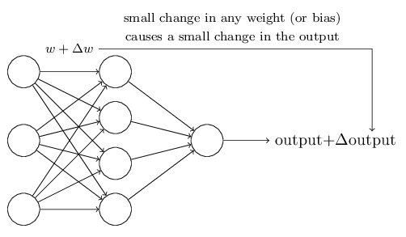

If it were true that a small change in a weight (or bias) causes only a small change in output, then we could use this fact to modify the weights and biases to get our network to behave more in the manner we want. For example, suppose the network was mistakenly classifying an image as an "8" when it should be a "9". We could figure out how to make a small change in the weights and biases so the network gets a little closer to classifying the image as a "9". And then we'd repeat this, changing the weights and biases over and over to produce better and better output. The network would be learning.

The problem is that this isn't what happens when our network contains perceptrons. In fact, a small change in the weights or bias of any single perceptron in the network can sometimes cause the output of that perceptron to completely flip, say from 0 to 1. That flip may then cause the behaviour of the rest of the network to completely change in some very complicated way. So while your "9" might now be classified correctly, the behaviour of the network on all the other images is likely to have completely changed in some hard-to-control way. That makes it difficult to see how to gradually modify the weights and biases so that the network gets closer to the desired behaviour. Perhaps there's some clever way of getting around this problem. But it's not immediately obvious how we can get a network of perceptrons to learn.

**We can overcome this problem by introducing a new type of artificial neuron called a sigmoid neuron. Sigmoid neurons are similar to perceptrons, but modified so that small changes in their weights and bias cause only a small change in their output. That's the crucial fact which will allow a network of sigmoid neurons to learn.**

 &nbsp;&nbsp;&nbsp;&nbsp;&nbsp;&nbsp;&nbsp;&nbsp;&nbsp;&nbsp;&nbsp;&nbsp;&nbsp;&nbsp;&nbsp;&nbsp;&nbsp;&nbsp; 

Just like a perceptron, the sigmoid neuron has inputs, x1,x2,…. But instead of being just 0 or 1, these inputs can also take on any values between 0 and 1. So, for instance, 0.638… is a valid input for a sigmoid neuron. Also just like a perceptron, the sigmoid neuron has weights for each input, w1,w2,…, and an overall bias, b. But the output is not 0 or 1. Instead, it's σ(w⋅x+b), where σ is called **the sigmoid function**, and is defined by:

 &nbsp;&nbsp;&nbsp;&nbsp;&nbsp;&nbsp;&nbsp;&nbsp;&nbsp;&nbsp;&nbsp;&nbsp;&nbsp;&nbsp;&nbsp;&nbsp;&nbsp;&nbsp; 
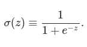

NOTE: **Incidentally, σ is sometimes called the logistic function, and this new class of neurons called logistic neurons. It's useful to remember this terminology, since these terms are used by many people working with neural nets.**

To put it all a little more explicitly, the output of a sigmoid neuron with inputs x1,x2,…, weights w1,w2,…, and bias b is:

 &nbsp;&nbsp;&nbsp;&nbsp;&nbsp;&nbsp;&nbsp;&nbsp;&nbsp;&nbsp;&nbsp;&nbsp;&nbsp;&nbsp;&nbsp;&nbsp;&nbsp;&nbsp; 
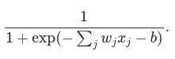

At first sight, sigmoid neurons appear very different to perceptrons. The algebraic form of the sigmoid function may seem opaque and forbidding if you're not already familiar with it. In fact, there are many similarities between perceptrons and sigmoid neurons, and the algebraic form of the sigmoid function turns out to be more of a technical detail than a true barrier to understanding.

**To understand the similarity to the perceptron model, suppose z≡w⋅x+b is a large positive number. Then e−z≈0 and so σ(z)≈1. In other words, when z=w⋅x+b is large and positive, the output from the sigmoid neuron is approximately 1, just as it would have been for a perceptron. Suppose on the other hand that z=w⋅x+b is very negative. Then e−z→∞, and σ(z)≈0. So when z=w⋅x+b is very negative, the behaviour of a sigmoid neuron also closely approximates a perceptron. It's only when w⋅x+b is of modest size that there's much deviation from the perceptron model.**

What about the algebraic form of σ? How can we understand that? In fact, the exact form of σ isn't so important - what really matters is the shape of the function when plotted. Here's the shape:

 &nbsp;&nbsp;&nbsp;&nbsp;&nbsp;&nbsp;&nbsp;&nbsp;&nbsp;&nbsp;&nbsp;&nbsp;&nbsp;&nbsp;&nbsp;&nbsp;&nbsp;&nbsp; 

This shape is a smoothed out version of a step function:

 &nbsp;&nbsp;&nbsp;&nbsp;&nbsp;&nbsp;&nbsp;&nbsp;&nbsp;&nbsp;&nbsp;&nbsp;&nbsp;&nbsp;&nbsp;&nbsp;&nbsp;&nbsp; 
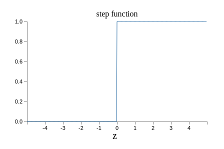

If σ had in fact been a step function, then the sigmoid neuron would be a perceptron, since the output would be 1 or 0 depending on whether w⋅x+b was positive or negative. By using the actual σ function we get, as already implied above, a smoothed out perceptron. Indeed, it's the smoothness of the σ function that is the crucial fact, not its detailed form. The smoothness of σ means that small changes Δwj in the weights and Δb in the bias will produce a small change Δoutput in the output from the neuron. In fact, calculus tells us that Δoutput is well approximated by:

 &nbsp;&nbsp;&nbsp;&nbsp;&nbsp;&nbsp;&nbsp;&nbsp;&nbsp;&nbsp;&nbsp;&nbsp;&nbsp;&nbsp;&nbsp;&nbsp;&nbsp;&nbsp; 
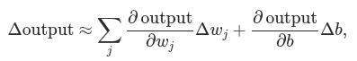

where the sum is over all the weights, wj, and ∂output/∂wj and ∂output/∂b denote partial derivatives of the output with respect to wj and b, respectively. Don't panic if you're not comfortable with partial derivatives! While the expression above looks complicated, with all the partial derivatives, it's actually saying something very simple (and which is very good news): **Δoutput is a linear function of the changes Δwj and Δb in the weights and bias. This linearity makes it easy to choose small changes in the weights and biases to achieve any desired small change in the output.** So while sigmoid neurons have much of the same qualitative behaviour as perceptrons, they make it much easier to figure out how changing the weights and biases will change the output.

How should we interpret the output from a sigmoid neuron? Obviously, one big difference between perceptrons and sigmoid neurons is that sigmoid neurons don't just output 0 or 1. They can have as output any real number between 0 and 1, so values such as 0.173… and 0.689… are legitimate outputs. This can be useful, for example, if we want to use the output value to represent the average intensity of the pixels in an image input to a neural network. But sometimes it can be a nuisance. Suppose we want the output from the network to indicate either "the input image is a 9" or "the input image is not a 9". Obviously, it'd be easiest to do this if the output was a 0 or a 1, as in a perceptron. But in practice we can set up a convention to deal with this, for example, by deciding to interpret any output of at least 0.5 as indicating a "9", and any output less than 0.5 as indicating "not a 9". 

# The architecture of neural networks

The leftmost layer in this network is called the input layer, and the neurons within the layer are called input neurons. The rightmost or output layer contains the output neurons. The middle layer is called a hidden layer, since the neurons in this layer are neither inputs nor outputs. The term "hidden" perhaps sounds a little mysterious - the first time I heard the term I thought it must have some deep philosophical or mathematical significance - but it really means nothing more than "not an input or an output". For example, the following four-layer network has two hidden layers:

 &nbsp;&nbsp;&nbsp;&nbsp;&nbsp;&nbsp;&nbsp;&nbsp;&nbsp;&nbsp;&nbsp;&nbsp;&nbsp;&nbsp;&nbsp;&nbsp;&nbsp;&nbsp; 
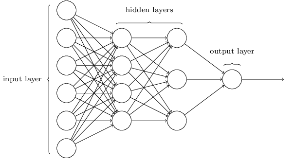

NOTE: Somewhat confusingly, and for historical reasons, such multiple layer networks are sometimes called multilayer perceptrons or MLPs, despite being made up of sigmoid neurons, not perceptrons.

The design of the input and output layers in a network is often straightforward. For example, suppose we're trying to determine whether a handwritten image depicts a "9" or not. A natural way to design the network is to encode the intensities of the image pixels into the input neurons. If the image is a 64 by 64 greyscale image, then we'd have 4,096=64×64 input neurons, with the intensities scaled appropriately between 0 and 1. The output layer will contain just a single neuron, with output values of less than 0.5 indicating "input image is not a 9", and values greater than 0.5 indicating "input image is a 9 ".

While the design of the input and output layers of a neural network is often straightforward, there can be quite an art to the design of the hidden layers. In particular, it's not possible to sum up the design process for the hidden layers with a few simple **rules of thumb**. Instead, neural networks researchers have developed many design heuristics for the hidden layers, which help people get the behaviour they want out of their nets. For example, such heuristics can be used to help determine how to trade off the number of hidden layers against the time required to train the network.

Up to now, we've been discussing neural networks where the output from one layer is used as input to the next layer. Such networks are called **_feedforward neural networks_**. This means there are no loops in the network - information is always fed forward, never fed back. If we did have loops, we'd end up with situations where the input to the σ function depended on the output. That'd be hard to make sense of, and so we don't allow such loops.

However, there are other models of artificial neural networks in which feedback loops are possible. These models are called recurrent neural networks. The idea in these models is to have neurons which fire for some limited duration of time, before becoming quiescent. That firing can stimulate other neurons, which may fire a little while later, also for a limited duration. That causes still more neurons to fire, and so over time we get a cascade of neurons firing. Loops don't cause problems in such a model, since a neuron's output only affects its input at some later time, not instantaneously.

Recurrent neural nets have been less influential than feedforward networks, in part because the learning algorithms for recurrent nets are (at least to date) less powerful. But recurrent networks are still extremely interesting. They're much closer in spirit to how our brains work than feedforward networks. And it's possible that recurrent networks can solve important problems which can only be solved with great difficulty by feedforward networks. 

# A simple network to classify handwritten digits

Having defined neural networks, let's return to handwriting recognition. We can split the problem of recognizing handwritten digits into two sub-problems. First, we'd like a way of breaking an image containing many digits into a sequence of separate images, each containing a single digit. For example, we'd like to break the image

 &nbsp;&nbsp;&nbsp;&nbsp;&nbsp;&nbsp;&nbsp;&nbsp;&nbsp;&nbsp;&nbsp;&nbsp;&nbsp;&nbsp;&nbsp;&nbsp;&nbsp;&nbsp; 
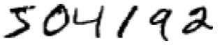

into six separate images,

 &nbsp;&nbsp;&nbsp;&nbsp;&nbsp;&nbsp;&nbsp;&nbsp;&nbsp;&nbsp;&nbsp;&nbsp;&nbsp;&nbsp;&nbsp;&nbsp;&nbsp;&nbsp; 
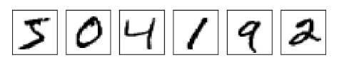

We humans solve this segmentation problem with ease, but it's challenging for a computer program to correctly break up the image. Once the image has been segmented, the program then needs to classify each individual digit. So, for instance, we'd like our program to recognize that the first digit above is 5.

To recognize individual digits we will use a three-layer neural network:

 &nbsp;&nbsp;&nbsp;&nbsp;&nbsp;&nbsp;&nbsp;&nbsp;&nbsp;&nbsp;&nbsp;&nbsp;&nbsp;&nbsp;&nbsp;&nbsp;&nbsp;&nbsp; 
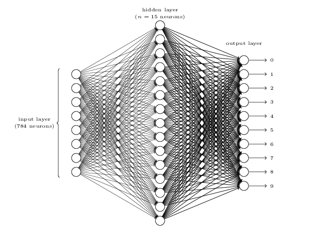

The input layer of the network contains neurons encoding the values of the input pixels. Our training data for the network will consist of many 28 by 28 pixel images of scanned handwritten digits, and so the input layer contains 784=28×28 neurons. For simplicity I've omitted most of the 784 input neurons in the diagram above. The input pixels are greyscale, with a value of 0.0 representing white, a value of 1.0 representing black, and in between values representing gradually darkening shades of grey.

The second layer of the network is a hidden layer. We denote the number of neurons in this hidden layer by n, and we'll experiment with different values for n. The example shown illustrates a small hidden layer, containing just n=15 neurons.

The output layer of the network contains 10 neurons. If the first neuron fires, i.e., has an output ≈1, then that will indicate that the network thinks the digit is a 0. If the second neuron fires then that will indicate that the network thinks the digit is a 1. And so on. A little more precisely, we number the output neurons from 0 through 9, and figure out which neuron has the highest activation value. If that neuron is, say, neuron number 6, then our network will guess that the input digit was a 6. And so on for the other output neurons.

You might wonder why we use 10 output neurons. After all, the goal of the network is to tell us which digit (0,1,2,…,9) corresponds to the input image. A seemingly natural way of doing that is to use just 4 output neurons, treating each neuron as taking on a binary value, depending on whether the neuron's output is closer to 0 or to 1. Four neurons are enough to encode the answer, since 24=16 is more than the 10 possible values for the input digit. Why should our network use 10 neurons instead? Isn't that inefficient? The ultimate justification is empirical: we can try out both network designs, and it turns out that, for this particular problem, the network with 10 output neurons learns to recognize digits better than the network with 4 output neurons. But that leaves us wondering why using 10 output neurons works better. Is there some heuristic that would tell us in advance that we should use the 10-output encoding instead of the 4-output encoding?

To understand why we do this, it helps to think about what the neural network is doing from first principles. Consider first the case where we use 10 output neurons. Let's concentrate on the first output neuron, the one that's trying to decide whether or not the digit is a 0. It does this by weighing up evidence from the hidden layer of neurons. What are those hidden neurons doing? Well, just suppose for the sake of argument that the first neuron in the hidden layer detects whether or not an image like the following is present:

 &nbsp;&nbsp;&nbsp;&nbsp;&nbsp;&nbsp;&nbsp;&nbsp;&nbsp;&nbsp;&nbsp;&nbsp;&nbsp;&nbsp;&nbsp;&nbsp;&nbsp;&nbsp; 
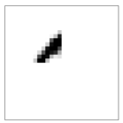

It can do this by heavily weighting input pixels which overlap with the image, and only lightly weighting the other inputs. In a similar way, let's suppose for the sake of argument that the second, third, and fourth neurons in the hidden layer detect whether or not the following images are present:

 &nbsp;&nbsp;&nbsp;&nbsp;&nbsp;&nbsp;&nbsp;&nbsp;&nbsp;&nbsp;&nbsp;&nbsp;&nbsp;&nbsp;&nbsp;&nbsp;&nbsp;&nbsp; 
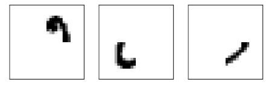

As you may have guessed, these four images together make up the 0 image that we saw in the line of digits shown earlier:

 &nbsp;&nbsp;&nbsp;&nbsp;&nbsp;&nbsp;&nbsp;&nbsp;&nbsp;&nbsp;&nbsp;&nbsp;&nbsp;&nbsp;&nbsp;&nbsp;&nbsp;&nbsp; 
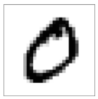

So if all four of these hidden neurons are firing then we can conclude that the digit is a 0. Of course, that's not the only sort of evidence we can use to conclude that the image was a 0 - we could legitimately get a 0 in many other ways (say, through translations of the above images, or slight distortions). But it seems safe to say that at least in this case we'd conclude that the input was a 0.

Supposing the neural network functions in this way, we can give a plausible explanation for why it's better to have 10 outputs from the network, rather than 4. If we had 4 outputs, then the first output neuron would be trying to decide what the most significant bit of the digit was. And there's no easy way to relate that most significant bit to simple shapes like those shown above. It's hard to imagine that there's any good historical reason the component shapes of the digit will be closely related to (say) the most significant bit in the output.

# Learning with gradient descent

We'll use the notation x to denote a training input. It'll be convenient to regard each training input x as a 28×28=784-dimensional vector. Each entry in the vector represents the grey value for a single pixel in the image. We'll denote the corresponding desired output by y=y(x), where y is a 10-dimensional vector. For example, if a particular training image, x, depicts a 6, then y(x)=(0,0,0,0,0,0,1,0,0,0)T is the desired output from the network. Note that T here is the transpose operation, turning a row vector into an ordinary (column) vector.

What we'd like is an **algorithm which lets us find weights and biases so that the output from the network approximates y(x) for all training inputs x.** To quantify how well we're achieving this goal we define a cost _function_(Sometimes referred to as a loss or objective function):

 &nbsp;&nbsp;&nbsp;&nbsp;&nbsp;&nbsp;&nbsp;&nbsp;&nbsp;&nbsp;&nbsp;&nbsp;&nbsp;&nbsp;&nbsp;&nbsp;&nbsp;&nbsp; 
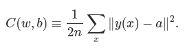

Here, w denotes the collection of all weights in the network, b all the biases, n is the total number of training inputs, a is the vector of outputs from the network when x is input, and the sum is over all training inputs, x. Of course, the output a depends on x, w and b, but to keep the notation simple I haven't explicitly indicated this dependence. The notation ∥v∥ just denotes the usual length function for a vector v. We'll call **C the quadratic cost function**; it's also sometimes known as the **mean squared error or just MSE**. Inspecting the form of the quadratic cost function, we see that C(w,b) is non-negative, since every term in the sum is non-negative. Furthermore, the cost C(w,b) becomes small, i.e., C(w,b)≈0, precisely when y(x) is approximately equal to the output, a, for all training inputs, x. So our training algorithm has done a good job if it can find weights and biases so that C(w,b)≈0. By contrast, it's not doing so well when C(w,b) is large - that would mean that y(x) is not close to the output a for a large number of inputs. So the aim of our training algorithm will be to **minimize the cost C(w,b) as a function of the weights and biases**. In other words, we want to find a set of weights and biases which make the cost as small as possible. We'll do that using an algorithm known as **gradient descent**.

Why introduce the quadratic cost? After all, aren't we primarily interested in the number of images correctly classified by the network? Why not try to maximize that number directly, rather than minimizing a proxy measure like the quadratic cost? The problem with that is that the number of images correctly classified is not a smooth function of the weights and biases in the network. For the most part, making small changes to the weights and biases won't cause any change at all in the number of training images classified correctly. That makes it difficult to figure out how to change the weights and biases to get improved performance. If we instead use a smooth cost function like the quadratic cost it turns out to be easy to figure out how to make small changes in the weights and biases so as to get an improvement in the cost. That's why we focus first on minimizing the quadratic cost, and only after that will we examine the classification accuracy.

Recapping, our goal in training a neural network is to find weights and biases which minimize the quadratic cost function C(w,b). This is a well-posed problem, but it's got a lot of distracting structure as currently posed - the interpretation of w and b as weights and biases, the σ function lurking in the background, the choice of network architecture, MNIST, and so on. It turns out that we can understand a tremendous amount by ignoring most of that structure, and just concentrating on the minimization aspect. So for now we're going to forget all about the specific form of the cost function, the connection to neural networks, and so on. Instead, we're going to imagine that we've simply been given a function of many variables and we want to minimize that function. We're going to develop a technique called **gradient descent** which can be used to solve such minimization problems. Then we'll come back to the specific function we want to minimize for neural networks.

Okay, let's suppose we're trying to minimize some function, C(v). This could be any real-valued function of many variables, v=v1,v2,…. Note that I've replaced the w and b notation by v to emphasize that this could be any function - we're not specifically thinking in the neural networks context any more. To minimize C(v) it helps to imagine C as a function of just two variables, which we'll call v1 and v2:

 &nbsp;&nbsp;&nbsp;&nbsp;&nbsp;&nbsp;&nbsp;&nbsp;&nbsp;&nbsp;&nbsp;&nbsp;&nbsp;&nbsp;&nbsp;&nbsp;&nbsp;&nbsp; 
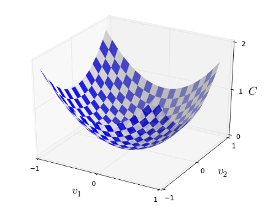

What we'd like is to find where C achieves its global minimum. Now, of course, for the function plotted above, we can eyeball the graph and find the minimum. In that sense, I've perhaps shown slightly too simple a function! A general function, C, may be a complicated function of many variables, and it won't usually be possible to just eyeball the graph to find the minimum.

One way of attacking the problem is to use calculus to try to find the minimum analytically. **We could compute derivatives** and then try using them to find places where C is an extremum. With some luck that might work when C is a function of just one or a few variables. But it'll turn into a nightmare when we have many more variables. And for neural networks we'll often want far more variables - the biggest neural networks have cost functions which depend on billions of weights and biases in an extremely complicated way. Using calculus to minimize that _just won't work_!

Okay, so calculus doesn't work. Fortunately, there is a beautiful analogy which suggests an algorithm which works pretty well. We start by thinking of our function as a kind of a valley. If you squint just a little at the plot above, that shouldn't be too hard. And we imagine a ball rolling down the slope of the valley. Our everyday experience tells us that the ball will eventually roll to the bottom of the valley. Perhaps we can use this idea as a way to find a minimum for the function? We'd randomly choose a starting point for an (imaginary) ball, and then simulate the motion of the ball as it rolled down to the bottom of the valley. We could do this simulation simply by computing derivatives (and perhaps some second derivatives) of C - those derivatives would tell us everything we need to know about the local "shape" of the valley, and therefore how our ball should roll.

Let's think about what happens when we move the ball **a small amount Δv1 in the v1 direction**, and a small amount Δv2 in the v2 direction. Calculus tells us that C changes as follows:

 &nbsp;&nbsp;&nbsp;&nbsp;&nbsp;&nbsp;&nbsp;&nbsp;&nbsp;&nbsp;&nbsp;&nbsp;&nbsp;&nbsp;&nbsp;&nbsp;&nbsp;&nbsp; 
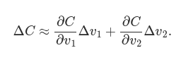

We're going to find a way of choosing Δv1 and Δv2 so as to make ΔC negative; i.e., we'll choose them so the ball is rolling down into the valley. To figure out how to make such a choice it helps to define Δv to be the vector of changes in v, Δv≡(Δv1,Δv2)T, where T is again the transpose operation, turning row vectors into column vectors. We'll also define the gradient of C to be the vector of partial derivatives, (∂C∂v1,∂C∂v2)T. We denote the gradient vector by ∇C, i.e.:

 &nbsp;&nbsp;&nbsp;&nbsp;&nbsp;&nbsp;&nbsp;&nbsp;&nbsp;&nbsp;&nbsp;&nbsp;&nbsp;&nbsp;&nbsp;&nbsp;&nbsp;&nbsp; 
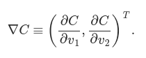

In a moment we'll rewrite the change ΔC in terms of Δv and the gradient, ∇C. Before getting to that, though, I want to clarify something that sometimes gets people hung up on the gradient. When meeting the ∇C notation for the first time, people sometimes wonder how they should think about the ∇ symbol. What, exactly, does ∇ mean? In fact, it's perfectly fine to think of ∇C as a single mathematical object - the vector defined above - which happens to be written using two symbols. In this point of view, ∇ is just a piece of notational flag-waving, telling you "hey, ∇C is a gradient vector". There are more advanced points of view where ∇ can be viewed as an independent mathematical entity in its own right (for example, as a differential operator), but we won't need such points of view.

With these definitions, ΔC can be rewritten as:

 &nbsp;&nbsp;&nbsp;&nbsp;&nbsp;&nbsp;&nbsp;&nbsp;&nbsp;&nbsp;&nbsp;&nbsp;&nbsp;&nbsp;&nbsp;&nbsp;&nbsp;&nbsp; 
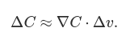

This equation helps explain why ∇C is called the gradient vector: ∇C relates changes in v to changes in C, just as we'd expect something called a gradient to do. But what's really exciting about the equation is that it lets us see how to choose Δv so as to make ΔC negative. In particular, suppose we choose:

 &nbsp;&nbsp;&nbsp;&nbsp;&nbsp;&nbsp;&nbsp;&nbsp;&nbsp;&nbsp;&nbsp;&nbsp;&nbsp;&nbsp;&nbsp;&nbsp;&nbsp;&nbsp; 
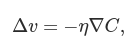

where η is a small, positive parameter (known as the learning rate). Then ΔC≈−η∇C⋅∇C=−η∥∇C∥2. Because ∥∇C∥2≥0, this guarantees that ΔC≤0, i.e., C will always decrease, never increase. Compute a value for Δv, then move the ball's position v by that amount:

 &nbsp;&nbsp;&nbsp;&nbsp;&nbsp;&nbsp;&nbsp;&nbsp;&nbsp;&nbsp;&nbsp;&nbsp;&nbsp;&nbsp;&nbsp;&nbsp;&nbsp;&nbsp; 
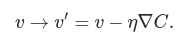

Then we'll use this update rule again, to make another move. If we keep doing this, over and over, we'll keep decreasing C until - we hope - we reach a global minimum.

**Summing up, the way the gradient descent algorithm works is to repeatedly compute the gradient ∇C, and then to move in the opposite direction, "falling down" the slope of the valley. We can visualize it like this**:

 &nbsp;&nbsp;&nbsp;&nbsp;&nbsp;&nbsp;&nbsp;&nbsp;&nbsp;&nbsp;&nbsp;&nbsp;&nbsp;&nbsp;&nbsp;&nbsp;&nbsp;&nbsp; 
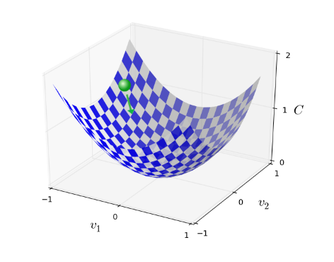

**To make gradient descent work correctly, we need to choose the learning rate η to be small enough.** If we don't, we might end up with ΔC>0, which obviously would not be good! At the same time, we don't want η to be too small, since that will make the changes Δv tiny, and thus the gradient descent algorithm will work very slowly. In practical implementations, η is often varied.

I've explained gradient descent when C is a function of just two variables. But, in fact, everything works just as well even when C is a function of many more variables. Suppose in particular that C is a function of m variables, v1,…,vm. Then the change ΔC in C produced by a small change Δv=(Δv1,…,Δvm)T is

 &nbsp;&nbsp;&nbsp;&nbsp;&nbsp;&nbsp;&nbsp;&nbsp;&nbsp;&nbsp;&nbsp;&nbsp;&nbsp;&nbsp;&nbsp;&nbsp;&nbsp;&nbsp; 
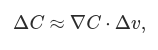

where the gradient ∇C is the vector

 &nbsp;&nbsp;&nbsp;&nbsp;&nbsp;&nbsp;&nbsp;&nbsp;&nbsp;&nbsp;&nbsp;&nbsp;&nbsp;&nbsp;&nbsp;&nbsp;&nbsp;&nbsp; 
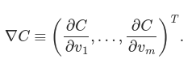

Just as for the two variable case, we can choose

 &nbsp;&nbsp;&nbsp;&nbsp;&nbsp;&nbsp;&nbsp;&nbsp;&nbsp;&nbsp;&nbsp;&nbsp;&nbsp;&nbsp;&nbsp;&nbsp;&nbsp;&nbsp; 
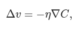

This gives us a way of following the gradient to a minimum, even when C is a function of many variables, by repeatedly applying the update rule

 &nbsp;&nbsp;&nbsp;&nbsp;&nbsp;&nbsp;&nbsp;&nbsp;&nbsp;&nbsp;&nbsp;&nbsp;&nbsp;&nbsp;&nbsp;&nbsp;&nbsp;&nbsp; 
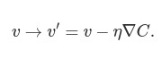

You can think of this update rule as defining the gradient descent algorithm. It gives us a way of repeatedly changing the position v in order to find a minimum of the function C. The rule doesn't always work - several things can go wrong and prevent gradient descent from finding the global minimum of C. But, in practice gradient descent often works extremely well, and in neural networks we'll find that it's a powerful way of minimizing the cost function, and so helping the net learn.

Indeed, there's even a sense in which gradient descent is the optimal strategy for searching for a minimum. Let's suppose that we're trying to make a move Δv in position so as to decrease C as much as possible. This is equivalent to minimizing ΔC≈∇C⋅Δv. We'll constrain the size of the move so that ∥Δv∥=ϵ for some small fixed ϵ>0. In other words, we want a move that is a small step of a fixed size, and we're trying to find the movement direction which decreases C as much as possible. It can be proved that the choice of Δv which minimizes ∇C⋅Δv is Δv=−η∇C, where η=ϵ/∥∇C∥ is determined by the size constraint ∥Δv∥=ϵ. So gradient descent can be viewed as a way of taking small steps in the direction which does the most to immediately decrease C.

# How backpropagation algorithm works

Let's begin with a notation which lets us refer to weights in the network in an unambiguous way. We'll use wljk to denote the weight for the connection from the kth neuron in the (l−1)th layer to the jth neuron in the lth layer. So, for example, the diagram below shows the weight on a connection from the fourth neuron in the second layer to the second neuron in the third layer of a network:

 &nbsp;&nbsp;&nbsp;&nbsp;&nbsp;&nbsp;&nbsp;&nbsp;&nbsp;&nbsp;&nbsp;&nbsp;&nbsp;&nbsp;&nbsp;&nbsp;&nbsp;&nbsp; 
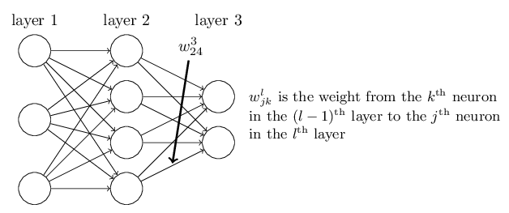

We use a similar notation for the network's biases and activations. Explicitly, we use blj for the bias of the jth neuron in the lth layer. And we use alj for the activation of the jth neuron in the lth layer. The following diagram shows examples of these notations in use:

 &nbsp;&nbsp;&nbsp;&nbsp;&nbsp;&nbsp;&nbsp;&nbsp;&nbsp;&nbsp;&nbsp;&nbsp;&nbsp;&nbsp;&nbsp;&nbsp;&nbsp;&nbsp; 
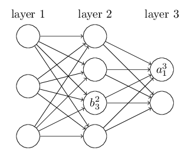

With these notations, the activation alj of the jth neuron in the lth layer is related to the activations in the (l−1)th layer by the equation:

 &nbsp;&nbsp;&nbsp;&nbsp;&nbsp;&nbsp;&nbsp;&nbsp;&nbsp;&nbsp;&nbsp;&nbsp;&nbsp;&nbsp;&nbsp;&nbsp;&nbsp;&nbsp; 
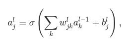

where the sum is over all neurons k in the (l−1)th layer. To rewrite this expression in a matrix form we define a weight matrix wl for each layer, l. The entries of the weight matrix wl are just the weights connecting to the lth layer of neurons, that is, the entry in the jth row and kth column is wljk. Similarly, for each layer l we define a bias vector, bl. You can probably guess how this works - the components of the bias vector are just the values blj, one component for each neuron in the lth layer. And finally, we define an activation vector al whose components are the activations alj.

Knowing this, previous equation can be rewritten in the beautiful and compact vectorized form:

 &nbsp;&nbsp;&nbsp;&nbsp;&nbsp;&nbsp;&nbsp;&nbsp;&nbsp;&nbsp;&nbsp;&nbsp;&nbsp;&nbsp;&nbsp;&nbsp;&nbsp;&nbsp; 
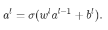

When using previous equation to compute al, we compute the intermediate quantity zl≡wlal−1+bl along the way. This quantity turns out to be useful enough to be worth naming: we call zl the weighted input to the neurons in layer l. Previous equation is sometimes written in terms of the weighted input, as al=σ(zl). It's also worth noting that zl has components zlj=∑kwljkal−1k+blj, that is, zlj is just the weighted input to the activation function for neuron j in layer l.

# The two assumptions we need about the cost function

The goal of backpropagation is to compute the partial derivatives ∂C/∂w and ∂C/∂b of the cost function C with respect to any weight w or bias b in the network. For backpropagation to work we need to make two main assumptions about the form of the cost function. Before stating those assumptions, though, it's useful to have an example cost function in mind.

 &nbsp;&nbsp;&nbsp;&nbsp;&nbsp;&nbsp;&nbsp;&nbsp;&nbsp;&nbsp;&nbsp;&nbsp;&nbsp;&nbsp;&nbsp;&nbsp;&nbsp;&nbsp; 
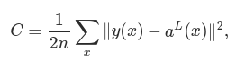

where: n is the total number of training examples; the sum is over individual training examples, x; y=y(x) is the corresponding desired output; L denotes the number of layers in the network; and aL=aL(x) is the vector of activations output from the network when x is input.

Okay, so what assumptions do we need to make about our cost function, C, in order that backpropagation can be applied? The first assumption we need is that the cost function can be written as an average C=1/n * ∑xCx over cost functions Cx for individual training examples, x. This is the case for the quadratic cost function, where the cost for a single training example is Cx=1/2∥y−aL∥2. 
 
The reason we need this assumption is because what backpropagation actually lets us do is compute the partial derivatives ∂Cx/∂w and ∂Cx/∂b for a single training example. We then recover ∂C/∂w and ∂C/∂b by averaging over training examples. In fact, with this assumption in mind, we'll suppose the training example x has been fixed, and drop the x subscript, writing the cost Cx as C. 

The second assumption we make about the cost is that it can be written as a function of the outputs from the neural network:

 &nbsp;&nbsp;&nbsp;&nbsp;&nbsp;&nbsp;&nbsp;&nbsp;&nbsp;&nbsp;&nbsp;&nbsp;&nbsp;&nbsp;&nbsp;&nbsp;&nbsp;&nbsp; 
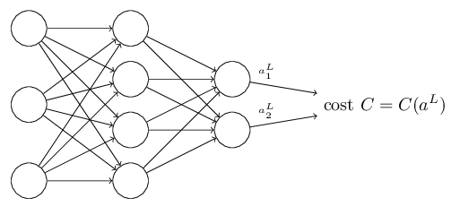

For example, the quadratic cost function satisfies this requirement, since the quadratic cost for a single training example x may be written as

 &nbsp;&nbsp;&nbsp;&nbsp;&nbsp;&nbsp;&nbsp;&nbsp;&nbsp;&nbsp;&nbsp;&nbsp;&nbsp;&nbsp;&nbsp;&nbsp;&nbsp;&nbsp; 

and thus is a function of the output activations. Of course, this cost function also depends on the desired output y, and you may wonder why we're not regarding the cost also as a function of y. Remember, though, that the input training example x is fixed, and so the output y is also a fixed parameter. In particular, it's not something we can modify by changing the weights and biases in any way, i.e., it's not something which the neural network learns. And so it makes sense to regard C as a function of the output activations aL alone, with y merely a parameter that helps define that function.

# The Hadamard product

The backpropagation algorithm is based on common linear algebraic operations - things like vector addition, multiplying a vector by a matrix, and so on. But one of the operations is a little less commonly used. In particular, suppose s and t are two vectors of the same dimension. Then we use s⊙t to denote the elementwise product of the two vectors. Thus the components of s⊙t are just (s⊙t)j=sjtj. As an example,

 &nbsp;&nbsp;&nbsp;&nbsp;&nbsp;&nbsp;&nbsp;&nbsp;&nbsp;&nbsp;&nbsp;&nbsp;&nbsp;&nbsp;&nbsp;&nbsp;&nbsp;&nbsp; 
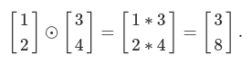

This kind of elementwise multiplication is sometimes called the **Hadamard product or Schur product.** 

# The four fundamental equations behind backpropagation

**Backpropagation is about understanding how changing the weights and biases in a network changes the cost function.**

Ultimately, this means computing the partial derivatives ∂C/∂wljk and ∂C/∂blj. But to compute those, we first introduce an intermediate quantity, δlj, which we call the error in the jth neuron in the lth layer. Backpropagation will give us a procedure to compute the error δlj, and then will relate δlj to ∂C/∂wljk and ∂C/∂blj.

To understand how the error is defined, imagine there is a demon in our neural network:

 &nbsp;&nbsp;&nbsp;&nbsp;&nbsp;&nbsp;&nbsp;&nbsp;&nbsp;&nbsp;&nbsp;&nbsp;&nbsp;&nbsp;&nbsp;&nbsp;&nbsp;&nbsp; 
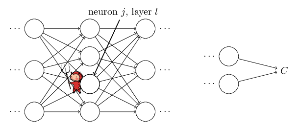

The demon sits at the jth neuron in layer l. As the input to the neuron comes in, the demon messes with the neuron's operation. It adds a little change Δzlj to the neuron's weighted input, so that instead of outputting σ(zlj), the neuron instead outputs σ(zlj+Δzlj). This change propagates through later layers in the network, finally causing the overall cost to change by an amount ∂C/∂zlj * Δzlj.

Now, this demon is a good demon, and is trying to help you improve the cost, i.e., they're trying to find a Δzlj which makes the cost smaller. Suppose ∂C∂zlj has a large value (either positive or negative). Then the demon can lower the cost quite a bit by choosing Δzzlj to have the opposite sign to ∂C∂zlj. By contrast, if ∂C∂zlj is close to zero, then the demon can't improve the cost much at all by perturbing the weighted input zlj. So far as the demon can tell, the neuron is already pretty near optimal.

Motivated by this story, we define the error δlj of neuron j in layer l by:

 &nbsp;&nbsp;&nbsp;&nbsp;&nbsp;&nbsp;&nbsp;&nbsp;&nbsp;&nbsp;&nbsp;&nbsp;&nbsp;&nbsp;&nbsp;&nbsp;&nbsp;&nbsp; 
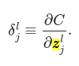

As per our usual conventions, we use δl to denote the vector of errors associated with layer l. Backpropagation will give us a way of computing δl for every layer, and then relating those errors to the quantities of real interest, ∂C/∂wljk and ∂C/∂blj.

An equation for the error in the output layer, δL: The components of δL are given by:

 &nbsp;&nbsp;&nbsp;&nbsp;&nbsp;&nbsp;&nbsp;&nbsp;&nbsp;&nbsp;&nbsp;&nbsp;&nbsp;&nbsp;&nbsp;&nbsp;&nbsp;&nbsp; 
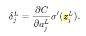

The first term on the right, ∂C/∂aLj, just measures how fast the cost is changing as a function of the jth output activation. If, for example, C doesn't depend much on a particular output neuron, j, then δLj will be small, which is what we'd expect. The second term on the right, σ′(zLj), measures how fast the activation function σ is changing at zLj.

This equation is a componentwise expression for δL. It's a perfectly good expression, but not the matrix-based form we want for backpropagation. However, it's easy to rewrite the equation in a matrix-based form, as:

 &nbsp;&nbsp;&nbsp;&nbsp;&nbsp;&nbsp;&nbsp;&nbsp;&nbsp;&nbsp;&nbsp;&nbsp;&nbsp;&nbsp;&nbsp;&nbsp;&nbsp;&nbsp; 
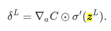

