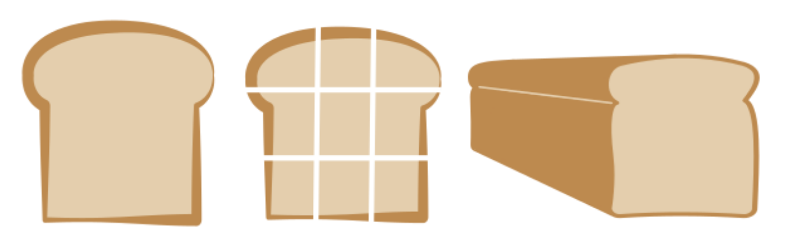
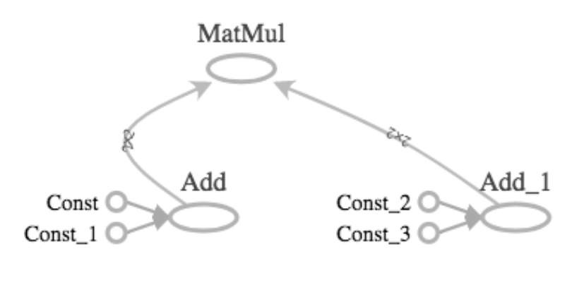
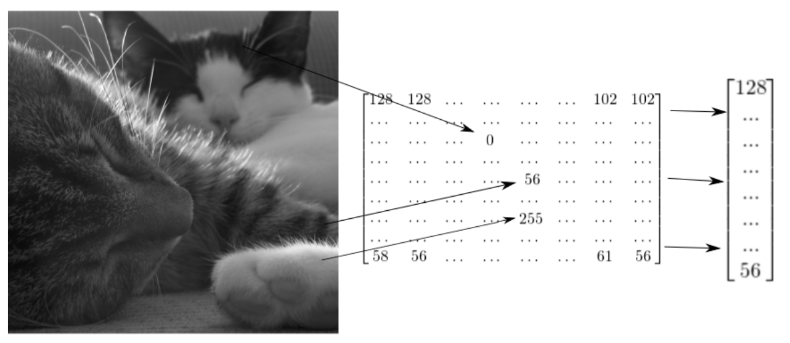
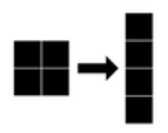
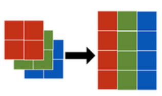

\usepackage{amsmath}

&nbsp;&nbsp;&nbsp;&nbsp;&nbsp;&nbsp;&nbsp;&nbsp;&nbsp;&nbsp;&nbsp;&nbsp;&nbsp;
 TensorFlow is an open-source library for graph-based numerical computation developed by Google Brain Team. We can use TenserFlow to perform:\
 
      - Addition, multiplication, differentiation
      - Design Machine Learning Models
 
 &nbsp;&nbsp;&nbsp;&nbsp;&nbsp;&nbsp;&nbsp;&nbsp;&nbsp;&nbsp;&nbsp;&nbsp;&nbsp;
 A more formal definition of TensorFlow is that it desccribes generalization of vectors and matrices to potentially higher dimensions.

###Example:

&nbsp;&nbsp;&nbsp;&nbsp;&nbsp;&nbsp;&nbsp;&nbsp;&nbsp;&nbsp;&nbsp;&nbsp;&nbsp;
 If we slice one slice of bread into 9 pieces, one of tehse 9 pieces is a **zeor dimensional tesor** and it corresponds to a single number. 
 A collection of 3 pieces that form a row or column represents a **one dimensional tensor**. All 9 pieces together are **2-dimensional tensor.**
 The whole loaf of bread that contains many slices is a **3-dimensional tensor**.
 
  &nbsp;&nbsp;&nbsp;&nbsp;&nbsp;&nbsp;&nbsp;&nbsp;&nbsp;&nbsp;&nbsp;&nbsp;&nbsp;&nbsp;&nbsp;&nbsp;&nbsp;&nbsp; 

&nbsp;&nbsp;&nbsp;&nbsp;&nbsp;&nbsp;&nbsp;&nbsp;&nbsp;&nbsp;&nbsp;&nbsp;&nbsp;&nbsp;&nbsp;&nbsp;&nbsp;&nbsp;&nbsp;&nbsp;
&nbsp;&nbsp;&nbsp;&nbsp;&nbsp;&nbsp;&nbsp;&nbsp;&nbsp;&nbsp;&nbsp;&nbsp;&nbsp;&nbsp;&nbsp;&nbsp;&nbsp;&nbsp;&nbsp;&nbsp;
&nbsp;&nbsp;&nbsp;&nbsp;&nbsp;&nbsp;&nbsp;&nbsp;&nbsp;&nbsp;&nbsp;&nbsp;&nbsp;&nbsp;&nbsp;&nbsp;&nbsp;&nbsp;&nbsp;*Figure 1 - Tensors Picturing*

Let's see how are tensors created:


  
  import tensorflow as tf
  
  # 0-D tensor
  d0 = tf.ones((1,))
  
  
  # 1-D tensor
  d1 = tf.ones((2,))
  
  
  # 2-D tensor
  d2 = tf.ones((2,2))
  
  
  # 3-D tensor
  d3 = tf.ones((2,2,2))
  
  # to print the tf object, we can apply .numpy() method
  print(d3.numpy())


 
# Constants 
&nbsp;&nbsp;&nbsp;&nbsp;&nbsp;&nbsp;&nbsp;&nbsp;&nbsp;&nbsp;&nbsp;&nbsp;&nbsp;
 Constants are the simplest category of tensors in TensorFlow. A constant cannot be changed and cannot be trained, but it can have any dimension. 


  
  from tensorflow import constant
  
  #Define a 2x3 constant --> 2x3 tensor of threes.
  a = constant(3, shape=[2,3])
  
  #Define a 2x2 constant.
  # [[1,2]
  #  [3,4]]
  b = constant([1,2,3,4],shape=[2,2])



 Some of the functions to define constants:
 

|    Operation    |            Example        |  
| :---------------|  :----------------------  |  
| tf.constant     | constant([1,2,3])         |  
| tf.zeros()      | zeros([[2,2])             |  
| tf.ones()       | ones([2,2])               |  
| tf.zeros_like() | zeros_like(input_tensor)  |   
| tf.zones_like() | ones_like(input_tensor)   |  
| tf.fill()       | fill([3,3],7)             |  

 
 Zeros or ones operations generate tensors of an arbitrary dimensions filled with zeros or ones respectively.
 
 Zeros_like or ones_like operations generate tensors filled with zeros or ones respectively, while copying dimension of some input tensor.
 
 Fill operation populates a tensor of an arbitrary dimension with the same scalar value in each element.
 
# Variables

&nbsp;&nbsp;&nbsp;&nbsp;&nbsp;&nbsp;&nbsp;&nbsp;&nbsp;&nbsp;&nbsp;&nbsp;&nbsp;
 Unlike constants, a variable can change its value during computation. The value of a variable isi shared, persistant, and modifiable. However, its ***data type
 and shape*** are fixed.
 
 
  
  import tensorflow as tf
  
  #defina a variable
  
  #one-D tensor with 6 elements with data types float 32 and int 16
  a0 = tf.Variable([1,2,3,4,5,6], dtype=tf.float32)
  a1 = tf.Variable([1,2,3,4,5,6], dtype=tf.int16)
  
  #define a constant
  b = tf.constant(2,tf.float32)
  
  #comopute their product - you can use either method
  c0 = tf.multiply(a0, b)
  c1 = a0 * b



# Basic Operations

&nbsp;&nbsp;&nbsp;&nbsp;&nbsp;&nbsp;&nbsp;&nbsp;&nbsp;&nbsp;&nbsp;&nbsp;&nbsp;
TensorFlow has a model of computation that revolves around the use of graphs. A TensorFlow graph contains edges and nodes, where the edges are tensors and the nodes are operations.

&nbsp;&nbsp;&nbsp;&nbsp;&nbsp;&nbsp;&nbsp;&nbsp;&nbsp;&nbsp;&nbsp;&nbsp;&nbsp;
In the figure 2, we can see the graph which was drawn using TensorFlow, the const operations define 2 by 2 constant tensors. Two tensors are summed using the add operation. Another two tensors are then summed using the add operation. Finally, the resulting matrices are multiplied together with the matmul operation.

 &nbsp;&nbsp;&nbsp;&nbsp;&nbsp;&nbsp;&nbsp;&nbsp;&nbsp;&nbsp;&nbsp;&nbsp;&nbsp;&nbsp;&nbsp;&nbsp;&nbsp;&nbsp; 

&nbsp;&nbsp;&nbsp;&nbsp;&nbsp;&nbsp;&nbsp;&nbsp;&nbsp;&nbsp;&nbsp;&nbsp;&nbsp;&nbsp;&nbsp;&nbsp;&nbsp;&nbsp;&nbsp;&nbsp;
&nbsp;&nbsp;&nbsp;&nbsp;&nbsp;&nbsp;&nbsp;&nbsp;&nbsp;&nbsp;&nbsp;&nbsp;&nbsp;&nbsp;&nbsp;&nbsp;&nbsp;&nbsp;&nbsp;&nbsp;
&nbsp;&nbsp;&nbsp;&nbsp;&nbsp;&nbsp;&nbsp;&nbsp;&nbsp;&nbsp;&nbsp;&nbsp;&nbsp;&nbsp;&nbsp;&nbsp;&nbsp;&nbsp;&nbsp;*Figure 2 - TensorFlow Operations*

### Addition Operator ####



#importing add and constants
from tensorflow import constant, add

# define 0-D, 1-D, and 2-D tensors

A0 = constant([1])
B0 = constant([2])

A1 = constant([1,2])
B1 = constant([3,4])

A2 = constant([[1,2], [3,4]])
B2 = constant([[5,6], [7,8]])

# performing additionwith add()
C0 = add(A0,B0)
C1 = add(A1,B1)
C2 = A2 + B2

\begin{bmatrix}
1 & 2 & 3\\
a & b & c
\end{bmatrix}

&nbsp;&nbsp;&nbsp;&nbsp;&nbsp;&nbsp;&nbsp;&nbsp;&nbsp;&nbsp;&nbsp;&nbsp;&nbsp;
The add operation performs element-wise addition with two tensors. **Each pair of tensors added must have the same shape**. Element-wise addition of the scalars 1 and 2 yields the scalar 3. Element-wise addition of the vectors 1,2 and 3,4 yields the vector 4,6. Element-wise addition of the matrices 1,2,3,4 and 5,6,7,8 yields the matrix 6,8,10,12. Furthermore, the add operator is overloaded, which means that we can also perform addition using the plus symbol.

### Element-wise and Matrix Multiplication ####

&nbsp;&nbsp;&nbsp;&nbsp;&nbsp;&nbsp;&nbsp;&nbsp;&nbsp;&nbsp;&nbsp;&nbsp;&nbsp;
For element-wise multiplication, which is performed with the **multiply()** operation, the ***tensors involved must have the same shape***. For instance, you may want to multiply the vector 1,2,3 by 3,4,5 or 1,2 by 3,4. For matrix multiplication, you use the **matmul()** operator. Note that performing matmul(A,B) requires that the ***number of columns of A equal the number of rows of B.***



from tensorflow import ones, multiply, matmul

A0 = ones(1)
A31 = ones([3,1])
A34 = ones([3,4])
A43 = ones([4,3])



&nbsp;&nbsp;&nbsp;&nbsp;&nbsp;&nbsp;&nbsp;&nbsp;&nbsp;&nbsp;&nbsp;&nbsp;&nbsp;
What operations can be performed using these tensors of ones? We can perform element-wise multiplication of any element by itself, such as A0 by A0, A31 by A31, or A34 by A34. We can also perform matrix multiplication of A43 by A34, but not A43 by A43..

### Summation over tensor dimensions ###

&nbsp;&nbsp;&nbsp;&nbsp;&nbsp;&nbsp;&nbsp;&nbsp;&nbsp;&nbsp;&nbsp;&nbsp;&nbsp;
This operation is performed using the **reduce_sum()** operator.  This can be used to sum over all dimensions of a tensor or just over one dimension of a tensor!

reduce_sum(A) --> sums over all dimensions of A

reduce_sum(A, i) --> sumes over dimension i of the tensor A



from tensorflow import ones, reduce_sum

A = ones([2,3,4])

#sum over all dimensions --> results in 24 since the tensor contains 24 elements all of which are 1
B = reduce_sum(A)
print(B.numpy())

# sum over dimenssions 0,1 and 2
B0 = reduce_sum(A,0)
print(B0.numpy())



&nbsp;&nbsp;&nbsp;&nbsp;&nbsp;&nbsp;&nbsp;&nbsp;&nbsp;&nbsp;&nbsp;&nbsp;&nbsp;
If we sum over dimension 0, we get a 3 by 4 matrix of 2s. If we sum over 1, we get a 2 by 4 matrix of 3s. And if we sum over 2, we get a 2 by 3 matrix of 4s. In each case, we reduce the size of the tensor by summing over one of its dimensions.

# Advaned Operations

|    Operation    |                                   Use                                |  
| :---------------|  :-----------------------------------------------------------------  |  
| gradient()      | Computes the slope of a function at a point                          |  
| reshape()       | Reshapes a tensor (e.g. 10x10 to 100x1)                              |  
| random()        | Populates tensor with entries drawn from a probability distribution  |  

&nbsp;&nbsp;&nbsp;&nbsp;&nbsp;&nbsp;&nbsp;&nbsp;&nbsp;&nbsp;&nbsp;&nbsp;&nbsp;
In many machine learning problems, you will need to find an optimum--that is, a minimum or maximum. You may, for instance, want to find the model parameters that minimize the loss function or maximize the objective function. Fortunately, we can do this by using the gradient operation, which tells us the slope of a function at a point. We start this process by passing points to the gradient operation until we find one where the gradient is zero. Next, we check if the gradient is increasing or decreasing at that point. If it is increasing, we have minimum. Otherwise, we have a maximum.


import tensorflow as tf

#define x
x = tf.Variable(-1.0)

#Define y within instance of GradiantTape
with tf.GradientTape() as tape:
     tape.watch(x)
     y = tf.multiply(x,x)
     
 # evaluate the gradient of y at x = -1
 g = tape.gradient(y,x)
 
 print(g.numpy())



&nbsp;&nbsp;&nbsp;&nbsp;&nbsp;&nbsp;&nbsp;&nbsp;&nbsp;&nbsp;&nbsp;&nbsp;&nbsp;
Note that we apply the watch method to an instance of gradient tape and then pass the variable x. This will allow us to compute the rate of change of y with respect to x. Next, we compute the gradient of y with respect to x using the tape instance of gradient tape. Note that y is the first argument and x is the second. As written, the operation computes the slope of y at a point. Running the code and printing, we find that the slope is -2 at x equals -1, which means that y is initially decreasing in x.

&nbsp;&nbsp;&nbsp;&nbsp;&nbsp;&nbsp;&nbsp;&nbsp;&nbsp;&nbsp;&nbsp;&nbsp;&nbsp;
We'll next consider an operation that is particularly useful for image classification problems: reshaping. The grayscale image shown has a natural representation as a matrix with values between 0 and 255. While some algorithms exploit this shape, others require you to reshape matrices into vectors before using them as inputs, as shown in the diagram.

 &nbsp;&nbsp;&nbsp;&nbsp;&nbsp;&nbsp;&nbsp;&nbsp;&nbsp;&nbsp;&nbsp;&nbsp;&nbsp;&nbsp;&nbsp;&nbsp;&nbsp;&nbsp; 

&nbsp;&nbsp;&nbsp;&nbsp;&nbsp;&nbsp;&nbsp;&nbsp;&nbsp;&nbsp;&nbsp;&nbsp;&nbsp;&nbsp;&nbsp;&nbsp;&nbsp;&nbsp;&nbsp;&nbsp;
&nbsp;&nbsp;&nbsp;&nbsp;&nbsp;&nbsp;&nbsp;&nbsp;&nbsp;&nbsp;&nbsp;&nbsp;&nbsp;&nbsp;&nbsp;&nbsp;&nbsp;&nbsp;&nbsp;&nbsp;
&nbsp;&nbsp;&nbsp;&nbsp;&nbsp;&nbsp;&nbsp;&nbsp;&nbsp;&nbsp;&nbsp;&nbsp;&nbsp;&nbsp;&nbsp;&nbsp;&nbsp;&nbsp;&nbsp;*Figure 3 - Images with Tensors*

&nbsp;&nbsp;&nbsp;&nbsp;&nbsp;&nbsp;&nbsp;&nbsp;&nbsp;&nbsp;&nbsp;&nbsp;&nbsp;
Now that you've seen how images can be represented as tensors, let's generate some input images and reshape them. We will create a random grayscale image by drawing numbers from the set of integers between 0 and 255. We will use these to populate a 2 by 2 matrix. We can then reshape this into a 4 by 1 vector, as shown in the diagram.

&nbsp;&nbsp;&nbsp;&nbsp;&nbsp;&nbsp;&nbsp;&nbsp;&nbsp;&nbsp;&nbsp;&nbsp;&nbsp;&nbsp;&nbsp;&nbsp;&nbsp;&nbsp; 

&nbsp;&nbsp;&nbsp;&nbsp;&nbsp;&nbsp;&nbsp;&nbsp;&nbsp;&nbsp;&nbsp;&nbsp;&nbsp;&nbsp;&nbsp;&nbsp;&nbsp;&nbsp;&nbsp;&nbsp;
&nbsp;&nbsp;&nbsp;&nbsp;&nbsp;&nbsp;&nbsp;&nbsp;&nbsp;&nbsp;&nbsp;&nbsp;&nbsp;&nbsp;&nbsp;&nbsp;&nbsp;&nbsp;&nbsp;&nbsp;
&nbsp;&nbsp;&nbsp;&nbsp;&nbsp;&nbsp;&nbsp;&nbsp;&nbsp;&nbsp;&nbsp;&nbsp;&nbsp;&nbsp;&nbsp;&nbsp;&nbsp;&nbsp;&nbsp;*Figure 4 - Gray Image Manipulation*


import tensorflow as tf

# Generate grayscale image
gray = tf.random.uniform([2,2], maxval = 255, dtype= 'int32')
print(gray.numpy())

#Reshape grayscale image
gray = tf.reshape(gray, [2*2 , 1])
print(gray.numpy())



&nbsp;&nbsp;&nbsp;&nbsp;&nbsp;&nbsp;&nbsp;&nbsp;&nbsp;&nbsp;&nbsp;&nbsp;&nbsp;
For color images, we will generate 3 such matrices to form a 2 by 2 by 3 tensor. We could then reshape the image into a 4 by 3 tensor, as shown in the diagram.

&nbsp;&nbsp;&nbsp;&nbsp;&nbsp;&nbsp;&nbsp;&nbsp;&nbsp;&nbsp;&nbsp;&nbsp;&nbsp;&nbsp;&nbsp;&nbsp;&nbsp;&nbsp; 

&nbsp;&nbsp;&nbsp;&nbsp;&nbsp;&nbsp;&nbsp;&nbsp;&nbsp;&nbsp;&nbsp;&nbsp;&nbsp;&nbsp;&nbsp;&nbsp;&nbsp;&nbsp;&nbsp;&nbsp;
&nbsp;&nbsp;&nbsp;&nbsp;&nbsp;&nbsp;&nbsp;&nbsp;&nbsp;&nbsp;&nbsp;&nbsp;&nbsp;&nbsp;&nbsp;&nbsp;&nbsp;&nbsp;&nbsp;&nbsp;
&nbsp;&nbsp;&nbsp;&nbsp;&nbsp;&nbsp;&nbsp;&nbsp;&nbsp;&nbsp;&nbsp;&nbsp;&nbsp;&nbsp;&nbsp;&nbsp;&nbsp;&nbsp;&nbsp;*Figure 4 - Colored Image Manipulation*


import tensorflow as tf

# Generate grayscale image
color = tf.random.uniform([2,2,3], maxval = 255, dtype= 'int32')
print(color.numpy())

#Reshape grayscale image
color = tf.reshape(color, [2*2 , 3])
print(color.numpy())



&nbsp;&nbsp;&nbsp;&nbsp;&nbsp;&nbsp;&nbsp;&nbsp;&nbsp;&nbsp;&nbsp;&nbsp;&nbsp;
The Squid

