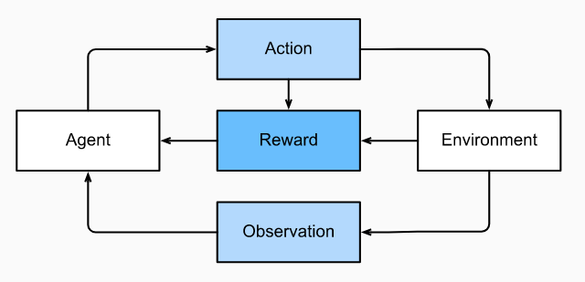

&nbsp;&nbsp;&nbsp;&nbsp;&nbsp;&nbsp;&nbsp;&nbsp;&nbsp;&nbsp;&nbsp;&nbsp;&nbsp;
If you are interested in using machine learning to develop an agent that interacts with an environment and takes actions,
then you are probably going to wind up focusing on reinforcement learning. This might include applications to robotics, 
to dialogue systems, and even to developing artificial intelligence (AI) for video games. Deep reinforcement learning, 
which applies deep learning to reinforcement learning problems, has surged in popularity. The breakthrough deep Q-network
that beat humans at Atari games using only the visual input, and the AlphaGo program that dethroned the world champion at 
the board game Go are two prominent examples.

&nbsp;&nbsp;&nbsp;&nbsp;&nbsp;&nbsp;&nbsp;&nbsp;&nbsp;&nbsp;&nbsp;&nbsp;&nbsp;
Reinforcement learning gives a very general statement of a problem, in which an agent interacts with an environment over 
a series of time steps. At each time step, the agent receives some observation from the environment and must choose an
action that is subsequently transmitted back to the environment via some mechanism (sometimes called an actuator). 
Finally, the agent receives a reward from the environment. This process is illustrated in Fig. 1 The agent then 
receives a subsequent observation, and chooses a subsequent action, and so on. The behavior of an reinforcement learning
agent is governed by a policy. In short, a policy is just a function that maps from observations of the environment to actions.
The goal of reinforcement learning is to produce a good policy.

&nbsp;&nbsp;&nbsp;&nbsp;&nbsp;&nbsp;&nbsp;&nbsp;&nbsp;&nbsp;&nbsp;&nbsp;&nbsp;&nbsp;&nbsp;&nbsp;&nbsp;&nbsp; 

&nbsp;&nbsp;&nbsp;&nbsp;&nbsp;&nbsp;&nbsp;&nbsp;&nbsp;&nbsp;&nbsp;&nbsp;&nbsp;&nbsp;&nbsp;&nbsp;&nbsp;&nbsp;
&nbsp;&nbsp;&nbsp;&nbsp;&nbsp;&nbsp;&nbsp;&nbsp;&nbsp;&nbsp;&nbsp;&nbsp;&nbsp;&nbsp;&nbsp;&nbsp;&nbsp;&nbsp;
&nbsp;&nbsp;&nbsp;&nbsp;&nbsp;&nbsp;&nbsp;&nbsp;&nbsp;&nbsp;&nbsp;&nbsp;&nbsp;&nbsp;&nbsp;&nbsp;&nbsp;&nbsp;
&nbsp;&nbsp;&nbsp;&nbsp;&nbsp;*Figure 1 - The interaction between reinforcement learning and an environment*

&nbsp;&nbsp;&nbsp;&nbsp;&nbsp;&nbsp;&nbsp;&nbsp;&nbsp;&nbsp;&nbsp;&nbsp;&nbsp;
It is hard to overstate the generality of the reinforcement learning framework. For example, we can cast any supervised
learning problem as a reinforcement learning problem. Say we had a classification problem. We could create a reinforcement
learning agent with one action corresponding to each class. We could then create an environment which gave a reward that
was exactly equal to the loss function from the original supervised learning problem.

&nbsp;&nbsp;&nbsp;&nbsp;&nbsp;&nbsp;&nbsp;&nbsp;&nbsp;&nbsp;&nbsp;&nbsp;&nbsp;
That being said, reinforcement learning can also address many problems that supervised learning cannot. For example, in 
supervised learning we always expect that the training input comes associated with the correct label. But in reinforcement 
learning, we do not assume that for each observation the environment tells us the optimal action. In general, we just get 
some reward. Moreover, the environment may not even tell us which actions led to the reward.

&nbsp;&nbsp;&nbsp;&nbsp;&nbsp;&nbsp;&nbsp;&nbsp;&nbsp;&nbsp;&nbsp;&nbsp;&nbsp;
Consider for example the game of chess. The only real reward signal comes at the end of the game when we either win, which
we might assign a reward of 1, or when we lose, which we could assign a reward of -1. So reinforcement learners must deal
with the credit assignment problem: determining which actions to credit or blame for an outcome. The same goes for an employee 
who gets a promotion on October 11. That promotion likely reflects a large number of well-chosen actions over the previous year.
Getting more promotions in the future requires figuring out what actions along the way led to the promotion.

&nbsp;&nbsp;&nbsp;&nbsp;&nbsp;&nbsp;&nbsp;&nbsp;&nbsp;&nbsp;&nbsp;&nbsp;&nbsp;
Finally, at any given point, reinforcement learners might know of one good policy, but there might be many other better 
policies that the agent has never tried. The reinforcement learner must constantly choose whether to exploit the best 
currently-known strategy as a policy, or to explore the space of strategies, potentially giving up some short-run reward in
exchange for knowledge.

&nbsp;&nbsp;&nbsp;&nbsp;&nbsp;&nbsp;&nbsp;&nbsp;&nbsp;&nbsp;&nbsp;&nbsp;&nbsp;
When the environment is fully observed, we call the reinforcement learning problem a Markov decision process. When the state 
does not depend on the previous actions, we call the problem a contextual bandit problem. When there is no state, just a set
of available actions with initially unknown rewards, this problem is the classic multi-armed bandit problem.

&nbsp;&nbsp;&nbsp;&nbsp;&nbsp;&nbsp;&nbsp;&nbsp;&nbsp;&nbsp;&nbsp;&nbsp;&nbsp;
The Squid

