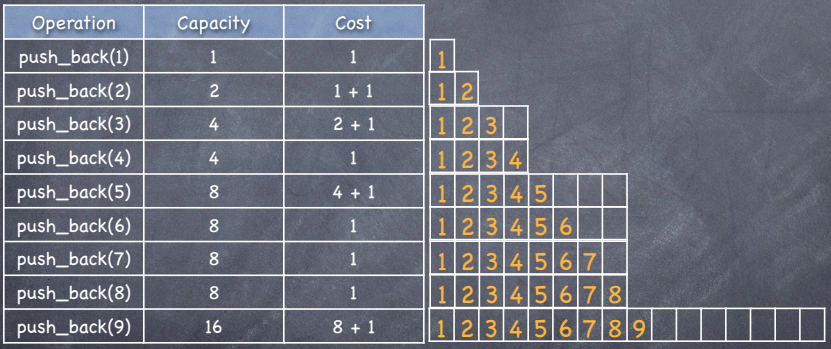

&nbsp;&nbsp;&nbsp;&nbsp;&nbsp;&nbsp;&nbsp;&nbsp;&nbsp;&nbsp;&nbsp;&nbsp;&nbsp;
In the **amortized analysis**, we average the time required to perform a **sequence of operations**. The difference between amortized and avereage-case analysis is that amortized  analysis does not involve probability, but it guarantees the *average performance of each operation in the worst case.*

There are 3 different approaches to amortized analysis:

      1. Agregate Method - Determine total cost T(n) for a sequence of 
      n operations and calculate the amortized cost per operation 
      as T(n)/n.
      
      2. Accounting Method - Assign cost to each operation, 
      overcharging some operations and undercharging some 
      operations. The idea is that early overcharged 
      operations prepay for later undercharged operations. 
      
      3. Potential Method - A potential energy is associated to 
      the data structure,rather than individual credit to operations. 
      
# Amortized Bounds:

Assign the amortized cost for each operation such that you ""preserve the sum."" In other words,

SUM(amortized cost of the operations) >= SUM(actual cost of the operatinos)

The sum of amortized costs should always be bigger because we want the upper bound on the actual cost. This is useful because in some algorithms such as Dijksra's algorithm, we do not care about the shortest path at time t, but only about the shortest path when the algorithm is completly finished. Hence, in this case we care only about sum of the costs, not individual operations cost.  

      
# Agregate Method

The agregate method represents the **amortized cost** as the average cost per operation T(n)/n. Even though different operations may exist, they will all be assigned the same amortized cost by this method (accounting and potential method assign different amortized costs to different operations). This is why this method is the most intuitive, but also recognized as the weakest method to perform the amortization.

## Assume that we are given a problem of the **Augmented Stack**:

A stack S has the following properties:

Push(x, S) - pushes element x on the stack - runtime O(1)
Pop(S) - runtime O(1) 
Multipop(S,k) pops the min(k, |S|) - pops the min(k,|S|) top elements of S - runtime O(min(k,|S|)

Suppose that a sequence of n operations takes T(n) time. Then the amortized cost per operation is defined to be T(n)/n.

The amortized cost applies to each operation, even when there are several different types of operations. 

In a sequence of n operations, the stack never holds more than n elements. Thus, the cost of a multipop operation is O(n).

It follows that the worst-case running time of any sequence of n stack operations is O(n2). However, this is an over-estimate!

**The total number of pops or multipops in the entire sequence of operations is <= the total number of pushes.**

Suppose that the maximum number of Push operations in the sequence is n. So the time for entire sequence is O(n). 

Amortized cost per operation: O(n)/n = O(1).

## Assume that we are given a problem of the vector::Push_back:

In C++, a vector is a sequence of elements that can be accessed by an index, but - unlike an array - it does not have a fixed size.

      vector<int> = v; // start with an empty vector
      
      v.push_back(1); // v = [1] and capacity = 1
      
      v.push_back(2); // v = [1,2] and capacity = 2
      
      v.push_back(3); // v = [1,2,3] and capacity = 4

The costs of the push_back() look as follows:
      
&nbsp;&nbsp;&nbsp;&nbsp;&nbsp;&nbsp;&nbsp;&nbsp;&nbsp;&nbsp;&nbsp;&nbsp;&nbsp;&nbsp;&nbsp;&nbsp;&nbsp;&nbsp; 

Cost for the i-th push back:
      
                        /  1+2k    if i  1=2k for some k
                      /
                C_i =   
                      \
                        \  1       otherwise
      
Hence, n push operations cost:
      
      T(n) = SUM(c_i) from 1 to n  +   SUM(2^i) from i=0 to i = log(n)  =  n + 2n - 1 = 3n - 1
      
** Thus, the amortized cost  is T(n)/n = (3n - 1) / 3  < 3.**
      
      
 
      
## Assume that we are given a problem of the **Binary Counter**:

A binary k-bit counter can be implemented with a k-element binary array. The counter is initially 0.  

The only operation is increment(A), which adds 1 to the current number in the counter. 00000000, 00000001, 00000010, 00000011, 00000100 ... 

The worst case running time occurs when all k bits are flipped, so increment(A) has running time O(k).

In a sequence of n increment operations, few increments will cause that many bits to flip. Indeed,

bit 0 flips with every increment 

bit 1 flips with every 2nd increment 

bit 2 flips with every 4th increment, ...

Total number of bit flips in n increment operations is n + n/2 + n/4 + ... + n/2k < n(1/(1-1/2))= 2n .

So total cost of the sequence is O(n). 

Amortized cost per operation is O(n)/n = O(1). 

**CLRS Chapter 17**

*Problem 17.1-1*

If the stach operations included a MULTIPUSH operation, which pushes k items onto stack, would the O(1) bound on the amortized cost of the stack operations continue to hold?

Answer: No. What if there was MULTIPUSH(k) and then MULTIPOP(k) operations. They both have O(k) execution time. Hence the amortized time by agregate method would be 2 * O(k) / 2 = O(k), which is not O(k).

      
      
      
      
      
      
      
      
      
      
      
# Accounting Method

Let us define a bank:

  - allow an operation to store credit in the bank account (bank account >= 0).
  - allow an operation to take coins out of the bank topay for execution time using the credit that is stored in the bank.
  - balance must be >= 0.

Let's say an insertion function in the tree costs O(lgn) and deletion takes O(lgn).

So, we would pay the bank 1 coin worth O(lgn) per each insertion.

When we delete an element, we use the money from the bank to cover the deletion, which gives us amortization. 

Amortized cost = actual cost + deposits - withdrawals 

In other words, we assign different charges to different operations. Some operations are charged more or less than the actual cost of the operation. *The amount we charge the operation is called **amortized cost***. When operation's amortized cost exceeds the actual cost of operation, we assigh that difference to specific objects in the data structure as ***credits***. The same credit can help pay for later operations when the amortized cost is smaller than the actual cost of the operation. Different operations may have different amortized costs, which is different from the agregate method.

## Assume that we are given a problem of the **Augmented Stack**:

Let stack have the following methods and their **actual costs**:
- push 1
- pop 1
- multipop min(k,s), where s is the stack size and k is # of elements being popped.

Their amortized costs:
- push 2,
- pop 0,
- multipop 0

Our goal is to demonstrate that we can pay for any sequence of stack operations using their amortized costs. 

Since the push operation costs 1, the additional 1 from the amortized cost is being stored as credit every time we execute the push function. We can see that we will have enough credit to pay for all pop or multi pop functions that are being executed because their cost is one and we cannot have more pop functions than push functions executed. Hence, we will always have enough money. 

Therefore, each amortized cost is O(1) and the cost of the entire sequence of the oeprations is O(n).

## Assume that we are given a problem of the **Vector::push_back**:

In this example the amortized cost of the push back operation is 3. 

This is how the process would look like. 

- We want to push element 1 into the vector. This element has the amortized cost of 3$. It has to pay 1$ for insertion, so it is left with 2$. The vector would look like:

            [ 1  ]
            [ 2$ ]
            
- We want to insert the element 2. We need to double the size of the vector and copy the element 1 to the new vector and insert the element 2. The element 1 will have $ 2 so it can afford to pay for itself to be copied, while the element 2 has to pay the insertion 1$. The vector would look like:

            [ 1  ][ 2  ]
            [ 1$ ][ 2$ ]
         
- Inserting the element 3. In this case, the second element would pay for copying the elements 1 and 2, while the element 3 would only pay for the insertion. The vector would look like:

            [ 1  ][ 2  ][ 3  ][    ]
            [ 1$ ][ 0$ ][ 2$ ][    ]
            
- Inserting element 4. No need to double the vector. Just insert. The vector would look like:

            [ 1  ][ 2  ][ 3  ][ 4  ]
            [ 1$ ][ 0$ ][ 2$ ][ $2 ]
            
- Inserting element 5. Again doubling the vector. Element 3 will pay for copying of the elements 1 and 2, while the element 4 will pay for the copying of the elements 3 and 4. The vector would look like:

            [ 1  ][ 2  ][ 3  ][ 4  ][ 5  ][    ][    ][    ]
            [ 1$ ][ 0$ ][ 0$ ][ 0$ ][ 2$ ][    ][    ][    ]

- Inserting element 6. The vector would look like:

            [ 1  ][ 2  ][ 3  ][ 4  ][ 5  ][ 6  ][    ][    ]
            [ 1$ ][ 0$ ][ 0$ ][ 0$ ][ 2$ ][ 2$ ][    ][    ]

- Inserting element 7. The vector would look like:

            [ 1  ][ 2  ][ 3  ][ 4  ][ 5  ][ 6  ][ 7  ][    ]
            [ 1$ ][ 0$ ][ 0$ ][ 0$ ][ 2$ ][ 2$ ][ 2$ ][    ]
            
- Inserting element 8. The vector would look like:

            [ 1  ][ 2  ][ 3  ][ 4  ][ 5  ][ 6  ][ 7  ][ 8  ]
            [ 1$ ][ 0$ ][ 0$ ][ 0$ ][ 2$ ][ 2$ ][ 2$ ][ 2$ ]

- Inserting element 9. In the same manner, the element 5 will pay for copying the elements 1 and 2, the elemnent 6 will pay for copying elements 3 and 4. Element 7 will pay for 5 and 6 and element 8 will pay for 7 and 8. Finally, we insert 9 and it only pays for insertion. The vector would look like:

            [ 1  ][ 2  ][ 3  ][ 4  ][ 5  ][ 6  ][ 7  ][ 8  ][ 9  ][    ][    ][    ][    ][    ][    ][    ]
            [ 1$ ][ 0$ ][ 0$ ][ 0$ ][ 0$ ][ 0$ ][ 0$ ][ 0$ ][ 2$ ][    ][    ][    ][    ][    ][    ][    ]
            

## Assume that we are given a problem of the **Binary Counter**:

In this example the actual cost for an increment operation is the number of bits flipped.

We can assign an amortized cost of 2 for each increment operation. The main idea is to use 1 to flip the bit from 0 to 1 and store 1 credit to flip it back to 0 later. 

We start will all bits being set to 0. This is how it would look like:

            [ 0  ][ 0  ][ 0  ][ 0  ]
            
- When we increment for 1, the flip of the first bit from 0 to 1 costs 1$ and we are left with 1$, the table would look like:

            [ 0  ][ 0  ][ 0  ][ 1  ]
            [ 0$ ][ 0$ ][ 0$ ][ 1$ ]
            
- Next increment. We need to flip the bit 1 to be 1 and that costs 1$ and leaves that bit with 1$. Bit 0 has to be flipped back to 0, but it already has the credit from the time when it was flipped to 1, so the flip back to 0 costs nothing, we used the credit.

            [ 0  ][ 0  ][ 1  ][ 0  ]
            [ 0$ ][ 0$ ][ 1$ ][ 0$ ]
            
- Next increment.           
       
            [ 0  ][ 0  ][ 1  ][ 1  ]
            [ 0$ ][ 0$ ][ 1$ ][ 1$ ]

- Next increment.           
       
            [ 0  ][ 1  ][ 0  ][ 0  ]
            [ 0$ ][ 1$ ][ 0$ ][ 0$ ]

- Next increment.           
       
            [ 0  ][ 1  ][ 0  ][ 1  ]
            [ 0$ ][ 1$ ][ 0$ ][ 1$ ]

- Next increment.           
       
            [ 0  ][ 1  ][ 1  ][ 0  ]
            [ 0$ ][ 1$ ][ 1$ ][ 0$ ]

- Next increment.           
       
            [ 0  ][ 1  ][ 1  ][ 1  ]
            [ 0$ ][ 1$ ][ 1$ ][ 1$ ]

# Potential Method

Define the **potential function Ф** as bank balance or potential that maps the data structure configuration. It must be a nonnegative integer. 

This potential function is essentially trying to calculate how bad is this data structure right now. If we have to do some expensive operation, we will hope that the potential grew large enough that we can charge that cost, which will decrease our potential.  

Amortized cost = actual cost + change in the potential Ф

change in the potential Ф = Ф(after the operation) - Ф(before the operation)

When summing all operations:

SUM(amortized costs) = SUM(actual costs) + Ф(beginning) - Ф(end)

This should be greater than the sun the actual cost of all the operations and therefore represent the upper bound.

## Assume that we are given a problem of the **Augmented Stack**:

Let S be a stack with m elements. Define the potential function Ф(S)=m, the number elements on S

Let's see how we would determine the costs of the 3 functions mentioned at the beginning of this document.

Push --> C_k' = C_k + Ф(Push(S,x)) - Ф(S)   =   1 + (m + 1) - m = 1 + 1 = 2, where C_k is the price of teh push operation

Pop -->  C_k' = C_k + Ф(Pop(S,x)) - Ф(S)   =   1 + (m - 1) - m = 1 - 1 = 0

MultiPop --> C_k' = C_k + Ф(MultiPop(S,x)) - Ф(S)   =   a + (m - a) - m = 0, where a represents the number of elements that are being popped.

## Assume that we are given a problem of the **Vector::push_back**:

We will define the function Ф(v) = 2 * v.size() - v.capacity()

We know that initial capacity and initial size are 0.

c_i' = 1 + Ф_i - Ф_(i-1) = 1 + 2 if ith operation doesn't cause growth

If the ith operation does cause growth, then 

capacity_i = 2 * capacity_(i-1), SZ_(i-1) = capacity_(i-1), SZ_i = capacity_(i-1) + 1

Hence,

c_i' = 1capacity_(i-1) + 1 + Ф_i - Ф_(i-1) = capacity-(i-1) + (2 * (capacity_(i-1) + 1) - (2 * capacity_(i-1) - capacity_(i-1))) = 3

## Assume that we are given a problem of the **Binary Counter**:

Potential Function Bi = number of 1s in counter after ith increment.

Suppose i_th increment operation resets t_i bits.

Actual cost: c_i = t_i + 1 because in addition to resetting t_i bits, it will set at least one bit to 1. 

Notice that B_i <= B_i-1 - t_i + 1

- if B_i = 0, then B_i-1 = t_i = k => if B_i = 0 then the ith operation resets all k bits.
- if B_i > 0, then B_i = B_i-1 - t_i + 1  

Difference in Potentials:

B_i - B_i-1 <= (B_i-1 - t_i + 1) - B_i-1 = -t_i + 1

Amortized cost: c_i + B_i - B_i-1 <= t_i + 1 -t_i + 1 = 2

Advantage of the potential method: We can use it to analyze counters that do not start from 0.

&nbsp;&nbsp;&nbsp;&nbsp;&nbsp;&nbsp;&nbsp;&nbsp;&nbsp;&nbsp;&nbsp;&nbsp;&nbsp;
 The Squid
