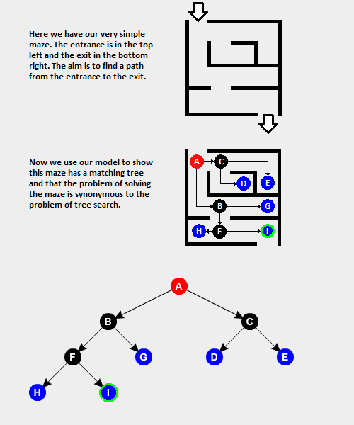
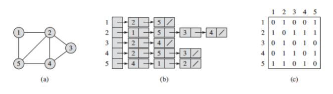
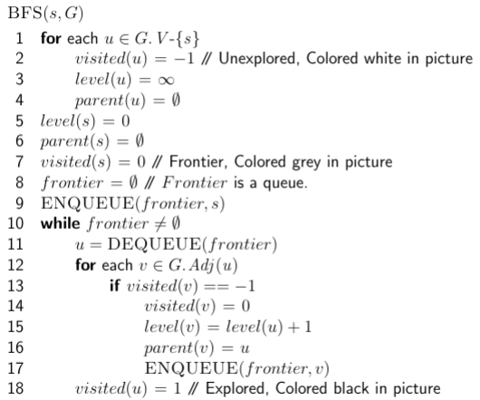
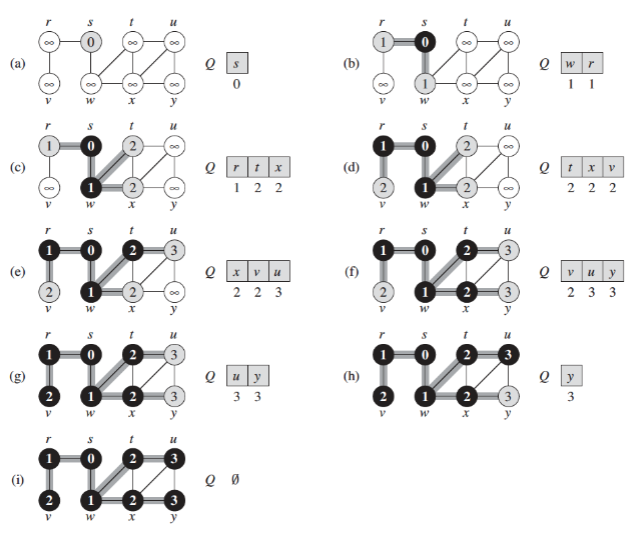
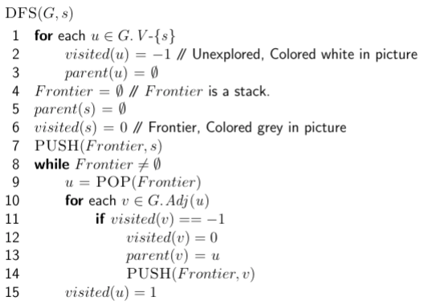

&nbsp;&nbsp;&nbsp;&nbsp;&nbsp;&nbsp;&nbsp;&nbsp;&nbsp;&nbsp;&nbsp;&nbsp;&nbsp;
A graph is an ordered pair G = (V, E) comprising a set V of vertices (nodes or points) together with a set E of edges (arcs or lines), which are 2-element subsets of V .

Graph Applications:

- Social Networks
- Transportation Networks
- Communication Networks
- Semantic Networks
- State Transitions in Multi-Stage Decision Problems
- Biology: Gene Regulatory Networks
- Circuits: Kirchoff’s Laws
- and so on...

&nbsp;&nbsp;&nbsp;&nbsp;&nbsp;&nbsp;&nbsp;&nbsp;&nbsp;&nbsp;&nbsp;&nbsp;&nbsp;&nbsp;&nbsp;&nbsp;&nbsp;&nbsp; 

&nbsp;&nbsp;&nbsp;&nbsp;&nbsp;&nbsp;&nbsp;&nbsp;&nbsp;&nbsp;&nbsp;&nbsp;&nbsp;&nbsp;&nbsp;&nbsp;&nbsp;&nbsp;
&nbsp;&nbsp;&nbsp;&nbsp;&nbsp;&nbsp;&nbsp;&nbsp;&nbsp;&nbsp;&nbsp;&nbsp;&nbsp;&nbsp;&nbsp;&nbsp;&nbsp;&nbsp;
&nbsp;&nbsp;&nbsp;&nbsp;&nbsp;&nbsp;&nbsp;&nbsp;&nbsp;&nbsp;&nbsp;&nbsp;&nbsp;&nbsp;&nbsp;&nbsp;&nbsp;&nbsp;
&nbsp;&nbsp;&nbsp;&nbsp;&nbsp;*Figure 1 - Transportation network*

&nbsp;&nbsp;&nbsp;&nbsp;&nbsp;&nbsp;&nbsp;&nbsp;&nbsp;&nbsp;&nbsp;&nbsp;&nbsp;&nbsp;&nbsp;&nbsp;&nbsp;&nbsp; 

&nbsp;&nbsp;&nbsp;&nbsp;&nbsp;&nbsp;&nbsp;&nbsp;&nbsp;&nbsp;&nbsp;&nbsp;&nbsp;&nbsp;&nbsp;&nbsp;&nbsp;&nbsp;
&nbsp;&nbsp;&nbsp;&nbsp;&nbsp;&nbsp;&nbsp;&nbsp;&nbsp;&nbsp;&nbsp;&nbsp;&nbsp;&nbsp;&nbsp;&nbsp;&nbsp;&nbsp;
&nbsp;&nbsp;&nbsp;&nbsp;&nbsp;&nbsp;&nbsp;&nbsp;&nbsp;&nbsp;&nbsp;&nbsp;&nbsp;&nbsp;&nbsp;&nbsp;&nbsp;&nbsp;
&nbsp;&nbsp;&nbsp;&nbsp;&nbsp;*Figure 2 - State Transition Graph*

There are 2 standard ways to represent graphs: adjacency lists and anjacency matrix (Figure 3).

&nbsp;&nbsp;&nbsp;&nbsp;&nbsp;&nbsp;&nbsp;&nbsp;&nbsp;&nbsp;&nbsp;&nbsp;&nbsp;&nbsp;&nbsp;&nbsp;&nbsp;&nbsp; 

&nbsp;&nbsp;&nbsp;&nbsp;&nbsp;&nbsp;&nbsp;&nbsp;&nbsp;&nbsp;&nbsp;&nbsp;&nbsp;&nbsp;&nbsp;&nbsp;&nbsp;&nbsp;
&nbsp;&nbsp;&nbsp;&nbsp;&nbsp;&nbsp;&nbsp;&nbsp;&nbsp;&nbsp;&nbsp;&nbsp;&nbsp;&nbsp;&nbsp;&nbsp;&nbsp;&nbsp;
&nbsp;&nbsp;&nbsp;&nbsp;&nbsp;&nbsp;&nbsp;&nbsp;&nbsp;&nbsp;&nbsp;&nbsp;&nbsp;&nbsp;&nbsp;&nbsp;&nbsp;&nbsp;
&nbsp;&nbsp;&nbsp;&nbsp;&nbsp;*Figure 3 - Graph Representation*

**Some characteristics of graphs:**

1. Degree/Valency: number of edges that are coming in or out of a vertex.
2. Path: A sequence of edges that trails along a sequence of vertices from a start node to a destination node.
3. Cycle/Loop: A path wherein the start and destination nodes are identical.
4. Distance: Length of shortest path between two nodes.
5. Diameter: Largest distance between any pair of vertices.
6. Connected Components: A subgraph in which any two vertices are connected to each other by paths, and which is connected to no additional vertices in the supergraph.

**Types of Graphs:**

1. Connected Graph: A graph with at least one path between any pair of vertices.
2. Acyclic Graph: A graph with no cycles (loops).
3. Simple Graph: An undirected graph without multiple edges or loops.
4. Trees: A connected/acyclic graph. (Unique path between any pair of vertices).
5. Forests: A collection of trees.
6. Bipartite Graph: A graph in which the vertex set can be partitioned into two sets, W and X, so that no two vertices in W share a common edge and no two vertices in X share a common edge.
7. Complete Graph: A graph where every pair of nodes lies in E.

### Graph Traversal(BFS & DFS)

**Frontier** is the boundary between the set of explored and unexplored nodes.

&nbsp;&nbsp;&nbsp;&nbsp;&nbsp;&nbsp;&nbsp;&nbsp;&nbsp;&nbsp;&nbsp;&nbsp;&nbsp;&nbsp;&nbsp;&nbsp;&nbsp;&nbsp; 

&nbsp;&nbsp;&nbsp;&nbsp;&nbsp;&nbsp;&nbsp;&nbsp;&nbsp;&nbsp;&nbsp;&nbsp;&nbsp;&nbsp;&nbsp;&nbsp;&nbsp;&nbsp;
&nbsp;&nbsp;&nbsp;&nbsp;&nbsp;&nbsp;&nbsp;&nbsp;&nbsp;&nbsp;&nbsp;&nbsp;&nbsp;&nbsp;&nbsp;&nbsp;&nbsp;&nbsp;
&nbsp;&nbsp;&nbsp;&nbsp;&nbsp;&nbsp;&nbsp;&nbsp;&nbsp;&nbsp;&nbsp;&nbsp;&nbsp;&nbsp;&nbsp;&nbsp;&nbsp;&nbsp;
&nbsp;&nbsp;&nbsp;&nbsp;&nbsp;*Figure 4 - Frontier*

**BFS**

Breadth-first search is one of the simplest search algorithms, but still widely used. BFS got this name because of the way it explores the vertices. Every vertex connected to node x will be explored prior to explorint ant other vertex that is connected to a node x + 1. Hence, the exploration goes accross the breadth of the frontier. BFS constructs a BFS-tree that originally consists only of the root, the node that we are starting the search from. Then, when it checks out a vertex that is 1 edge away and is not a member of BFS tree, then it adds that vertex to the BFS-tree as well as the edge between those vertices. The process keeps repeating. It is important to know that the node that is being serched from is called **predecessor** or **parent**. 

The pseudo code for Breadth-First Search is as follows:

&nbsp;&nbsp;&nbsp;&nbsp;&nbsp;&nbsp;&nbsp;&nbsp;&nbsp;&nbsp;&nbsp;&nbsp;&nbsp;&nbsp;&nbsp;&nbsp;&nbsp;&nbsp; 

&nbsp;&nbsp;&nbsp;&nbsp;&nbsp;&nbsp;&nbsp;&nbsp;&nbsp;&nbsp;&nbsp;&nbsp;&nbsp;&nbsp;&nbsp;&nbsp;&nbsp;&nbsp;
&nbsp;&nbsp;&nbsp;&nbsp;&nbsp;&nbsp;&nbsp;&nbsp;&nbsp;&nbsp;&nbsp;&nbsp;&nbsp;&nbsp;&nbsp;&nbsp;&nbsp;&nbsp;
&nbsp;&nbsp;&nbsp;&nbsp;&nbsp;&nbsp;&nbsp;&nbsp;&nbsp;&nbsp;&nbsp;&nbsp;&nbsp;&nbsp;&nbsp;&nbsp;&nbsp;&nbsp;
&nbsp;&nbsp;&nbsp;&nbsp;&nbsp;*Figure 5 - BFS*

The iterations look like (where Q represents the frontier):

&nbsp;&nbsp;&nbsp;&nbsp;&nbsp;&nbsp;&nbsp;&nbsp;&nbsp;&nbsp;&nbsp;&nbsp;&nbsp;&nbsp;&nbsp;&nbsp;&nbsp;&nbsp; 

&nbsp;&nbsp;&nbsp;&nbsp;&nbsp;&nbsp;&nbsp;&nbsp;&nbsp;&nbsp;&nbsp;&nbsp;&nbsp;&nbsp;&nbsp;&nbsp;&nbsp;&nbsp;
&nbsp;&nbsp;&nbsp;&nbsp;&nbsp;&nbsp;&nbsp;&nbsp;&nbsp;&nbsp;&nbsp;&nbsp;&nbsp;&nbsp;&nbsp;&nbsp;&nbsp;&nbsp;
&nbsp;&nbsp;&nbsp;&nbsp;&nbsp;&nbsp;&nbsp;&nbsp;&nbsp;&nbsp;&nbsp;&nbsp;&nbsp;&nbsp;&nbsp;&nbsp;&nbsp;&nbsp;
&nbsp;&nbsp;&nbsp;&nbsp;&nbsp;*Figure 4 - BFS itarations*

This process is being implemented using a queue data structure for the frontier. Every vertex that we visit, we will push to the queue and then, we will explore the vertices one by one from the front of the queue (while popping them of course).

**Problems to solve:**

1. [Word Ladder](https://leetcode.com/problems/word-ladder/)

**DFS**

Depth-First Search got its name because it goes in depth first. This algorithm uses stack data structure to visit all the nodes and it creates the DFS subtree, of course. The pseudo code looks as following:

&nbsp;&nbsp;&nbsp;&nbsp;&nbsp;&nbsp;&nbsp;&nbsp;&nbsp;&nbsp;&nbsp;&nbsp;&nbsp;&nbsp;&nbsp;&nbsp;&nbsp;&nbsp; 

&nbsp;&nbsp;&nbsp;&nbsp;&nbsp;&nbsp;&nbsp;&nbsp;&nbsp;&nbsp;&nbsp;&nbsp;&nbsp;&nbsp;&nbsp;&nbsp;&nbsp;&nbsp;
&nbsp;&nbsp;&nbsp;&nbsp;&nbsp;&nbsp;&nbsp;&nbsp;&nbsp;&nbsp;&nbsp;&nbsp;&nbsp;&nbsp;&nbsp;&nbsp;&nbsp;&nbsp;
&nbsp;&nbsp;&nbsp;&nbsp;&nbsp;&nbsp;&nbsp;&nbsp;&nbsp;&nbsp;&nbsp;&nbsp;&nbsp;&nbsp;&nbsp;&nbsp;&nbsp;&nbsp;
&nbsp;&nbsp;&nbsp;&nbsp;&nbsp;*Figure 4 - DFS pseudocode*

The point is that as long as we are encountering a new vertex that has not been explored before, we are suspending (adding to the stack) the current vertex and then moving to that newly explored vertex. Once we find the vertex that has no other vertices connected to it, we checkout the vertex from the top of the stack and repeat the process of exploring new vertices. 

**Problems to solve:**

1. [Path Sum II](https://leetcode.com/problems/path-sum-ii/)
2. [Path Sum III](https://leetcode.com/problems/path-sum-iii/)
3. [Max Path Sum](https://leetcode.com/problems/binary-tree-maximum-path-sum/)

**List of Interesting Problems on Graphs**

- Searching over Graphs
- Topological Sort
- Minimum Spanning Tree
- Shortest Path
- Maximum Flow
- Maximum Bipartite matching
- Hamiltonian Path
- Graph Coloring
- Rigidity of Graphs
- Graph Centrality

&nbsp;&nbsp;&nbsp;&nbsp;&nbsp;&nbsp;&nbsp;&nbsp;&nbsp;&nbsp;&nbsp;&nbsp;&nbsp;
Nikola Andrić
