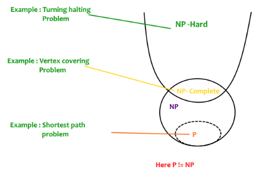

– (A determinstic computer is what we know)
– A nondeterministic computer is one that can “guess” the right
answer or solution 

P is a set of problems that can be solved by a deterministic Turing machine in **Polynomial time**. More specifically, those are the problems that can be solved in O(n^k) time for some
constant k, where n is the size of the input.

NP is set of decision problems that can be solved by a **Non-deterministic Turing Machine in Polynomial time.** P is subset of NP (any problem that can be solved by a deterministic machine in polynomial time can also be solved by a non-deterministic machine in polynomial time). 
Informally, NP is a set of decision problems that can be solved by a polynomial-time via a “Lucky Algorithm”, a magical algorithm that always makes a right guess among the given set of choices.

**NP-complete** problems are the **hardest problems** in the NP set.  A decision problem L is NP-complete if: 
1) **L is in NP** (Any given solution for NP-complete problems can be verified quickly, but there is no efficient known solution). 
2) Every problem in **NP is reducible to L in polynomial time**.

A problem is NP-Hard if it follows property 2 mentioned above, doesn’t need to follow property 1. Therefore, the NP-Complete set is also a subset of the NP-Hard set. 

A lot of times you can solve a problem by reducing it to a different problem. We can reduce Problem B to Problem A if, given a solution to Problem A, I can easily
construct a solution to Problem B. (In this case, "easily" means "in polynomial time.“).

&nbsp;&nbsp;&nbsp;&nbsp;&nbsp;&nbsp;&nbsp;&nbsp;&nbsp;&nbsp;&nbsp;&nbsp;&nbsp;&nbsp;&nbsp;&nbsp;&nbsp;&nbsp; 
&nbsp;&nbsp;&nbsp;&nbsp;&nbsp;&nbsp;&nbsp;&nbsp;&nbsp;&nbsp;&nbsp;&nbsp;&nbsp;&nbsp;&nbsp;&nbsp;&nbsp;&nbsp; 
&nbsp;&nbsp;&nbsp;&nbsp;&nbsp;&nbsp;&nbsp;&nbsp;&nbsp;&nbsp;&nbsp;&nbsp;&nbsp;&nbsp;&nbsp;&nbsp;&nbsp;&nbsp; 

