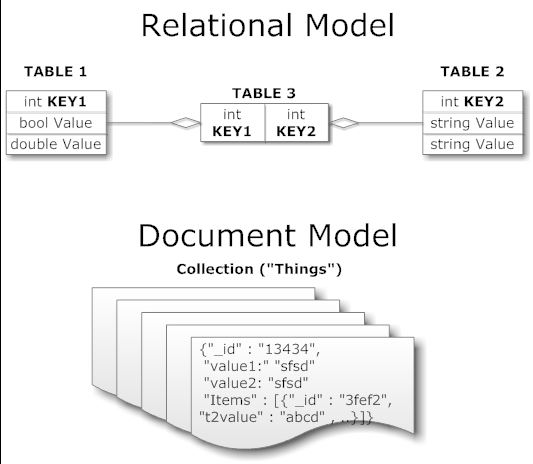
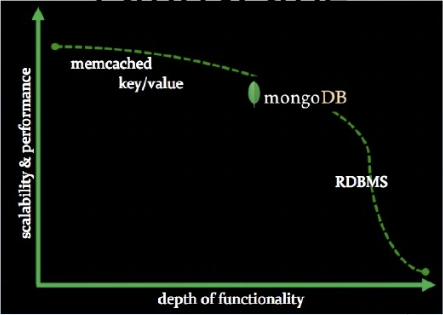
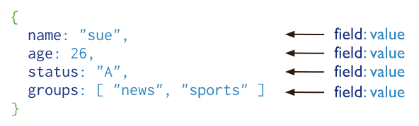
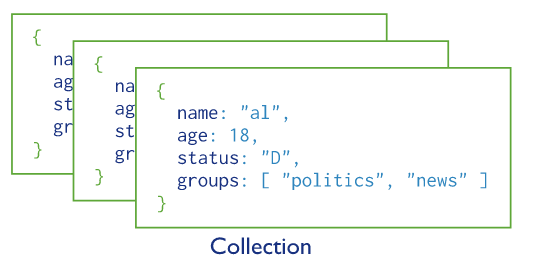

**Mongo DB** can be defined as a **document-oriented database system** that uses the concept of **NoSQL**. 
It also provides high availability, high performance, along with automatic scaling. 
This open-source product was developed by the company - 10gen in October 2007, and the company also maintains it. 

**Relational Data Models vs. Document Models**

The key to using Mongo or SQL Server effectively is understanding how the underlying data model works and how this impacts your ability to read / write what you want when you want to the datastore. Below are illustrations of the relational (SQL) model versus the document model.

&nbsp;&nbsp;&nbsp;&nbsp;&nbsp;&nbsp;&nbsp;&nbsp;&nbsp;&nbsp;&nbsp;&nbsp;&nbsp;&nbsp;&nbsp;&nbsp;&nbsp;&nbsp; 

In a **relational model** all of your information is expressed in the form of **tables**, all of which contain **keys** and some of which contain **foreign keys** to other tables. 
All of the information you read from and write to the database is expressed as either adding rows to these tables or combining their values based on some keys.

In a **document model** you have a relatively flat **collection of items** all **identified by one primary key**, and instead of defining a relationship between
 two collections you simply **embed one inside the other**. So the relationship between the three tables in our relational model is expressed as a single, 
 flat document in this model.

It is important to note here that there’s** no schema** that tells MongoDB what fields should or shouldn’t be expected in each document 
in the “Things” collection – in the relational universe each table is strongly, declaratively typed and every single item inserted into 
the row must conform to all of the constraints imposed by the relational database management system (RDBMS.) Anything goes in Mongo.

The goal of MongoDB is to build the bridge to overcomoe the gap between key-value storages that are fast and scalable and relational databases that have
rich functionality, but are inefficient when data is scaled up.

&nbsp;&nbsp;&nbsp;&nbsp;&nbsp;&nbsp;&nbsp;&nbsp;&nbsp;&nbsp;&nbsp;&nbsp;&nbsp;&nbsp;&nbsp;&nbsp;&nbsp;&nbsp; 

# Document Database

A record in MongoDB is a document, which is a data structure composed of field and value pairs and is in **BSON format**. The values of fields may include other documents, arrays, and arrays of documents.

#NOTE: MongoDB stores data records as BSON documents. BSON is a binary representation of JSON documents, though it contains more data types than JSON. 

&nbsp;&nbsp;&nbsp;&nbsp;&nbsp;&nbsp;&nbsp;&nbsp;&nbsp;&nbsp;&nbsp;&nbsp;&nbsp;&nbsp;&nbsp;&nbsp;&nbsp;&nbsp; 

The advantages of using documents are:

- Documents (i.e. objects) correspond to native data types in many programming languages.
- Embedded documents and arrays reduce need for expensive joins.
- Dynamic schema supports fluent polymorphism.

MongoDB stores documents in **collections**. 

# Collections

In MongoDB, databases hold one or more **collections** of documents. Collections are similar to tables in relational databases.

&nbsp;&nbsp;&nbsp;&nbsp;&nbsp;&nbsp;&nbsp;&nbsp;&nbsp;&nbsp;&nbsp;&nbsp;&nbsp;&nbsp;&nbsp;&nbsp;&nbsp;&nbsp; 

MongoDB provides the db.createCollection() method to explicitly create a collection with various options, such as setting the maximum size or the documentation validation rules.
However, you do not need to do that. You can simply do the following:

        use myNewDB
        
        db.myNewCollection1.insertOne( { x: 1 } )
        
If a database does not exist, MongoDB creates the database when you first store data for that database. 
As such, you can switch to a non-existent database and perform the operation above. The insertOne() operation creates both the database myNewDB and the collection myNewCollection1 if they do not already exist.

# CRUD

**CRUD** operations **create**, **read**, **update**, and **delete** documents.

Create or insert operations add new documents to a collection. If the collection does not currently exist, insert operations will create the collection.

MongoDB provides the following methods to insert documents into a collection:

- db.collection.**insertOne**() New in version 3.2
- db.collection.**insertMany**() New in version 3.2

In MongoDB, insert operations target a single collection.

## Read Operations

Read operations retrieve documents from a collection; i.e. query a collection for documents. MongoDB provides the following methods to read documents from a collection:

db.collection.**find**()

You can specify query filters or criteria that identify the documents to return.

Some examples with comparison to RDBMS:

To select all documents in the collection, pass an empty document as the query filter parameter to the find method.

    SQL statement: SELECT * FROM inventory

    MongoDB: db.inventory.find( {} )

To specify equality conditions, use <field>:<value> expressions:
  
      MongoDB: { <field1>: <value1>, ... }
  

The following example selects from the inventory collection all documents where the status equals "D":
  
  
        SQL statement: SELECT * FROM inventory WHERE status = "D"

        MongoDB: db.inventory.find( { status: "D" } )

  
**Specify Conditions Using Query Operators**
  
A query filter document can use the query operators to specify conditions in the following form:  

      MongoDB: { <field1>: { <operator1>: <value1> }, ... }
  
The following example retrieves all documents from the inventory collection where status equals either "A" **or** "D":  
  
      SQL statement: SELECT * FROM inventory WHERE status in ("A", "D")

      MongoDB: db.inventory.find( { status: { $in: [ "A", "D" ] } } )
  

The following example retrieves all documents in the inventory collection where the status equals "A" **and** qty is less than ($lt) 30:
  
      SQL statement: SELECT * FROM inventory WHERE status = "A" AND qty < 30

      MongoDB: db.inventory.find( { status: "A", qty: { $lt: 30 } } )

Using the **$or** operator, you can specify a compound query that joins each clause with a logical OR conjunction so that the query selects the documents in the collection that match at least one condition.

The following example retrieves all documents in the collection where the status equals "A" or qty is less than ($lt) 30:
                                                                            
      SQL statement: SELECT * FROM inventory WHERE status = "A" OR qty < 30

      MongoDB: db.inventory.find( { $or: [ { status: "A" }, { qty: { $lt: 30 } } ] } )
                                                                        
                                                                            
 In the following example, the compound query document selects all documents in the collection where the status equals "A" **and** either qty is less than ($lt) 30 **or** item starts with the character p:                                                                           
  
  
  
       SQL statement: SELECT * FROM inventory WHERE status = "A" AND ( qty < 30 OR item LIKE "p%")

      MongoDB: db.inventory.find( {
                   status: "A",
                   $or: [ { qty: { $lt: 30 } }, { item: /^p/ } ]
              } )

  
 ## Update Operations
