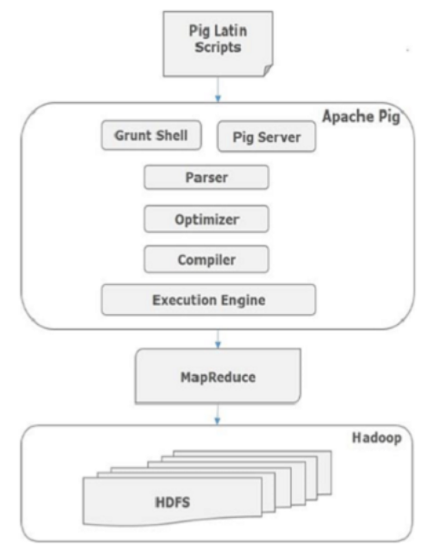
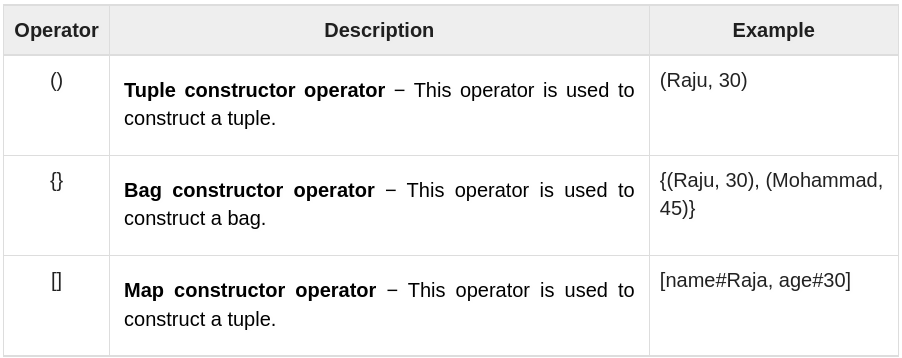
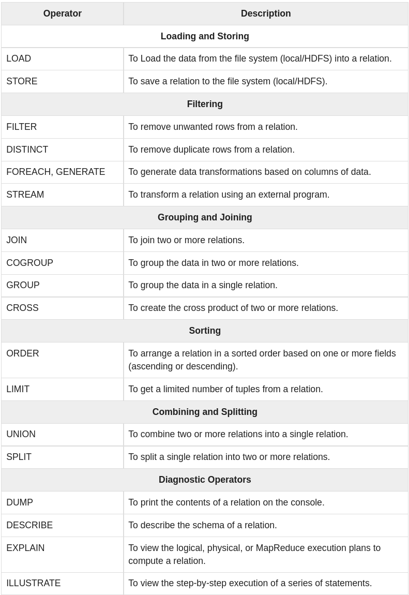

&nbsp;&nbsp;&nbsp;&nbsp;&nbsp;&nbsp;&nbsp;&nbsp;&nbsp;&nbsp;&nbsp;&nbsp;&nbsp;&nbsp;&nbsp;&nbsp;&nbsp;&nbsp; 

# What is Apache Pig?

**Apache Pig** is an abstraction over MapReduce. It is a tool/platform which is used to analyze larger sets of data representing them as data flows. Pig is generally used with Hadoop; we can perform all the data manipulation operations in Hadoop using Apache Pig.

To write data analysis programs, Pig provides a high-level language known as **Pig Latin**. This language provides various operators using which programmers can develop their own functions for reading, writing, and processing data.

To analyze data using Apache Pig, programmers need to write scripts using **Pig Latin language**. All these scripts are internally converted to Map and Reduce tasks. Apache Pig has a component known as **Pig Engine** that accepts the Pig Latin scripts as input and converts those scripts into MapReduce jobs.

# Why Do We Need Apache Pig?

Programmers who are not so good at Java normally used to struggle working with Hadoop, especially while performing any MapReduce tasks. Apache Pig is a boon for all such programmers.

- Using Pig Latin, programmers can perform MapReduce tasks easily without having to type complex codes in Java.
- Apache Pig uses multi-query approach, thereby reducing the length of codes. For example, an operation that would require you to type 200 lines of code (LoC) in Java can be easily done by typing as less as just 10 LoC in Apache Pig. Ultimately Apache Pig reduces the development time by almost 16 times.
- Pig Latin is SQL-like language and it is easy to learn Apache Pig when you are familiar with SQL.
- Apache Pig provides many built-in operators to support data operations like **joins, filters, ordering, etc.** In addition, it also provides nested data types like **tuples, bags, and maps that are missing from MapReduce.**

# Applications of Apache Pig

Apache Pig is generally used by data scientists for performing tasks involving ad-hoc processing and quick prototyping. Apache Pig is used −

- To process huge data sources such as web logs.
- To perform data processing for search platforms.
- To process time sensitive data loads.

#NOTE: Ad hoc is a Latin phrase meaning literally 'to this'. 

# Architecture

As we already said, the language used to analyze data in Hadoop using Pig is known as Pig Latin. 
It is a highlevel data processing language which provides a **rich set of data types** and **operators** to perform various operations on the data.

To perform a particular task Programmers using Pig, programmers need to write a Pig script using the Pig Latin language, and execute them using any of the execution mechanisms (Grunt Shell, UDFs, Embedded). After execution, these scripts will go through a series of transformations applied by the Pig Framework, to produce the desired output.

Internally, Apache Pig converts these scripts into a series of MapReduce jobs, and thus, it makes the programmer’s job easy. The architecture of Apache Pig is shown below.

&nbsp;&nbsp;&nbsp;&nbsp;&nbsp;&nbsp;&nbsp;&nbsp;&nbsp;&nbsp;&nbsp;&nbsp;&nbsp;&nbsp;&nbsp;&nbsp;&nbsp;&nbsp; 

# Apache Pig Components

As shown in the figure, there are various components in the Apache Pig framework. Let us take a look at the major components.

**Parser**

Initially the Pig Scripts are handled by the Parser. It checks the syntax of the script, does type checking, and other miscellaneous checks. The output of the parser will be a DAG (directed acyclic graph), which represents the Pig Latin statements and logical operators.

In the DAG, the logical operators of the script are represented as the nodes and the data flows are represented as edges.

**Optimizer**

The logical plan (DAG) is passed to the logical optimizer, which carries out the logical optimizations such as projection and pushdown.

**Compiler**

The compiler compiles the optimized logical plan into a series of MapReduce jobs.

**Execution engine**

Finally the MapReduce jobs are submitted to Hadoop in a sorted order. Finally, these MapReduce jobs are executed on Hadoop producing the desired results.

# Pig Latin Data Model

The data model of Pig Latin is fully nested and it allows complex non-atomic datatypes such as **map and tuple**. Given below is the diagrammatical representation of Pig Latin’s data model.

**Atom**

Any single value in Pig Latin, irrespective of their data, type is known as an **Atom**. It is stored as string and can be used as string and number. int, long, float, double, chararray, and bytearray are the atomic values of Pig. A piece of data or a simple atomic value is known as a **field**.

Example − ‘raja’ or ‘30’

**Tuple**

A record that is formed by an ordered set of fields is known as a tuple, the fields can be of any type. A tuple is similar to a row in a table of RDBMS.

Example − (Raja, 30)

**Bag**

A bag is an unordered set of tuples. In other words, a collection of tuples (non-unique) is known as a bag. Each tuple can have any number of fields (flexible schema). A bag is represented by ‘{}’. It is similar to a table in RDBMS, but unlike a table in RDBMS, it is not necessary that every tuple contain the same number of fields or that the fields in the same position (column) have the same type.

Example − {(Raja, 30), (Mohammad, 45)}

A bag can be a field in a relation; in that context, it is known as inner bag.

Example − {Raja, 30, {9848022338, raja@gmail,}}

**Map**

A map (or data map) is a set of key-value pairs. The key needs to be of type chararray and should be unique. The value might be of any type. It is represented by ‘[]’

Example − [name#Raja, age#30]

**Relation**

A relation is a bag of tuples. The relations in Pig Latin are unordered (there is no guarantee that tuples are processed in any particular order).

A **Relation** is the **outermost structure of the Pig Latin data model**. And it is a bag where −

- A bag is a collection of tuples.
- A tuple is an ordered set of fields.
- A field is a piece of data.

# Apache Pig Execution Mechanisms

Apache Pig scripts can be executed in three ways, namely, interactive mode, batch mode, and embedded mode.

1. **Interactive Mode (Grunt shell)** − You can run Apache Pig in interactive mode using the Grunt shell. In this shell, you can enter the Pig Latin statements and get the output (using Dump operator).
2. **Batch Mode (Script)** − You can run Apache Pig in Batch mode by writing the Pig Latin script in a single file with .pig extension.
3. **Embedded Mode (UDF)** − Apache Pig provides the provision of defining our own functions (User Defined Functions) in programming languages such as Java, and using them in our script.

# Pig Latin – Basics

**Pig Latin – Type Construction Operators**

The following table describes the Type construction operators of Pig Latin.

&nbsp;&nbsp;&nbsp;&nbsp;&nbsp;&nbsp;&nbsp;&nbsp;&nbsp;&nbsp;&nbsp;&nbsp;&nbsp;&nbsp;&nbsp;&nbsp;&nbsp;&nbsp; 

**Pig Latin – Relational Operations**

The following table describes the relational operators of Pig Latin.

&nbsp;&nbsp;&nbsp;&nbsp;&nbsp;&nbsp;&nbsp;&nbsp;&nbsp;&nbsp;&nbsp;&nbsp;&nbsp;&nbsp;&nbsp;&nbsp;&nbsp;&nbsp; 

**The Load Operator**

You can load data into Apache Pig from the file system (HDFS/ Local) using LOAD operator of Pig Latin.

Syntax:  Relation_name = LOAD 'Input file path' USING function as schema;

Where,

**relation_name** − We have to mention the relation in which we want to store the data.

**Input file path** − We have to mention the HDFS directory where the file is stored. (In MapReduce mode)

**function** − We have to choose a function from the set of load functions provided by Apache Pig (BinStorage, JsonLoader, PigStorage, TextLoader).

**Schema** − We have to define the schema of the data. We can define the required schema as follows −

           (column1 : data type, column2 : data type, column3 : data type);

Example:

          student = LOAD 'hdfs://localhost:9000/pig_data/student_data.txt' 
             USING PigStorage(',')
             as ( id:int, firstname:chararray, lastname:chararray, phone:chararray, 
             city:chararray );

**STORE Operator**

You can store the loaded data in the file system using the store operator. 

Example:

          student_data.txt in HDFS with the following content.

          001,Rajiv,Reddy,9848022337,Hyderabad
          002,siddarth,Battacharya,9848022338,Kolkata
          003,Rajesh,Khanna,9848022339,Delhi
          004,Preethi,Agarwal,9848022330,Pune
          005,Trupthi,Mohanthy,9848022336,Bhuwaneshwar
          006,Archana,Mishra,9848022335,Chennai.
          
          student = LOAD 'hdfs://localhost:9000/pig_data/student_data.txt' 
             USING PigStorage(',')
             as ( id:int, firstname:chararray, lastname:chararray, phone:chararray, 
             city:chararray );

          # Now, let us store the relation in the HDFS directory “/pig_Output/” as shown below.

          STORE student INTO ' hdfs://localhost:9000/pig_Output/ ' USING PigStorage (',');

To verify that the result is saaved you can run ls in the ' hdfs://localhost:9000/pig_Output/ ' folder and cat command on the file inside the folder to see the content.

**Dump Operator**

The Dump operator is used to run the Pig Latin statements and display the results on the screen. It is generally used for debugging Purpose.

          Dump Relation_Name
 
 **Describe Operator**
 
 The describe operator is used to view the schema of a relation.
 
          # Describe Relation_name
          
          describe student;
          
          #output
          student: { id: int,firstname: chararray,lastname: chararray,phone: chararray,city: chararray }
 
 **Explain Operator**
 
 The explain operator is used to display the logical, physical, and MapReduce execution plans of a relation.
 
 
 **Illustrate operator**
 
 The illustrate operator gives you the step-by-step execution of a sequence of statements.

**GROUP Operator**

The GROUP operator is used to group the data in one or more relations. It collects the data having the same key.

          # Group_data = GROUP Relation_name BY age;
          
          group_data = GROUP student_details by age;
          
          Dump group_data;
          
          # output
          
          (21,{(4,Preethi,Agarwal,21,9848022330,Pune),(1,Rajiv,Reddy,21,9848022337,Hydera bad)})
          (22,{(3,Rajesh,Khanna,22,9848022339,Delhi),(2,siddarth,Battacharya,22,984802233 8,Kolkata)})
          (23,{(6,Archana,Mishra,23,9848022335,Chennai),(5,Trupthi,Mohanthy,23,9848022336 ,Bhuwaneshwar)})
          (24,{(8,Bharathi,Nambiayar,24,9848022333,Chennai),(7,Komal,Nayak,24,9848022334, trivendram)})
          
Here you can observe that the resulting schema has two columns −

- One is **age**, by which we have grouped the relation.
- The other is a **bag**, which contains the group of tuples, student records with the respective age.        

**COGROUP Operator**

The **COGROUP operator** works more or less in the same way as the GROUP operator. 
The only **difference** between the two operators is that the group operator is normally used with one relation, 
while the cogroup operator is used in statements **involving two or more relations.**

Let us group the records/tuples of the relations student_details and employee_details with the key age, as shown below.

           cogroup_data = COGROUP student_details by age, employee_details by age;
           
           
           Dump cogroup_data;
           
           #output
           
          (21,{(4,Preethi,Agarwal,21,9848022330,Pune), (1,Rajiv,Reddy,21,9848022337,Hyderabad)}, {    })  
          (22,{ (3,Rajesh,Khanna,22,9848022339,Delhi), (2,siddarth,Battacharya,22,9848022338,Kolkata) },{ (6,Maggy,22,Chennai),(1,Robin,22,newyork) })  
          (23,{(6,Archana,Mishra,23,9848022335,Chennai),(5,Trupthi,Mohanthy,23,9848022336 ,Bhuwaneshwar)},{(5,David,23,Bhuwaneshwar),(3,Maya,23,Tokyo),(2,BOB,23,Kolkata)}) 
          (24,{(8,Bharathi,Nambiayar,24,9848022333,Chennai),(7,Komal,Nayak,24,9848022334, trivendram)}, { })  
          (25,{   },{(4,Sara,25,London)})

The cogroup operator groups the tuples from each relation according to age where each group depicts a particular age value.

For example, if we consider the 1st tuple of the result, it is grouped by age 21. And it contains two bags −

the first bag holds all the tuples from the first relation (student_details in this case) having age 21, and

the second bag contains all the tuples from the second relation (employee_details in this case) having age 21.

In case a relation doesn’t have tuples having the age value 21, it returns an empty bag.

**JOIN Operator**

The **JOIN** operator is used to combine records from two or more relations. While performing a join operation, we declare one (or a group of) tuple(s) from each relation, as keys. 
When these keys match, the two particular tuples are matched, else the records are dropped. Joins can be of the following types −

- Self-join
- Inner-join
- Outer-join − left join, right join, and full join

**Self-join** is used to join a table with itself as if the table were two relations, temporarily renaming at least one relation.

Generally, in Apache Pig, to perform self-join, we will load the same data multiple times, under different aliases (names). Therefore let us load the contents of the file customers.txt as two tables as shown below.

           customers1 = LOAD 'hdfs://localhost:9000/pig_data/customers.txt' USING PigStorage(',')
             as (id:int, name:chararray, age:int, address:chararray, salary:int);

           customers2 = LOAD 'hdfs://localhost:9000/pig_data/customers.txt' USING PigStorage(',')
             as (id:int, name:chararray, age:int, address:chararray, salary:int); 

           customers3 = JOIN customers1 BY id, customers2 BY id;

           Dump customers3;

           #output
           (1,Ramesh,32,Ahmedabad,2000,1,Ramesh,32,Ahmedabad,2000)
           (2,Khilan,25,Delhi,1500,2,Khilan,25,Delhi,1500)
           (3,kaushik,23,Kota,2000,3,kaushik,23,Kota,2000)
           (4,Chaitali,25,Mumbai,6500,4,Chaitali,25,Mumbai,6500)
           (5,Hardik,27,Bhopal,8500,5,Hardik,27,Bhopal,8500)
           (6,Komal,22,MP,4500,6,Komal,22,MP,4500)
           (7,Muffy,24,Indore,10000,7,Muffy,24,Indore,10000)

**Inner Join** is used quite frequently; it is also referred to as equijoin. An inner join returns rows when there is a match in both tables.

It creates a new relation by combining column values of two relations (say A and B) based upon the join-predicate. 
The query compares each row of A with each row of B to find all pairs of rows which satisfy the join-predicate. 
When the join-predicate is satisfied, the column values for each matched pair of rows of A and B are combined into a result row.

           customers.txt

           1,Ramesh,32,Ahmedabad,2000.00
           2,Khilan,25,Delhi,1500.00
           3,kaushik,23,Kota,2000.00
           4,Chaitali,25,Mumbai,6500.00 
           5,Hardik,27,Bhopal,8500.00
           6,Komal,22,MP,4500.00
           7,Muffy,24,Indore,10000.00
           orders.txt

           102,2009-10-08 00:00:00,3,3000
           100,2009-10-08 00:00:00,3,1500
           101,2009-11-20 00:00:00,2,1560
           103,2008-05-20 00:00:00,4,2060
           
          coustomer_orders = JOIN customers BY id, orders BY customer_id;
          
          Dump coustomer_orders;
          
          #output
          (2,Khilan,25,Delhi,1500,101,2009-11-20 00:00:00,2,1560)
          (3,kaushik,23,Kota,2000,100,2009-10-08 00:00:00,3,1500)
          (3,kaushik,23,Kota,2000,102,2009-10-08 00:00:00,3,3000)
          (4,Chaitali,25,Mumbai,6500,103,2008-05-20 00:00:00,4,2060)

**Outer Join:** Unlike inner join, outer join returns all the rows from at least one of the relations. An outer join operation is carried out in three ways −

1. Left outer join
2. Right outer join
3. Full outer join

**The left outer Join** operation returns all rows from the left table, even if there are no matches in the right relation.

          outer_left = JOIN customers BY id LEFT OUTER, orders BY customer_id;

          Dump outer_left;

          #output
          
          (1,Ramesh,32,Ahmedabad,2000,,,,)
          (2,Khilan,25,Delhi,1500,101,2009-11-20 00:00:00,2,1560)
          (3,kaushik,23,Kota,2000,100,2009-10-08 00:00:00,3,1500)
          (3,kaushik,23,Kota,2000,102,2009-10-08 00:00:00,3,3000)
          (4,Chaitali,25,Mumbai,6500,103,2008-05-20 00:00:00,4,2060)
          (5,Hardik,27,Bhopal,8500,,,,)
          (6,Komal,22,MP,4500,,,,)
          (7,Muffy,24,Indore,10000,,,,) 

**The right outer join** operation returns all rows from the right table, even if there are no matches in the left table.

          outer_right = JOIN customers BY id RIGHT, orders BY customer_id;

          Dump outer_right

          #output
          
          (2,Khilan,25,Delhi,1500,101,2009-11-20 00:00:00,2,1560)
          (3,kaushik,23,Kota,2000,100,2009-10-08 00:00:00,3,1500)
          (3,kaushik,23,Kota,2000,102,2009-10-08 00:00:00,3,3000)
          (4,Chaitali,25,Mumbai,6500,103,2008-05-20 00:00:00,4,2060) 

**The full outer join** operation returns rows when there is a match in one of the relations.

          outer_full = JOIN customers BY id FULL OUTER, orders BY customer_id;

          Dump outer_full;
          
          #output
          
          (1,Ramesh,32,Ahmedabad,2000,,,,)
          (2,Khilan,25,Delhi,1500,101,2009-11-20 00:00:00,2,1560)
          (3,kaushik,23,Kota,2000,100,2009-10-08 00:00:00,3,1500)
          (3,kaushik,23,Kota,2000,102,2009-10-08 00:00:00,3,3000)
          (4,Chaitali,25,Mumbai,6500,103,2008-05-20 00:00:00,4,2060)
          (5,Hardik,27,Bhopal,8500,,,,)
          (6,Komal,22,MP,4500,,,,)
          (7,Muffy,24,Indore,10000,,,,)

**Using Multiple Keys**

We can perform JOIN operation using multiple keys.

           Relation3_name = JOIN Relation2_name BY (key1, key2), Relation3_name BY (key1, key2);
           
**CROSS Operator**

The CROSS operator computes the cross-product of two or more relations. 
Produces a result set which is the number of rows in the first table multiplied by the number of rows in the second table.
 
 
 Assume that we have two files namely customers.txt and orders.txt in the /pig_data/ directory of HDFS as shown below.

          customers.txt

          1,Ramesh,32,Ahmedabad,2000.00
          2,Khilan,25,Delhi,1500.00
          3,kaushik,23,Kota,2000.00
          4,Chaitali,25,Mumbai,6500.00
          5,Hardik,27,Bhopal,8500.00
          6,Komal,22,MP,4500.00
          7,Muffy,24,Indore,10000.00
          
          orders.txt

          102,2009-10-08 00:00:00,3,3000
          100,2009-10-08 00:00:00,3,1500
          101,2009-11-20 00:00:00,2,1560
          103,2008-05-20 00:00:00,4,2060
          And we have loaded these two files into Pig with the relations customers and orders as shown below.

          customers = LOAD 'hdfs://localhost:9000/pig_data/customers.txt' USING PigStorage(',')
             as (id:int, name:chararray, age:int, address:chararray, salary:int);

          orders = LOAD 'hdfs://localhost:9000/pig_data/orders.txt' USING PigStorage(',')
             as (oid:int, date:chararray, customer_id:int, amount:int);
             
Let us now get the cross-product of these two relations using the cross operator on these two relations as shown below.

            cross_data = CROSS customers, orders;
            Dump cross_data;
Output

It will produce the following output, displaying the contents of the relation cross_data.

            (7,Muffy,24,Indore,10000,103,2008-05-20 00:00:00,4,2060) 
            (7,Muffy,24,Indore,10000,101,2009-11-20 00:00:00,2,1560) 
            (7,Muffy,24,Indore,10000,100,2009-10-08 00:00:00,3,1500) 
            (7,Muffy,24,Indore,10000,102,2009-10-08 00:00:00,3,3000) 
            (6,Komal,22,MP,4500,103,2008-05-20 00:00:00,4,2060) 
            (6,Komal,22,MP,4500,101,2009-11-20 00:00:00,2,1560) 
            (6,Komal,22,MP,4500,100,2009-10-08 00:00:00,3,1500) 
            (6,Komal,22,MP,4500,102,2009-10-08 00:00:00,3,3000) 
            (5,Hardik,27,Bhopal,8500,103,2008-05-20 00:00:00,4,2060) 
            (5,Hardik,27,Bhopal,8500,101,2009-11-20 00:00:00,2,1560) 
            (5,Hardik,27,Bhopal,8500,100,2009-10-08 00:00:00,3,1500) 
            (5,Hardik,27,Bhopal,8500,102,2009-10-08 00:00:00,3,3000) 
            (4,Chaitali,25,Mumbai,6500,103,2008-05-20 00:00:00,4,2060) 
            (4,Chaitali,25,Mumbai,6500,101,2009-20 00:00:00,4,2060) 
            (2,Khilan,25,Delhi,1500,101,2009-11-20 00:00:00,2,1560) 
            (2,Khilan,25,Delhi,1500,100,2009-10-08 00:00:00,3,1500) 
            (2,Khilan,25,Delhi,1500,102,2009-10-08 00:00:00,3,3000) 
            (1,Ramesh,32,Ahmedabad,2000,103,2008-05-20 00:00:00,4,2060) 
            (1,Ramesh,32,Ahmedabad,2000,101,2009-11-20 00:00:00,2,1560) 
            (1,Ramesh,32,Ahmedabad,2000,100,2009-10-08 00:00:00,3,1500) 
            (1,Ramesh,32,Ahmedabad,2000,102,2009-10-08 00:00:00,3,3000)-11-20 00:00:00,2,1560) 
            (4,Chaitali,25,Mumbai,6500,100,2009-10-08 00:00:00,3,1500) 
            (4,Chaitali,25,Mumbai,6500,102,2009-10-08 00:00:00,3,3000) 
            (3,kaushik,23,Kota,2000,103,2008-05-20 00:00:00,4,2060) 
            (3,kaushik,23,Kota,2000,101,2009-11-20 00:00:00,2,1560) 
            (3,kaushik,23,Kota,2000,100,2009-10-08 00:00:00,3,1500) 
            (3,kaushik,23,Kota,2000,102,2009-10-08 00:00:00,3,3000) 
            (2,Khilan,25,Delhi,1500,103,2008-05-20 00:00:00,4,2060) 
            (2,Khilan,25,Delhi,1500,101,2009-11-20 00:00:00,2,1560) 
            (2,Khilan,25,Delhi,1500,100,2009-10-08 00:00:00,3,1500)
            (2,Khilan,25,Delhi,1500,102,2009-10-08 00:00:00,3,3000) 
            (1,Ramesh,32,Ahmedabad,2000,103,2008-05-20 00:00:00,4,2060) 
            (1,Ramesh,32,Ahmedabad,2000,101,2009-11-20 00:00:00,2,1560) 
            (1,Ramesh,32,Ahmedabad,2000,100,2009-10-08 00:00:00,3,1500) 
            (1,Ramesh,32,Ahmedabad,2000,102,2009-10-08 00:00:00,3,3000) 
 
 
 
 **UNION operator**
 
 The **UNION operator** of Pig Latin is used to merge the content of two relations. 
 To perform UNION operation on two relations, their columns and domains must be identical.
 
 **SPLIT operator**
 
 The **SPLIT operator** is used to split a relation into two or more relations.
 
 Let us now split the relation into two, one listing the employees of age less than 23, and the other listing the employees having the age between 22 and 25.
 
          SPLIT student_details into student_details1 if age<23, student_details2 if (22<age and age>25);

          Dump student_details1; 
          (1,Rajiv,Reddy,21,9848022337,Hyderabad) 
          (2,siddarth,Battacharya,22,9848022338,Kolkata)
          (3,Rajesh,Khanna,22,9848022339,Delhi) 
          (4,Preethi,Agarwal,21,9848022330,Pune)

          Dump student_details2; 
          (5,Trupthi,Mohanthy,23,9848022336,Bhuwaneshwar) 
          (6,Archana,Mishra,23,9848022335,Chennai) 
          (7,Komal,Nayak,24,9848022334,trivendram) 
          (8,Bharathi,Nambiayar,24,9848022333,Chennai)
 
 
 **FILTER operator**
 
 The **FILTER operator** is used to select the required tuples from a relation based on a condition.
 
 Let us now use the Filter operator to get the details of the students who belong to the city Chennai.
 
           student_details.txt

            001,Rajiv,Reddy,21,9848022337,Hyderabad
            002,siddarth,Battacharya,22,9848022338,Kolkata
            003,Rajesh,Khanna,22,9848022339,Delhi 
            004,Preethi,Agarwal,21,9848022330,Pune 
            005,Trupthi,Mohanthy,23,9848022336,Bhuwaneshwar 
            006,Archana,Mishra,23,9848022335,Chennai 
            007,Komal,Nayak,24,9848022334,trivendram 
            008,Bharathi,Nambiayar,24,9848022333,Chennai
          
           filter_data = FILTER student_details BY city == 'Chennai';

           Dump filter_data;

           (6,Archana,Mishra,23,9848022335,Chennai)
           (8,Bharathi,Nambiayar,24,9848022333,Chennai)
 
 
**DISTINCT operator**

The **DISTINCT operator** is used to remove redundant (duplicate) tuples from a relation. 
 
            student_details.txt

            001,Rajiv,Reddy,9848022337,Hyderabad
            002,siddarth,Battacharya,9848022338,Kolkata 
            002,siddarth,Battacharya,9848022338,Kolkata 
            003,Rajesh,Khanna,9848022339,Delhi 
            003,Rajesh,Khanna,9848022339,Delhi 
            004,Preethi,Agarwal,9848022330,Pune 
            005,Trupthi,Mohanthy,9848022336,Bhuwaneshwar
            006,Archana,Mishra,9848022335,Chennai 
            006,Archana,Mishra,9848022335,Chennai

            distinct_data = DISTINCT student_details;

            Dump distinct_data;

            (1,Rajiv,Reddy,9848022337,Hyderabad)
            (2,siddarth,Battacharya,9848022338,Kolkata) 
            (3,Rajesh,Khanna,9848022339,Delhi) 
            (4,Preethi,Agarwal,9848022330,Pune) 
            (5,Trupthi,Mohanthy,9848022336,Bhuwaneshwar)
            (6,Archana,Mishra,9848022335,Chennai)
 

**FOREACH operator**

The **FOREACH operator** is used to generate specified data transformations based on the column data.

Let us now get the id, age, and city values of each student from the relation student_details and store it into another relation named foreach_data using the foreach operator as shown below.

            student_details.txt

            001,Rajiv,Reddy,21,9848022337,Hyderabad
            002,siddarth,Battacharya,22,9848022338,Kolkata
            003,Rajesh,Khanna,22,9848022339,Delhi 
            004,Preethi,Agarwal,21,9848022330,Pune 
            005,Trupthi,Mohanthy,23,9848022336,Bhuwaneshwar 
            006,Archana,Mishra,23,9848022335,Chennai 
            007,Komal,Nayak,24,9848022334,trivendram 
            008,Bharathi,Nambiayar,24,9848022333,Chennai

             foreach_data = FOREACH student_details GENERATE id,age,city;

             Dump foreach_data;

            (1,21,Hyderabad)
            (2,22,Kolkata)
            (3,22,Delhi)
            (4,21,Pune) 
            (5,23,Bhuwaneshwar)
            (6,23,Chennai) 
            (7,24,trivendram)
            (8,24,Chennai) 
  
  
 **ORDER BY operator**
 
 The **ORDER BY operator** is used to display the contents of a relation in a sorted order based on one or more fields.           
            
 Let us now sort the relation in a descending order based on the age of the student and store it into another relation named order_by_data using the ORDER BY operator as shown below.
 
           student_details.txt

          001,Rajiv,Reddy,21,9848022337,Hyderabad
          002,siddarth,Battacharya,22,9848022338,Kolkata
          003,Rajesh,Khanna,22,9848022339,Delhi 
          004,Preethi,Agarwal,21,9848022330,Pune 
          005,Trupthi,Mohanthy,23,9848022336,Bhuwaneshwar 
          006,Archana,Mishra,23,9848022335,Chennai 
          007,Komal,Nayak,24,9848022334,trivendram 
          008,Bharathi,Nambiayar,24,9848022333,Chennai        

          order_by_data = ORDER student_details BY age DESC;

          Dump order_by_data;

          (8,Bharathi,Nambiayar,24,9848022333,Chennai)
          (7,Komal,Nayak,24,9848022334,trivendram)
          (6,Archana,Mishra,23,9848022335,Chennai) 
          (5,Trupthi,Mohanthy,23,9848022336,Bhuwaneshwar)
          (3,Rajesh,Khanna,22,9848022339,Delhi) 
          (2,siddarth,Battacharya,22,9848022338,Kolkata)
          (4,Preethi,Agarwal,21,9848022330,Pune) 
          (1,Rajiv,Reddy,21,9848022337,Hyderabad)

            
**LIMIT operator**            

The **LIMIT operator** is used to get a limited number of tuples from a relation.           
 
Now, let’s sort the relation in descending order based on the age of the student and store it into another relation named limit_data using the ORDER BY operator as shown below.

          student_details.txt

          001,Rajiv,Reddy,21,9848022337,Hyderabad
          002,siddarth,Battacharya,22,9848022338,Kolkata
          003,Rajesh,Khanna,22,9848022339,Delhi 
          004,Preethi,Agarwal,21,9848022330,Pune 
          005,Trupthi,Mohanthy,23,9848022336,Bhuwaneshwar 
          006,Archana,Mishra,23,9848022335,Chennai 
          007,Komal,Nayak,24,9848022334,trivendram 
          008,Bharathi,Nambiayar,24,9848022333,Chennai            

          limit_data = LIMIT student_details 4; 

          Dump limit_data; 

          (1,Rajiv,Reddy,21,9848022337,Hyderabad) 
          (2,siddarth,Battacharya,22,9848022338,Kolkata) 
          (3,Rajesh,Khanna,22,9848022339,Delhi) 
          (4,Preethi,Agarwal,21,9848022330,Pune) 
