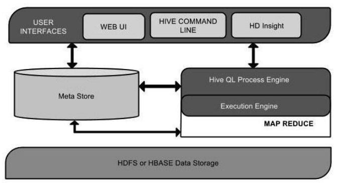
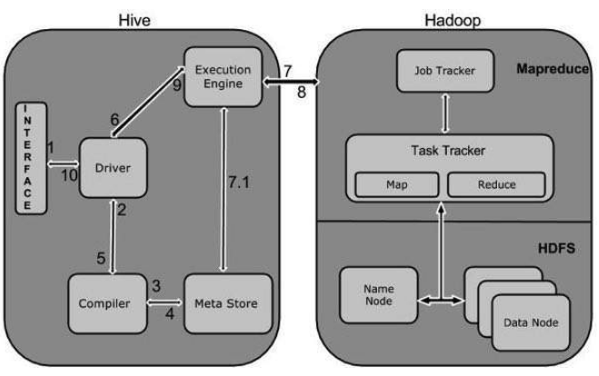

Hive is a data warehouse infrastructure tool to process structured data in Hadoop. It resides on top of Hadoop to summarize Big Data, and makes querying and analyzing easy.

Initially Hive was developed by Facebook, later the Apache Software Foundation took it up and developed it further as an open source under the name Apache Hive.

Hive is not:

- A relational database
- A design for OnLine Transaction Processing (OLTP)
- A language for real-time queries and row-level updates
- 
Features of Hive:

- It stores schema in a database and processed data into HDFS.
- It is designed for OLAP.
- It provides SQL type language for querying called HiveQL or HQL.
- It is familiar, fast, scalable, and extensible.

# Architecture of Hive

&nbsp;&nbsp;&nbsp;&nbsp;&nbsp;&nbsp;&nbsp;&nbsp;&nbsp;&nbsp;&nbsp;&nbsp;&nbsp;&nbsp;&nbsp;&nbsp;&nbsp;&nbsp; 

&nbsp;&nbsp;&nbsp;&nbsp;&nbsp;&nbsp;&nbsp;&nbsp;&nbsp;&nbsp;&nbsp;&nbsp;&nbsp;&nbsp;&nbsp;&nbsp;&nbsp;&nbsp; 

The Hive interface such as Command Line or Web UI sends query to Driver (any database driver such as JDBC, ODBC, etc.) to execute.

The driver takes the help of query compiler that parses the query to check the syntax and query plan or the requirement of query.

The compiler sends metadata request to Metastore (any database).

Metastore sends metadata as a response to the compiler.

The compiler checks the requirement and resends the plan to the driver. Up to here, the parsing and compiling of a query is complete.

The driver sends the execute plan to the execution engine.

Internally, the process of execution job is a MapReduce job. The execution engine sends the job to JobTracker, which is in Name node and it assigns this job to TaskTracker, which is in Data node. Here, the query executes MapReduce job.

Meanwhile in execution, the execution engine can execute metadata operations with Metastore.

The execution engine receives the results from Data nodes.

The execution engine sends those resultant values to the driver.

The driver sends the results to Hive Interfaces.

# Data Types

All the data types in Hive are classified into four types, given as follows:

- Column Types
- Literals
- Null Values
- Complex Types

**Column Types**

Column type are used as column data types of Hive. They are as follows:

**Integral Types**

Integer type data can be specified using integral data types, INT. When the data range exceeds the range of **INT**, you need to use **BIGINT** and if the data range is smaller than the INT, you use **SMALLINT**. **TINYINT** is smaller than SMALLINT.

**String Types**

String type data types can be specified using single quotes (' ') or double quotes (" "). It contains two data types: **VARCHAR** and **CHAR**. Hive follows C-types escape characters.

VARCHAR --> length 1 - 65355
CHAR --> length 255

**Timestamp**

It supports traditional UNIX timestamp with optional nanosecond precision. It supports java.sql.Timestamp format “YYYY-MM-DD HH:MM:SS.fffffffff” and format “yyyy-mm-dd hh:mm:ss.ffffffffff”.

**Dates**

DATE values are described in year/month/day format in the form {{YYYY-MM-DD}}.

**Decimals**

The DECIMAL type in Hive is as same as Big Decimal format of Java. It is used for representing immutable arbitrary precision. The syntax and example is as follows:

        DECIMAL(precision, scale)
        decimal(10,0)

**Union Types**

Union is a collection of heterogeneous data types. You can create an instance using create union. The syntax and example is as follows:

        UNIONTYPE<int, double, array<string>, struct<a:int,b:string>>

        {0:1} 
        {1:2.0} 
        {2:["three","four"]} 
        {3:{"a":5,"b":"five"}} 
        {2:["six","seven"]} 
        {3:{"a":8,"b":"eight"}} 
        {0:9} 
        {1:10.0}
        
**Literals**

The following literals are used in Hive:

**Floating Point Types**

Floating point types are nothing but numbers with decimal points. Generally, this type of data is composed of DOUBLE data type.

**Decimal Type**

Decimal type data is nothing but floating point value with higher range than DOUBLE data type. The range of decimal type is approximately -10-308 to 10308.

**Null Value**

Missing values are represented by the special value NULL.

**Complex Types**

The Hive complex data types are as follows:

**Arrays**

Arrays in Hive are used the same way they are used in Java.

Syntax: ARRAY<data_type>

**Maps**

Maps in Hive are similar to Java Maps.

Syntax: MAP<primitive_type, data_type>

**Structs**

Structs in Hive is similar to using complex data with comment.

Syntax: STRUCT<col_name : data_type [COMMENT col_comment], ...>
  
# Create Database Statement

**A database in Hive is a namespace or a collection of tables.** The syntax for this statement is as follows:

CREATE DATABASE|SCHEMA [IF NOT EXISTS] <database name>
  
Here, IF NOT EXISTS is an optional clause, which notifies the user that a database with the same name already exists. We can use SCHEMA in place of DATABASE in this command. The following query is executed to create a database named userdb:

          hive> CREATE DATABASE [IF NOT EXISTS] userdb;
          or

          hive> CREATE SCHEMA userdb;
  
The following query is used to verify a databases list:

          hive> SHOW DATABASES;
          default
          userdb

# Drop Database Statement
  
          hive> DROP DATABASE IF EXISTS userdb;
  

# Create Table Statement
  
  Syntax::
  
          CREATE [TEMPORARY] [EXTERNAL] TABLE [IF NOT EXISTS] [db_name.] table_name

              [(col_name data_type [COMMENT col_comment], ...)]
              [COMMENT table_comment]
              [ROW FORMAT row_format]
              [STORED AS file_format]
  
  
          hive> CREATE TABLE IF NOT EXISTS employee ( eid int, name String,
              salary String, destination String)
              COMMENT ‘Employee details’
              ROW FORMAT DELIMITED
              FIELDS TERMINATED BY ‘\t’
              LINES TERMINATED BY ‘\n’
              STORED AS TEXTFILE;

 If you add the option IF NOT EXISTS, Hive ignores the statement in case the table already exists.

On successful creation of table, you get to see the following response:

              OK
              Time taken: 5.905 seconds
  
  
  
# Alter Table Statement
  
  The statement takes any of the following syntaxes based on what attributes we wish to modify in a table.

              ALTER TABLE name RENAME TO new_name
              ALTER TABLE name ADD COLUMNS (col_spec[, col_spec ...])
              ALTER TABLE name DROP [COLUMN] column_name
              ALTER TABLE name CHANGE column_name new_name new_type
              ALTER TABLE name REPLACE COLUMNS (col_spec[, col_spec ...])
  
  
  
# Drop Table Statement
  
            DROP TABLE IF EXISTS employee;
            OK
            Time taken: 5.3 seconds
        
  
# Partitioning
  
Tables or partitions are sub-divided into buckets, to provide extra structure to the data that may be used for more efficient querying. Bucketing works based on the value of hash function of some column of a table.

For example, a table named Tab1 contains employee data such as id, name, dept, and yoj (i.e., year of joining). Suppose you need to retrieve the details of all employees who joined in 2012. A query searches the whole table for the required information. However, if you partition the employee data with the year and store it in a separate file, it reduces the query processing time.
  
  
  We can add partitions to a table by altering the table.

            ALTER TABLE table_name ADD [IF NOT EXISTS] PARTITION partition_spec
          [LOCATION 'location1'] partition_spec [LOCATION 'location2'] ...;

            hive> ALTER TABLE employee
          > ADD PARTITION (year=’2012’)
          > location '/2012/part2012';
  
 Renaming a Partition
  
          ALTER TABLE table_name PARTITION partition_spec RENAME TO PARTITION partition_spec;

          hive> ALTER TABLE employee PARTITION (year=’1203’)
           > RENAME TO PARTITION (Yoj=’1203’);
  
 Dropping a Partition
 
          ALTER TABLE table_name DROP [IF EXISTS] PARTITION partition_spec, PARTITION partition_spec,...;

          hive> ALTER TABLE employee DROP [IF EXISTS]
           > PARTITION (year=’1203’);
  
 # HiveQL - Select-Where
  
  The Hive Query Language (HiveQL) is a query language for Hive to process and analyze structured data in a Metastore.
  
  Syntax:
  

          SELECT [ALL | DISTINCT] select_expr, select_expr, ... 
          FROM table_reference 
          [WHERE where_condition] 
          [GROUP BY col_list] 
          [HAVING having_condition] 
          [CLUSTER BY col_list | [DISTRIBUTE BY col_list] [SORT BY col_list]] 
          [LIMIT number];
  
          +------+--------------+-------------+-------------------+--------+
          | ID   | Name         | Salary      | Designation       | Dept   |
          +------+--------------+-------------+-------------------+--------+
          |1201  | Gopal        | 45000       | Technical manager | TP     |
          |1202  | Manisha      | 45000       | Proofreader       | PR     |
          |1203  | Masthanvali  | 40000       | Technical writer  | TP     |
          |1204  | Krian        | 40000       | Hr Admin          | HR     |
          |1205  | Kranthi      | 30000       | Op Admin          | Admin  | 
          +------+--------------+-------------+-------------------+--------+
  
          hive> SELECT * FROM employee WHERE salary>30000;
  
          +------+--------------+-------------+-------------------+--------+
          | ID   | Name         | Salary      | Designation       | Dept   |
          +------+--------------+-------------+-------------------+--------+
          |1201  | Gopal        | 45000       | Technical manager | TP     |
          |1202  | Manisha      | 45000       | Proofreader       | PR     |
          |1203  | Masthanvali  | 40000       | Technical writer  | TP     |
          |1204  | Krian        | 40000       | Hr Admin          | HR     |
          +------+--------------+-------------+-------------------+--------+
  
 # HiveQL - Select-Order By
  
  
  The ORDER BY clause is used to retrieve the details based on one column and sort the result set by ascending or descending order.

Syntax

    
          SELECT [ALL | DISTINCT] select_expr, select_expr, ... 
          FROM table_reference 
          [WHERE where_condition] 
          [GROUP BY col_list] 
          [HAVING having_condition] 
          [ORDER BY col_list]] 
          [LIMIT number];

          +------+--------------+-------------+-------------------+--------+
          | ID   | Name         | Salary      | Designation       | Dept   |
          +------+--------------+-------------+-------------------+--------+
          |1201  | Gopal        | 45000       | Technical manager | TP     |
          |1202  | Manisha      | 45000       | Proofreader       | PR     |
          |1203  | Masthanvali  | 40000       | Technical writer  | TP     |
          |1204  | Krian        | 40000       | Hr Admin          | HR     |
          |1205  | Kranthi      | 30000       | Op Admin          | Admin  |
          +------+--------------+-------------+-------------------+--------+  
        
          hive> SELECT Id, Name, Dept FROM employee ORDER BY DEPT;
  
          +------+--------------+-------------+-------------------+--------+
          | ID   | Name         | Salary      | Designation       | Dept   |
          +------+--------------+-------------+-------------------+--------+
          |1205  | Kranthi      | 30000       | Op Admin          | Admin  |
          |1204  | Krian        | 40000       | Hr Admin          | HR     |
          |1202  | Manisha      | 45000       | Proofreader       | PR     |
          |1201  | Gopal        | 45000       | Technical manager | TP     |
          |1203  | Masthanvali  | 40000       | Technical writer  | TP     |
          +------+--------------+-------------+-------------------+--------+
  
 # HiveQL - Select-Group By
  
 The GROUP BY clause is used to group all the records in a result set using a particular collection column. It is used to query a group of records.
  
  Syntax

            SELECT [ALL | DISTINCT] select_expr, select_expr, ... 
            FROM table_reference 
            [WHERE where_condition] 
            [GROUP BY col_list] 
            [HAVING having_condition] 
            [ORDER BY col_list]] 
            [LIMIT number];
          
            +------+--------------+-------------+-------------------+--------+ 
            | ID   | Name         | Salary      | Designation       | Dept   |
            +------+--------------+-------------+-------------------+--------+ 
            |1201  | Gopal        | 45000       | Technical manager | TP     | 
            |1202  | Manisha      | 45000       | Proofreader       | PR     | 
            |1203  | Masthanvali  | 40000       | Technical writer  | TP     | 
            |1204  | Krian        | 45000       | Proofreader       | PR     | 
            |1205  | Kranthi      | 30000       | Op Admin          | Admin  |
            +------+--------------+-------------+-------------------+--------+
  
            hive> SELECT Dept,count(*) FROM employee GROUP BY DEPT;
  
            +------+--------------+ 
            | Dept | Count(*)     | 
            +------+--------------+ 
            |Admin |    1         | 
            |PR    |    2         | 
            |TP    |    3         | 
            +------+--------------+
            
  
# HiveQL - Select-Joins
  
            CUSTOMERS table

          +----+----------+-----+-----------+----------+ 
          | ID | NAME     | AGE | ADDRESS   | SALARY   | 
          +----+----------+-----+-----------+----------+ 
          | 1  | Ramesh   | 32  | Ahmedabad | 2000.00  |  
          | 2  | Khilan   | 25  | Delhi     | 1500.00  |  
          | 3  | kaushik  | 23  | Kota      | 2000.00  | 
          | 4  | Chaitali | 25  | Mumbai    | 6500.00  | 
          | 5  | Hardik   | 27  | Bhopal    | 8500.00  | 
          | 6  | Komal    | 22  | MP        | 4500.00  | 
          | 7  | Muffy    | 24  | Indore    | 10000.00 | 
          +----+----------+-----+-----------+----------+

          ORDERS table

          +-----+---------------------+-------------+--------+ 
          |OID  | DATE                | CUSTOMER_ID | AMOUNT | 
          +-----+---------------------+-------------+--------+ 
          | 102 | 2009-10-08 00:00:00 |           3 | 3000   | 
          | 100 | 2009-10-08 00:00:00 |           3 | 1500   | 
          | 101 | 2009-11-20 00:00:00 |           2 | 1560   | 
          | 103 | 2008-05-20 00:00:00 |           4 | 2060   | 
          +-----+---------------------+-------------+--------+

  
          hive> SELECT c.ID, c.NAME, c.AGE, o.AMOUNT 
              FROM CUSTOMERS c JOIN ORDERS o 
              ON (c.ID = o.CUSTOMER_ID);

          +----+----------+-----+--------+ 
          | ID | NAME     | AGE | AMOUNT | 
          +----+----------+-----+--------+ 
          | 3  | kaushik  | 23  | 3000   | 
          | 3  | kaushik  | 23  | 1500   | 
          | 2  | Khilan   | 25  | 1560   | 
          | 4  | Chaitali | 25  | 2060   | 
          +----+----------+-----+--------+
  
**LEFT OUTER JOIN**
  
  The HiveQL LEFT OUTER JOIN returns all the rows from the left table, even if there are no matches in the right table.
  
          hive> SELECT c.ID, c.NAME, o.AMOUNT, o.DATE 
          FROM CUSTOMERS c 
          LEFT OUTER JOIN ORDERS o 
          ON (c.ID = o.CUSTOMER_ID);

           +----+----------+--------+---------------------+ 
          | ID | NAME     | AMOUNT | DATE                | 
          +----+----------+--------+---------------------+ 
          | 1  | Ramesh   | NULL   | NULL                | 
          | 2  | Khilan   | 1560   | 2009-11-20 00:00:00 | 
          | 3  | kaushik  | 3000   | 2009-10-08 00:00:00 | 
          | 3  | kaushik  | 1500   | 2009-10-08 00:00:00 | 
          | 4  | Chaitali | 2060   | 2008-05-20 00:00:00 | 
          | 5  | Hardik   | NULL   | NULL                | 
          | 6  | Komal    | NULL   | NULL                | 
          | 7  | Muffy    | NULL   | NULL                | 
          +----+----------+--------+---------------------+
  
**RIGHT OUTER JOIN**
  
The HiveQL RIGHT OUTER JOIN returns all the rows from the right table, even if there are no matches in the left table.
  
            hive> SELECT c.ID, c.NAME, o.AMOUNT, o.DATE 
                FROM CUSTOMERS c 
                RIGHT OUTER JOIN ORDERS o 
                ON (c.ID = o.CUSTOMER_ID);

          +------+----------+--------+---------------------+ 
          | ID   | NAME     | AMOUNT | DATE                | 
          +------+----------+--------+---------------------+ 
          | 3    | kaushik  | 3000   | 2009-10-08 00:00:00 | 
          | 3    | kaushik  | 1500   | 2009-10-08 00:00:00 | 
          | 2    | Khilan   | 1560   | 2009-11-20 00:00:00 | 
          | 4    | Chaitali | 2060   | 2008-05-20 00:00:00 | 
          +------+----------+--------+---------------------+
  
**FULL OUTER JOIN**
  
The HiveQL FULL OUTER JOIN combines the records of both the left and the right outer tables that fulfil the JOIN condition.
 
          hive> SELECT c.ID, c.NAME, o.AMOUNT, o.DATE 
          FROM CUSTOMERS c 
          FULL OUTER JOIN ORDERS o 
          ON (c.ID = o.CUSTOMER_ID);
  

          +------+----------+--------+---------------------+ 
          | ID   | NAME     | AMOUNT | DATE                | 
          +------+----------+--------+---------------------+ 
          | 1    | Ramesh   | NULL   | NULL                | 
          | 2    | Khilan   | 1560   | 2009-11-20 00:00:00 | 
          | 3    | kaushik  | 3000   | 2009-10-08 00:00:00 | 
          | 3    | kaushik  | 1500   | 2009-10-08 00:00:00 | 
          | 4    | Chaitali | 2060   | 2008-05-20 00:00:00 | 
          | 5    | Hardik   | NULL   | NULL                | 
          | 6    | Komal    | NULL   | NULL                |
          | 7    | Muffy    | NULL   | NULL                |  
          | 3    | kaushik  | 3000   | 2009-10-08 00:00:00 | 
          | 3    | kaushik  | 1500   | 2009-10-08 00:00:00 | 
          | 2    | Khilan   | 1560   | 2009-11-20 00:00:00 | 
          | 4    | Chaitali | 2060   | 2008-05-20 00:00:00 | 
          +------+----------+--------+---------------------+
  
