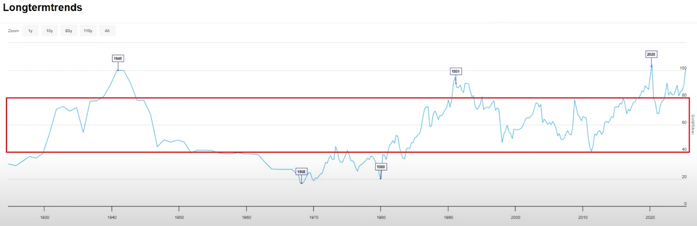
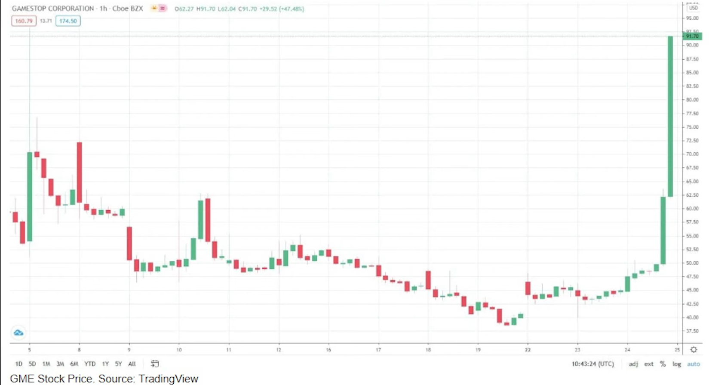

# Silver (SLV ETF)

## 🪙 Why Silver?

1. **Supply and Demand Imbalance**

    - Demand > Supply: Industrial demand is growing rapidly while supply has remained steady.
    - Silver production peaked in 2016 and has been declining.
    - Only 25% of silver comes from primary silver mines. The rest is a byproduct of mining other metals like gold, copper, lead, and zinc.
    - Recycling offsets some of the lost production, but not enough to meet rising demand.

2. **Rising Industrial Demand**

    - Silver’s unmatched electrical conductivity makes it essential in:
    - Electric Vehicles (EVs):
    - Traditional cars: 15–28g silver
    - Battery EVs: 25–50g
    - Next-gen solid-state EV batteries (launching ~2026–2027): up to 1,000g per vehicle
    - Solar Panels: ~1.2g silver per panel
    - AI & High-Performance Computing: used in circuit boards and data centers
    - Military Tech: required in drones, missiles, and targeting systems

3. **Inflation Hedge**

    - Silver protects against the dollar’s decreasing purchasing power.
    - It acts as both a store of value and an investment, with the potential to outperform inflation due to increasing industrial demand.

4. **Historical Significance**

    - Used as money for thousands of years.
    - Trusted through government collapses, financial panics, and inflationary periods.

5. **Undervalued Asset**

    - **Gold-to-Silver Ratio (GSR) [(Link To The Chart)](https://www.bullionbypost.com/price-ratio/gold/silver/alltime/)** historically averages around 40-80. So back in the 60s and 80s, the GSR fell to around 20. That means that it only takes 20 silver coins to get you a gold coin. But most of the time the gold to silver ratio is in the 40 to 80 range. So it's common for the GSR to be around 60. So the question is right now is gold overvalued is silver undervalued or maybe a little bit of both. But regardless in relation to gold, historically speaking, silver is cheap right now. and either gold drops or silver plays catch-up. And if silver closes the gap and gets back to the historical average, then it would mean a significant price increase for silver. So that's why I consider silver to be one of the best value opportunities in the market today. That's why I'm saying it's one of my favorites because it's not just a safe haven, it's a discounted asset with some serious upside potential. 

    

    - Currently, GSR is about 100:1, suggesting silver is undervalued compared to gold.
    
    

## 📈 Exit Strategy

I don’t sell at a fixed price like $60 or $100. Instead, I watch for key signals:

### 🚩 Warning Signs to Sell:

- Gold-to-Silver Ratio (GSR) drops to ~50: consider partial sell
- GSR drops to ~40: consider major sell
- Another warning sign to sell is when investor demand just shoots up. FOMO & Retail Investor Surge (This is an example of FOMO surge - GAMESTOP corporation stock price)

#### 🎮 Why GME (GameStop) Shows This Perfectly:

- In early 2021, GameStop stock (GME) went from under $20 to nearly $500 in a matter of days. 
- This wasn’t because the company suddenly became super valuable. 
- It happened because millions of retail investors on Reddit and social media rushed in, afraid they’d miss out on the "next big thing."
- People bought not because of logic, but because of hype and herd behavior.

👉 This is FOMO in action: the price goes up because people see the price going up—and they want in.

💡 Why This Matters for Silver

If silver becomes the next "hot topic"—on Reddit, in the news, or through social media—FOMO could drive a retail surge, just like GME. That would send silver prices much higher very quickly, even if the fundamentals hadn't changed overnight.

- Short Squeeze Event (Explained bellow)

### 🪙 What I’ll Do with the Proceeds:

- Reinvest into gold, platinum, real estate (US or abroad), or stocks
- Depends on value opportunities at the time
- Will replenish silver holdings later if price drops

### ⚠️ Key Considerations

1. **Volatility During Market Crashes** - Silver may drop temporarily in a stock market crash due to liquidations and margin calls, but it often rebounds stronger later—view it as a buying opportunity

2. **Price Manipulation** - JP Morgan admitted to unlawful silver trading (spoofing) in 2020 shorting tactics still affect the market. Eventually, manipulation may backfire, triggering a massive short squeeze.

    - In simple terms:

        - Some big financial institutions have been manipulating silver prices, meaning they do things behind the scenes to keep the price lower than it should be.
        - One way they do this is by **"shorting"** silver—betting that the price will go down.
    - But here's the risk for them:
        - If silver suddenly starts going up, these institutions will lose money on their short bets.
        - To cut their losses, they'll be forced to buy back silver quickly—and in huge amounts.
        - This rush to buy can push the price even higher, causing more people to jump in and buy too.
        - The result? A  **"short squeeze"**  —a kind of price explosion driven by panic buying.

#### 📈 Why This Matters:

If this happens, silver could skyrocket in price very quickly. This is why many investors believe that, when the manipulation ends or fails, it could be a big opportunity for those holding silver.

### What things to keep track of?

1. **SLV price**
2. **GSR drop (~50-40)**

